# Lab 1 - Azure Machine Learning Model Training

This lab covers clustering with Azure Machine Learning, Automated ML, and model explainability.

### Source datasets used by the labs

### COVID-19 Case Surveillance Public Use Data

https://data.cdc.gov/Case-Surveillance/COVID-19-Case-Surveillance-Public-Use-Data/vbim-akqf

The COVID-19 case surveillance system database includes individual-level data reported to U.S. states and autonomous reporting entities, including New York City and the District of Columbia (D.C.), as well as U.S. territories and states. On April 5, 2020, COVID-19 was added to the Nationally Notifiable Condition List and classified as “immediately notifiable, urgent (within 24 hours)” by a Council of State and Territorial Epidemiologists (CSTE) Interim Position Statement (Interim-20-ID-01). CSTE updated the position statement on August 5, 2020 to clarify the interpretation of antigen detection tests and serologic test results within the case classification. The statement also recommended that all states and territories enact laws to make COVID-19 reportable in their jurisdiction, and that jurisdictions conducting surveillance should submit case notifications to CDC. COVID-19 case surveillance data are collected by jurisdictions and shared voluntarily with CDC.

The dataset contains 13.4 million rows of deidentified patient data.

### COVID-19 Open Research Dataset

https://azure.microsoft.com/en-us/services/open-datasets/catalog/covid-19-open-research/

In response to the COVID-19 pandemic, the [Allen Institute for AI](https://allenai.org/) has partnered with leading research groups to prepare and distribute the COVID-19 Open Research Dataset (CORD-19), a free resource of over 47,000 scholarly articles, including over 36,000 with full text, about COVID-19 and the coronavirus family of viruses for use by the global research community. This dataset is made available by the the Allen Institute of AI and [Semantic Scholar](https://pages.semanticscholar.org/coronavirus-research).

This dataset is intended to mobilize researchers to apply recent advances in natural language processing to generate new insights in support of the fight against this infectious disease.

The corpus may be updated as new research is published in peer-reviewed publications and archival services like [bioRxiv](https://www.biorxiv.org/), [medRxiv](https://www.medrxiv.org/), and others.

## Lab Objectives

- Task 1 - Explore dashboard of COVID-19 data
- Task 2 - Explore lab scenario
- Task 3 - Prepare Azure Machine Learning workspace
- Task 4 - Prepare data for the Machine Learning process
- Task 5 - Train a Machine Learning model with Automated ML
- Task 6 - Explore AutoML results
- Task 7 - Generate a Responsible AI dashboard
- Task 8 -  Explore the Responsible AI dashboard

## Task 1 - Explore dashboard of COVID-19 data

Understanding the source datasets is very important in AI and ML. To help you expedite the process, we have created a Power BI dashboard you can use to explore them at the beginning of each lab.


To get more details about the source datasets, check out the [Data Overview](https://github.com/CloudLabsAI-Azure/ai-in-a-day/blob/main/data-overview.md) section.

To explore the dashboard of COVID-19 data, open the `Azure-AI-in-a-Day-Data-Overview` file located on the desktop (**C:\Users\public\desktop**) 💻 of the virtual machine provided with your environment. If you see the `Introducing the updated mobile layout` pop-up screen, then close it by clicking on `Got it`. Collapse the **Fields** and **Visualizations** tabs to see the clear report.

> **Note:** Please close and reopen the Power BI Desktop document if it throws an error on the first attempt.

 

## Task 2 - Explore lab scenario

Given the magnitude of the COVID-19 problem, it comes naturally to have a lot of research on the topic. In fact, in 2020 alone, tens of thousands of papers have been published on COVID-19 alone. The sheer amount of communication on the subject makes it difficult for a researcher to grasp and structure all the relevant topics and details. Furthermore, pre-defined catalogs and paper classification might not always reflect their content in the most effective way possible.

Based on a set of existing research papers, we will use Natural Language Processing and Machine Learning to identify these papers' natural grouping. For each new document that gets into our system, we will use Machine Learning to classify it into one of the previously identified groups. We will use Automated ML (a feature of Azure Machine Learning) to train the best classification model and explain its behaviour.

The following diagram highlights the portion of the general architecture covered by this lab.

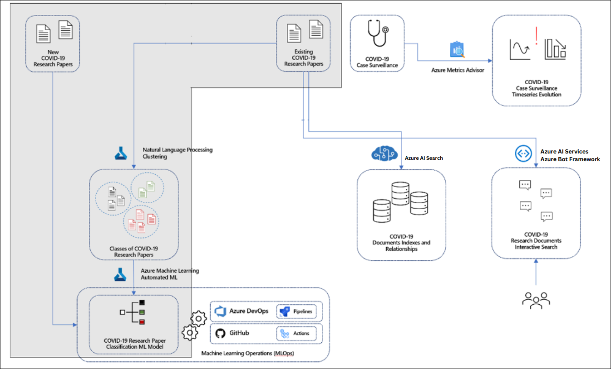

The high-level steps covered in the lab are:

- Explore dashboard of COVID-19 data
- Explore lab scenario
- Run word embedding process on natural language content of research papers
- Explore results of word embedding
- Run clustering of research papers and explore results
- Use the newly found clusters to label the research document and run the Auto ML process to train a classifier
- Run the classifier on "new" research papers
- Explain the best model produced by AutoML

## Task 3 - Prepare Azure Machine Learning workspace

1. In the **LabVM**, click on the **Azure Portal** shortcut of the Microsoft Edge browser, which is created on the desktop 💻.
  
    
    
1. On the **Sign into Microsoft Azure** tab, you will see the login screen. In that enter the following **Email/Username** and then click on **Next**. 
   
   * Email/Username: **<inject key="AzureAdUserEmail" enableCopy="true"/>** 
   
1. Enter the following **Password** and click on **Sign in**. 
   
   * Password: **<inject key="AzureAdUserPassword" enableCopy="true"/>**
   
1. If you see the pop-up **Stay Signed in?**, click on **No**. Also, if you see a **Save Password** pop-up, close that.

1. If you see the pop-up **You have free Azure Advisor recommendations!**, close the window to continue the lab.

1. If the **Welcome to Microsoft Azure** pop-up window appears, click on **Maybe Later** to skip the tour.

1. Navigate to `All Resources`.

    
        
1. Locate **Machine Learning** resource named **<inject key="AML Workspace Name " enableCopy="true"/>** and select it.

    
    
1. On the **Overview (1)** page, click on **Launch studio (2)**. If you are prompted to sign in again, use the same lab credentials you used to login to the Azure portal. Close the welcome **pop-up** if any with the cross icon.  
    
    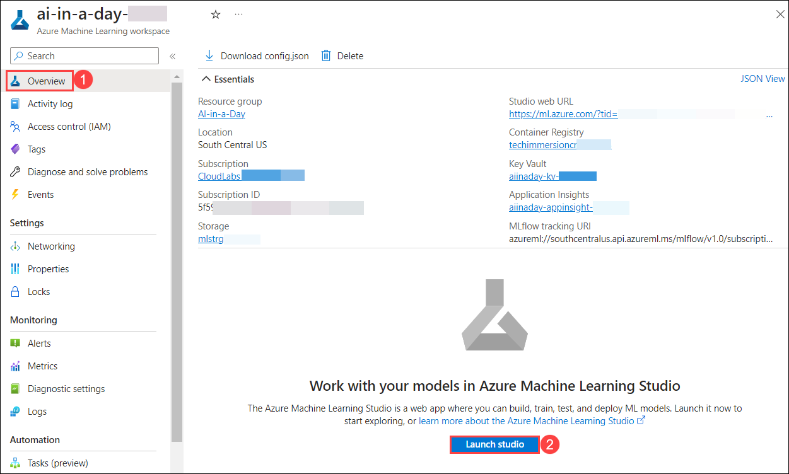

1. In Azure Machine Learning Studio, select `Compute` **(1)** from the left side menu and verify that your compute instance is `running` **(2)**.
   
   * Compute instance name: notebook<inject key="DeploymentID" enableCopy="false"/>

    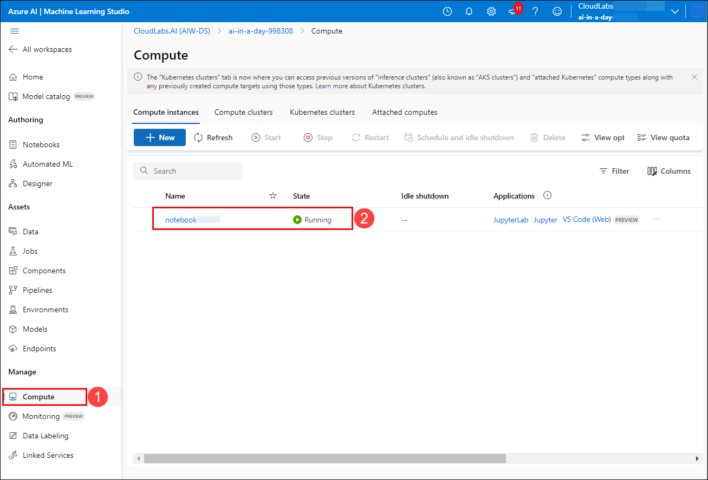

    >**Note**: If you launched Azure Machine Learning Studio right after your lab environment was provisioned, you might find the compute instance in a provisioning state. In this case, wait a few minutes until it changes its status to `Running`.

1. In the Azure Machine Learning Studio under **Compute** **(1)**, click on **... (2)** and, open the **Terminal** **(2)** environment.
    
   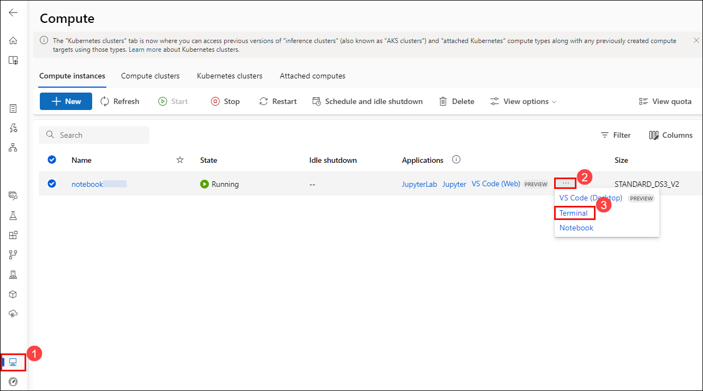
   
1. Run the following commands and make sure all commands will execute successfully.
    
    ```  
    conda env create -f aiw-ai-kernel.yml
    ```
    
    ```
    conda activate aiw-ai-kernel
    ```
    
    ```
    ipython kernel install --user --name aiw-ai-kernel --display-name "Python (aiw-ai-kernel)"
    ```
   
   
   
   

1. From the `Application` section associated with the compute instance, select `Jupyter` **(1)**. 

    

1. If you see **IMPORTANT NOTE: Always use trusted code**, then check on **Yes, I Understand** and then click on **Continue**.

    
    
   >**Note**: If prompted with Do you wish to trust this compute instance? webpage, click on **Click here to trust this compute instance**.
    
    
    
## Task 4 - Prepare data for the Machine Learning process

1. In the Jupyter application, navigate to the given path **\Users\odl_user_<inject key="DeploymentID" enableCopy="false"/>** and open `1. Data Preparation.ipynb` notebook.

   
   
2. On Jupiter page, select **Kernel (1)**, then **Change kernel (2)** and make sure **Python (aiw-ai-kernel) (3)** is selected.

   

3. Execute the cells inside `1. Data Preparation.ipynb` notebook one by one (Click on the 'Run' button or by using either Ctrl + Enter to stay on the same cell, or Shift + Enter to advance to the next cell) and observe the results of each cell execution.

   
   
   
 4. Please make sure to read the cells carefully and update the storage account name wherever required with **<inject key="Storage Account Name" enableCopy="false"/>**

     

## Task 5 - Train a Machine Learning model with Automated ML

In this task, we'll use Azure Automated ML to train a machine learning model capable of determining the best cluster for a COVID-19 scientific article. It builds upon the work done in the Data Preparation notebook.

1. In the Azure Machine Learning Studio, switch to the `Automated ML` **(1)** section and select `+ New Automated ML job` **(2)** to start the Automated ML.

    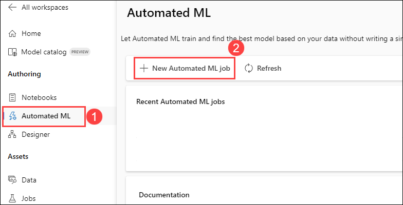

2. In the `Submit an Automated ML job` wizard, for Experiment name `Select Existing` **(1)** and select Existing experiment as `COVID19_Classification` **(2)**. Click  `Next` **(3)** to proceed.

    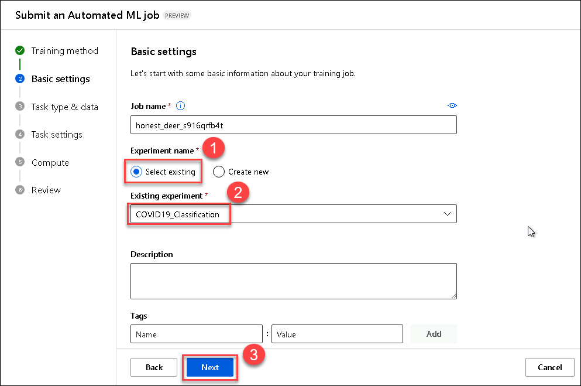
   
3. On the `Task type and data` page, make sure `Classification` **(1)** is selected. Select `COVID19Articles_Train_Vectors` as your dataset and click `Next` to proceed.

    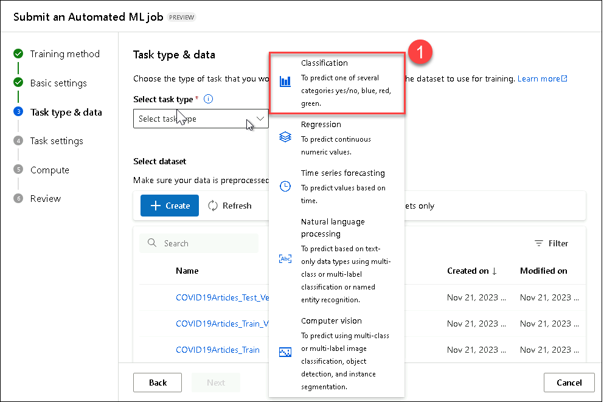

4. On `Task settings` page, select the Target column to `cluster` **(1)**. The values we're trying to predict are in the `cluster` column.

     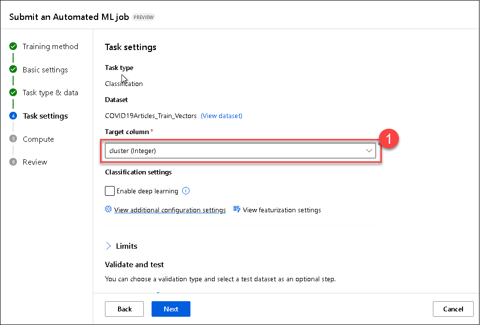

5. Scroll down on the same page, fill in the values listed below and click `Next`.

    - **Validation type (1)**: k-fold cross validation
    - **Number of cross validations (2)**: 5
    - Leave Default for Test dataset

      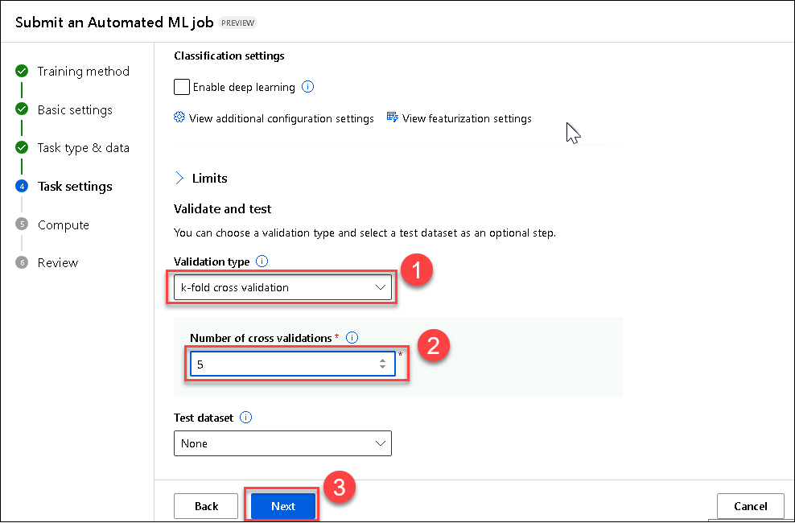
      
6. In order to be able to launch an Automated ML run, we need to provision an Azure ML compute cluster. On the `Compute` page, select compute type as `Compute Cluster` **(1)** and select Azure AML compute cluster as `aml-compute-cpu` **(2)** from the list of clusters. If the list is empty select `+ New` **(3)** link.

    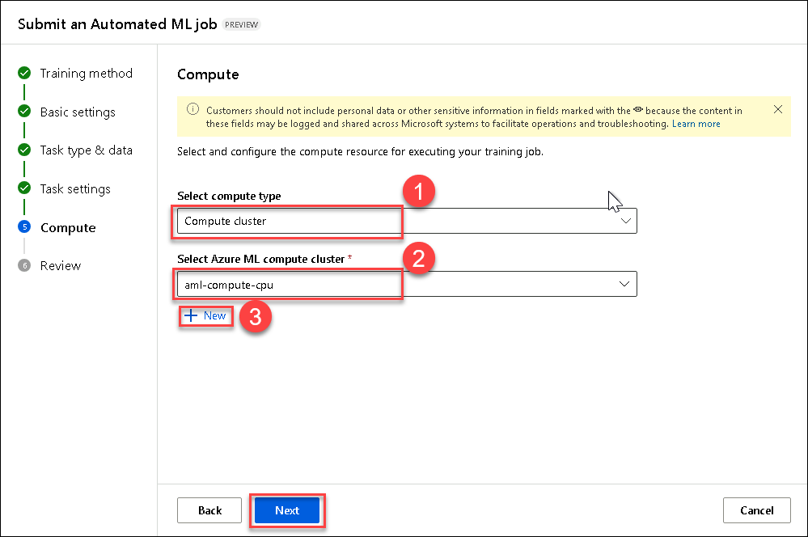

   >**Note**: If you already have `aml-compute-cpu` cluster provisioned, feel free to skip to step 9.

7. On the `Create compute cluster` screen set the values listed below:

    - **Virtual machine priority (1)**: Dedicated
    - **Virtual machine type (2)**: CPU
    - **Virtual machine Size (3)**: Standard_DS3_v2

    

    Select `Next` **(4)** to continue.

8. To configure cluster settings set the values given below:

    - **Compute name (1)**: aml-<inject key="DeploymentID" enableCopy="false"/>
    - **Minimum number of nodes (2)**: 0
    - **Maximum number of nodes (3)**: 4  

    Setting the number of maximum nodes to a higher value will allow Automated ML to run more experiments in parallel but will also increase your costs.

        

9. On the Review page, select `Submit training job` **(1)**  to kick off the Automated ML experiment run. If this is the first time you are launching an experiment run in the Azure Machine Learning workspace, the total experiment time will be longer than the `training job time` we have set. This is because of the time needed to start the Compute Cluster and deploy the container images required to execute.

    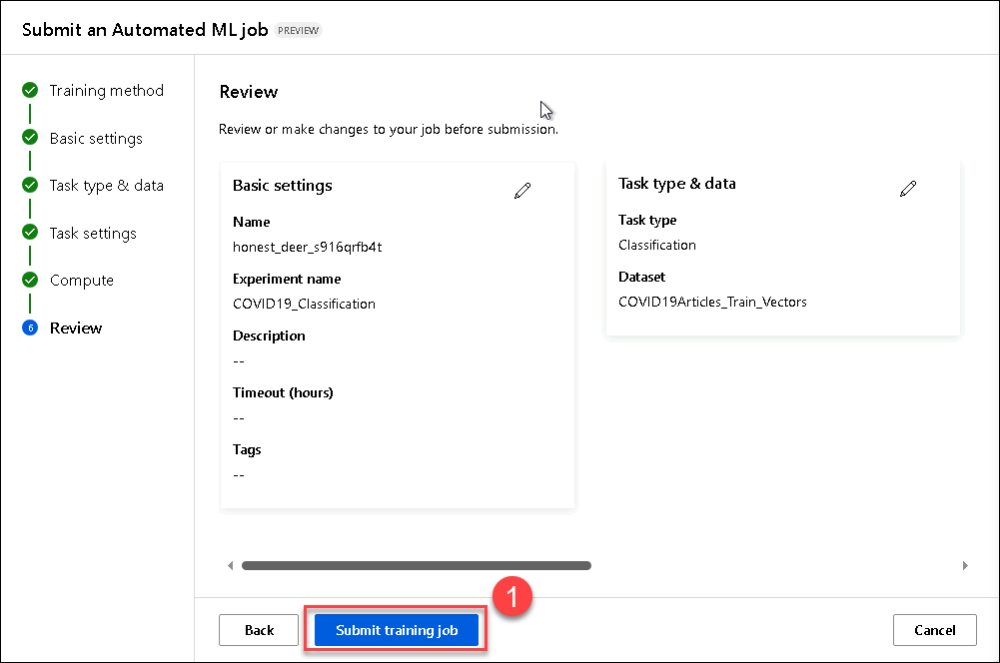

12. On the following screen, you will see the progress of your experiment run.

13. Now that you understand the process of launching an AutoML run, let's explore in the next task the results of an already completed AutoML run.

>**Note**: We have already executed in this environment an AutoML run that is very similar to the one you've just launched. This allows you to explore AutoML results without having to wait for the completion of the run.

## Task 6 - Explore AutoML results

1. In the Azure Machine Learning Studio, navigate to the **Jobs (1)** section and locate the **COVID19_Classification** experiment **(2)**. Select the experiment name link.

   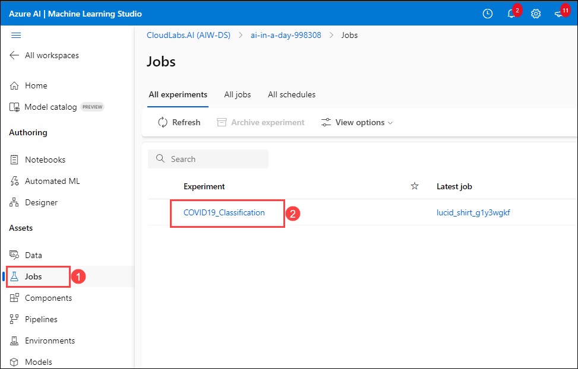

2. You will navigate to the experiment details page, where you should see the list of experiment runs. Locate the first run **(1)** listed here, which has the status **Completed**. The name of the run can be different in your environment and may not match the below screenshot.

   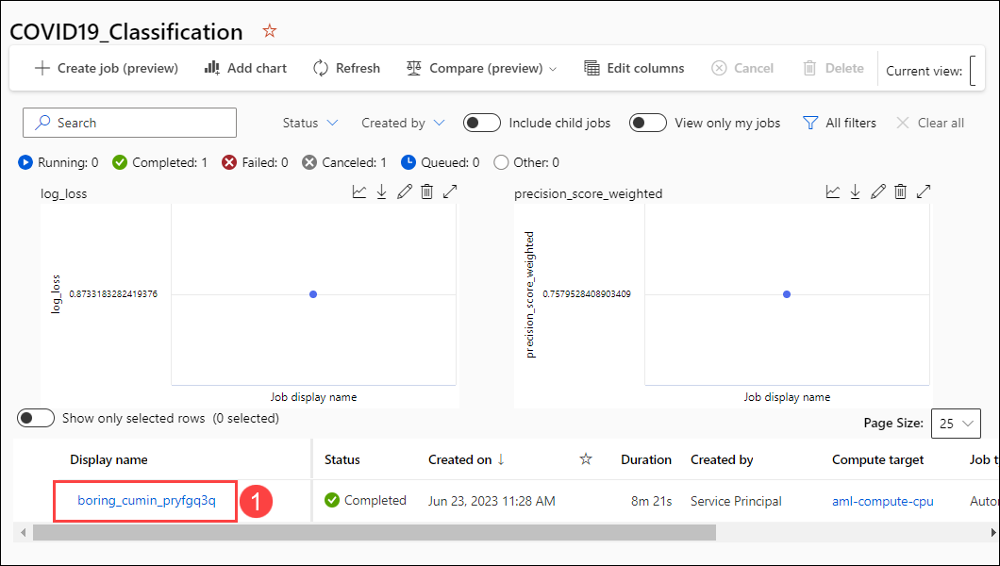

3. On the **Run details** page, navigate to the **Models (1)** section. Check the values on the  **AUC weighted** column **(2)**, which is the primary metric selected in the AutoML run configuration. See how the best model was selected; this is the one with the maximum metric value. This is also the model for which the explanation was generated. Select **View explanation (3)**.

   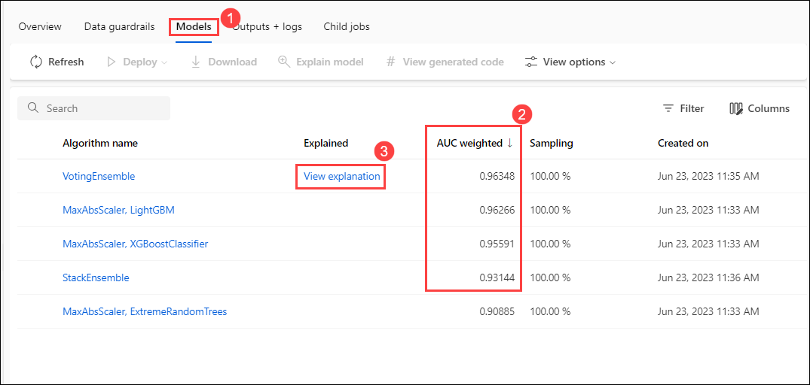

4. On the **Explanations (preview) (1)** section, browse the available explanations **(2)** and investigate the **Model performance (3)** representation.

   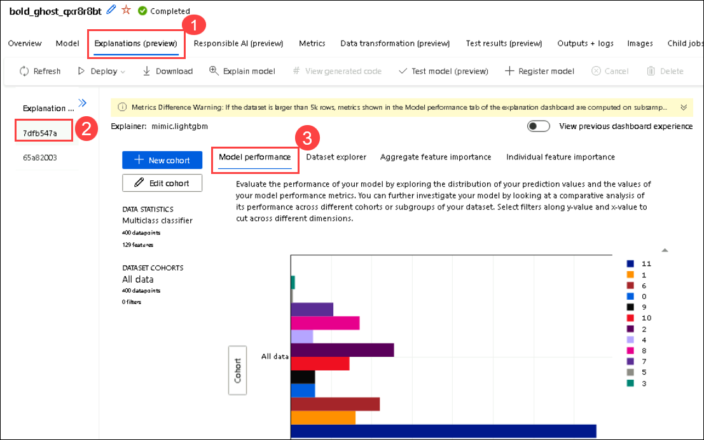

   <validation step="46d5c33f-126f-4f3c-9a15-a4596a0b876c" />

   > **Congratulations** on completing the task! Now, it's time to validate it. Here are the steps:
   > - Click the Lab Validation tab located at the upper right corner of the lab guide section and navigate to the Lab Validation tab.
   > - Hit the Validate button for the corresponding task.
   > - If you receive a success message, you can proceed to the next task. If not, carefully read the error message and retry the step, following the instructions in the lab guide.
   > - If you need any assistance, please contact us at labs-support@spektrasystems.com. We are available 24/7 to help you out.


## Task 7 - Generate a Responsible AI dashboard

Responsible AI is a governance framework that documents how a specific organization is addressing the challenges around artificial intelligence (AI) from both an ethical and legal point of view. Resolving ambiguity about where responsibility lies if something goes wrong is an important driver for responsible AI initiatives.

**Principles of responsible AI**: AI and the machine learning models that support it should be comprehensive, explainable, ethical and efficient.

 - Comprehensiveness – Comprehensive AI has clearly defined testing and governance criteria to prevent machine learning from being hacked easily.
 - Explainable AI is programmed to describe its purpose, rationale and decision-making process in a way that can be understood by the average end user.
 - Ethical AI initiatives have processes in place to seek out and eliminate bias in machine learning models.
 - Efficient AI is able to run continually and respond quickly to changes in the operational environment.

1. In the Jupyter application, navigate to the given path **\Users\odl_user_<inject key="DeploymentID" enableCopy="false"/>** and open `erroranalysis-dashboard-regression-superconductor.ipynb` notebook.

   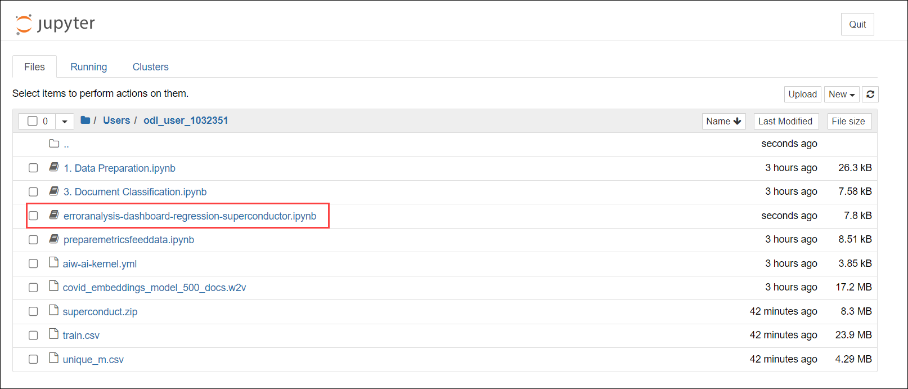
   
2. Once the notebook is opened in the Jupyter application, select **Kernel** **(1)**. Then select **Change kernel** **(2)** and make sure to select **Python (aiw-ai-kernel) (3)**.

   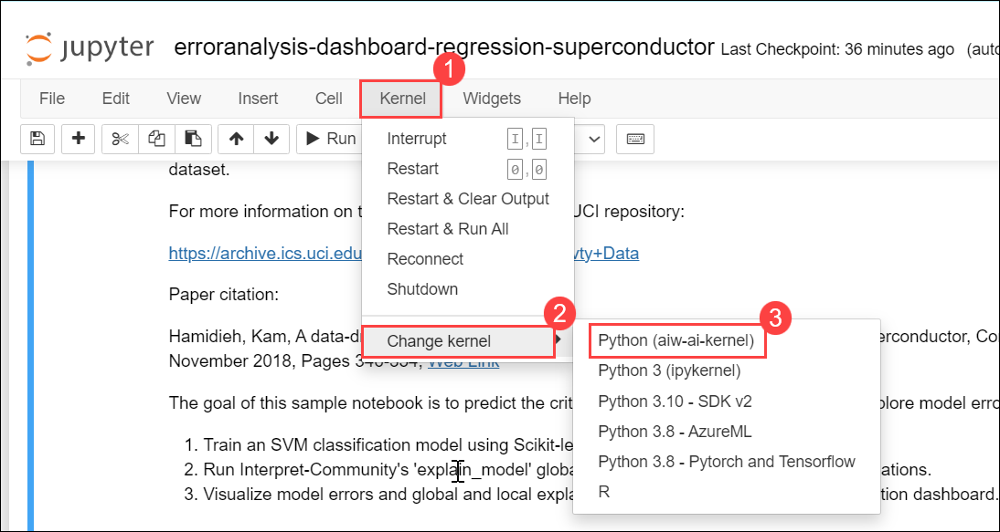

3. Execute the cells inside `erroranalysis-dashboard-regression-superconductor.ipynb` notebook one by one (Click on the **Run** button or by using either Ctrl + Enter to stay on the same cell, or Shift + Enter to advance to the next cell or) and observe the results of each cell execution.

   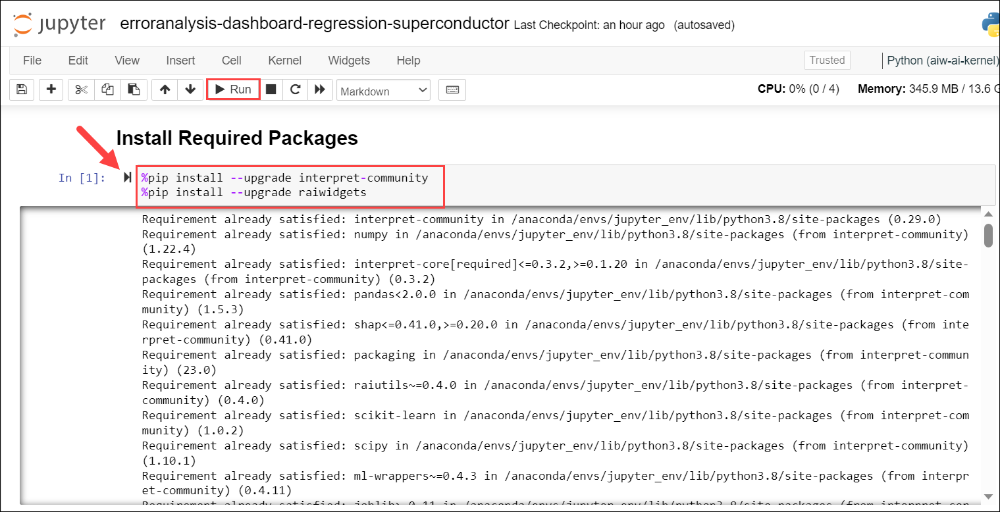
   
4. Please make sure to read the cells carefully and run them one by one. Click on the **Endpoint** URL at the end of the notebook before moving to the next task.

     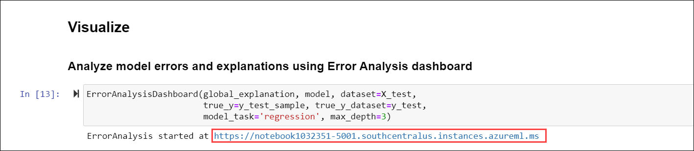

## Task 8 -  Explore the Responsible AI dashboard

1. Once you click on the endpoint, you will be navigated to the new tab. Select **Tree map (1)** from the drop-down next to **Error Explorer**, the tree visualization uses the mutual information between each feature and the error to best separate error instances from success instances hierarchically in the data. This simplifies the process of discovering and highlighting common failure patterns. Choose the **Mean squared error (2)** for **Select metric** and click on **Explanation** to view the results. 

   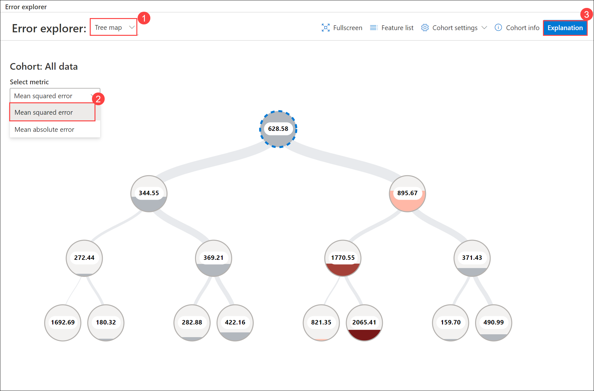
 
1. On the **Explanation** page, observe the box plot graph representing the data. In addition, you can explore the available options to view different representations of data.

    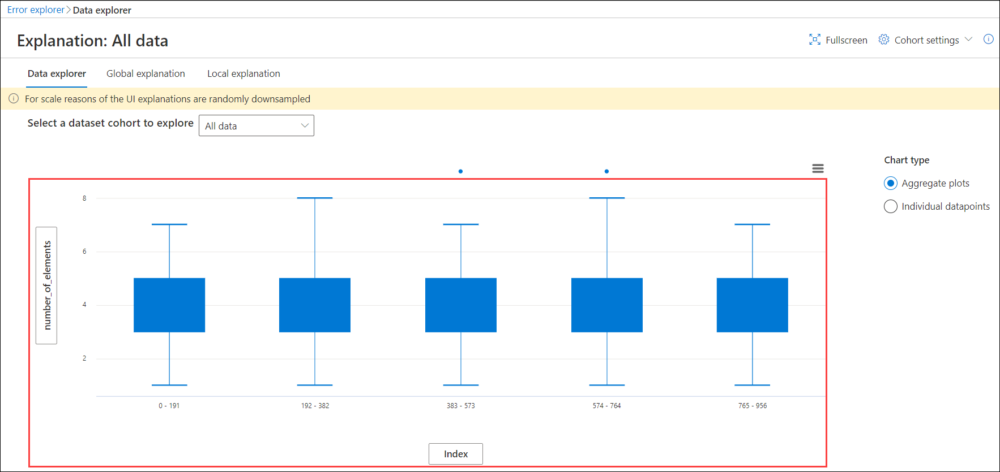

1. Navigate back to **Error explorer** page, and choose **Heat map (1)** form the drop-down next to **Error Explorer**. Set the **Select mertic** to **Mean absolute error (2)**, choose **number_of_elements (3)** for **Rows: Feature 1** and **mean_atomic_mass (4)**.

    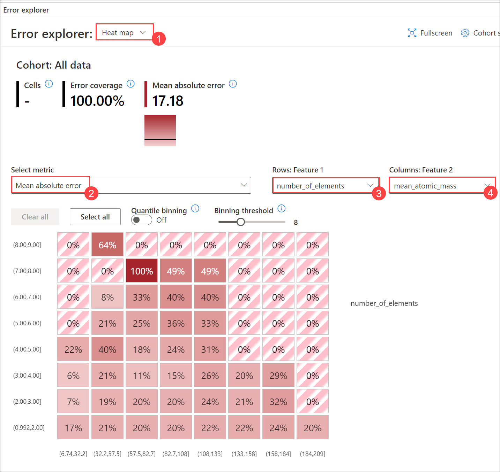

## Summary

In this lab, you have built, trained, and evaluated the machine learning model using Azure Machine Learning


