# Lab 1 - Azure Machine Learning Model Training

This lab covers clustering with Azure Machine Learning, Automated ML, and model explainability.

## Task 1 - Explore dashboard of COVID-19 data

Understanding the source datasets is very important in AI and ML. To help you expedite the process, we have created a Power BI dashboard you can use to explore them at the beginning of each lab.


To get more details about the source datasets, check out the [Data Overview](https://github.com/CloudLabsAI-Azure/ai-in-a-day/blob/main/data-overview.md) section.

To explore the dashboard of COVID-19 data, open the `Azure-AI-in-a-Day-Data-Overview` file located on the desktop (**C:\Users\public\desktop**) 💻 of the virtual machine provided with your environment. If you see `Introducing the updated mobile layout` pop-up screen, then close it by clicking on `Got it`. Collapse the **Fields** and **Visualizations** tabs to see the clear report.

> **Note:** Please close and reopen the Power BI Desktop document if it throws an error in the first attempt.

 

## Task 2 - Explore lab scenario

Given the magnitude of the COVID-19 problem, it comes naturally to have a lot of research on the topic. In fact, in 2020 alone, tens of thousands of papers have been published on COVID-19 alone. The sheer amount of communication on the subject makes it difficult for a researcher to grasp and structure all the relevant topics and details. Furthermore, pre-defined catalogs and paper classification might not always reflect their content in the most effective way possible.

Based on a set of existing research papers, we will use Natural Language Processing and Machine Learning to identify these papers' natural grouping. For each new document that gets into our system, we will use Machine Learning to classify it into one of the previously identified groups. We will use Automated ML (a feature of Azure Machine Learning) to train the best classification model and explain its behaviour.

The following diagram highlights the portion of the general architecture covered by this lab.

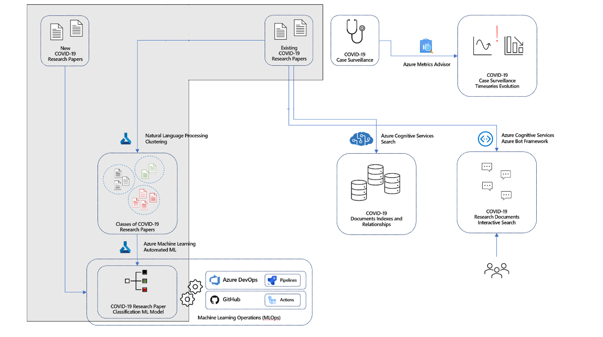

The high-level steps covered in the lab are:

- Explore dashboard of COVID-19 data
- Explore lab scenario
- Run word embedding process on natural language content of research papers
- Explore results of word embedding
- Run clustering of research papers and explore results
- Use the newly found clusters to label the research document and run the Auto ML process to train a classifier
- Run the classifier on "new" research papers
- Explain the best model produced by AutoML

## Task 3 - Prepare Azure Machine Learning workspace

1. In the **LabVM**, click on the **Azure Portal** shortcut of the Microsoft Edge browser, which is created on the desktop 💻.
  
    
    
1. On the **Sign into Microsoft Azure** tab, you will see the login screen. In that enter the following **Email/Username** and then click on **Next**. 
   
   * Email/Username: **<inject key="AzureAdUserEmail" enableCopy="true"/>** 
   
1. Enter the following **Password** and click on **Sign in**. 
   
   * Password: **<inject key="AzureAdUserPassword" enableCopy="true"/>**
   
1. If you see the pop-up **Stay Signed in?**, click on **No**. Also, if you see a **Save Password** pop-up, close that.

1. If you see the pop-up **You have free Azure Advisor recommendations!**, close the window to continue the lab.

1. If the **Welcome to Microsoft Azure** pop-up window appears, click on **Maybe Later** to skip the tour.

1. Navigate to `All Resources`.

    
        
1. Locate **Machine Learning** resource named **<inject key="AML Workspace Name " enableCopy="true"/>** and select it.

    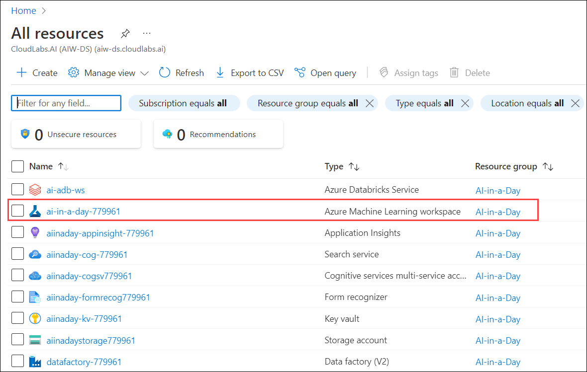
    
1. On the **Overview (1)** page, click on **Launch studio (2)**. If you are prompted to sign in again, use the same lab credentials you used to login to the Azure portal. Close the welcome **pop-up** if any with the cross icon.  
    
    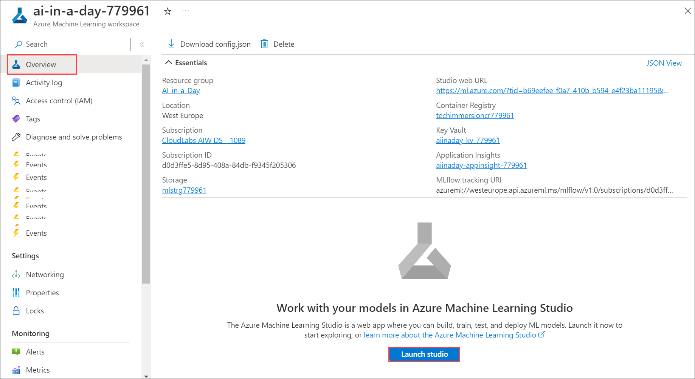

1. In Azure Machine Learning Studio, select `Compute` **(1)** from the left side menu and verify that your compute instance is `running` **(2)**.
   
   * Compute instance name: notebook<inject key="DeploymentID" enableCopy="false"/>

    

    >**Note**: If you launched Azure Machine Learning Studio right after your lab environment was provisioned, you might find the compute instance in a provisioning state. In this case, wait a few minutes until it changes its status to `Running`.

1. In the Azure Machine Learning Studio under **Compute** **(1)**, open the **Terminal** **(2)** environment.
    
   
   
1. Run the following commands and make sure all commands will execute successfully.
    
    ```  
    conda env create -f aiw-ai-kernel.yml
    ```
    
    ```
    conda activate aiw-ai-kernel
    ```
    
    ```
    ipython kernel install --user --name aiw-ai-kernel --display-name "Python (aiw-ai-kernel)"
    ```
   
   
   
   

1. From the `Application` section associated with the compute instance, select `Jupyter` **(1)**. 

    

1. If you see **IMPORTANT NOTE: Always use trusted code**, then check on **Yes, I Understand** and then click on **Continue**.

    
    
   >**Note**: If prompted with Do you wish to trust this compute instance? webpage, click on **Click here to trust this compute instance**.
    
    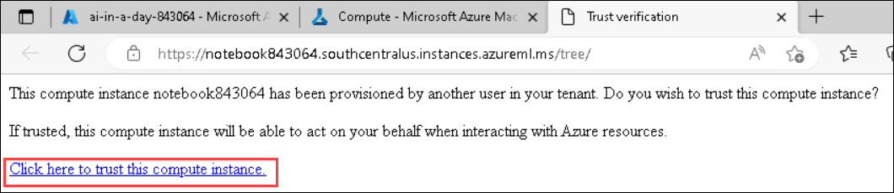
    
## Task 4 - Prepare data for the Machine Learning process

1. In the Jupyter application, navigate to the given path **\Users\odl_user_<inject key="DeploymentID" enableCopy="false"/>** and open `1. Data Preparation.ipynb` notebook.

   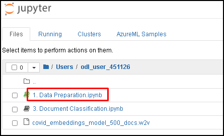
   
2. On Jupiter page, select **Kernel (1)**, then **Change kernel (2)** and make sure **Python (aiw-ai-kernel) (3)** is selected.

   

3. Execute the cells inside `1. Data Preparation.ipynb` notebook one by one (Click on the 'Run' button or by using either Ctrl + Enter to stay on the same cell, or Shift + Enter to advance to the next cell or) and observe the results of each cell execution.

   
   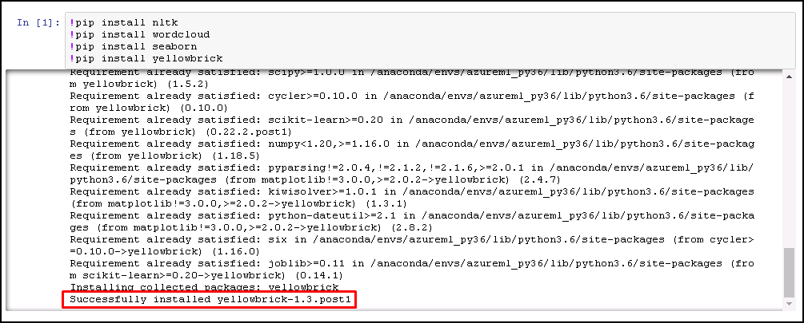
   
 4. Please make sure to read the cells carefully and update the storage account name wherever required with **<inject key="Storage Account Name" enableCopy="false"/>**

     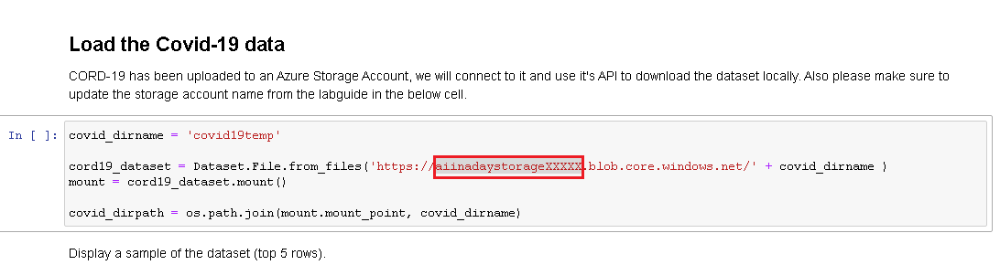

## Task 5 - Train a Machine Learning model with Automated ML

In this task, we'll use Azure Automated ML to train a machine learning model capable of determining the best cluster for a COVID-19 scientific article. It builds upon the work done in the Data Preparation notebook.

1. In the Azure Machine Learning Studio, switch to the `Automated ML` **(1)** section and select `+ New Automated ML job` **(2)** to start the Automated ML.

    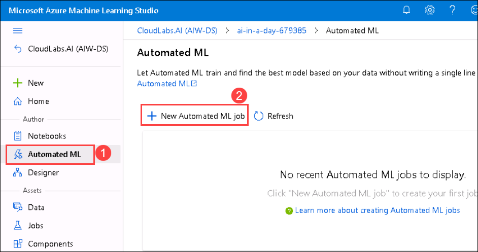

2. In the `Create a new Automated ML job` wizard pick `COVID19Articles_Train_Vectors` **(1)** as your dataset and select `Next` **(2)** to proceed.

    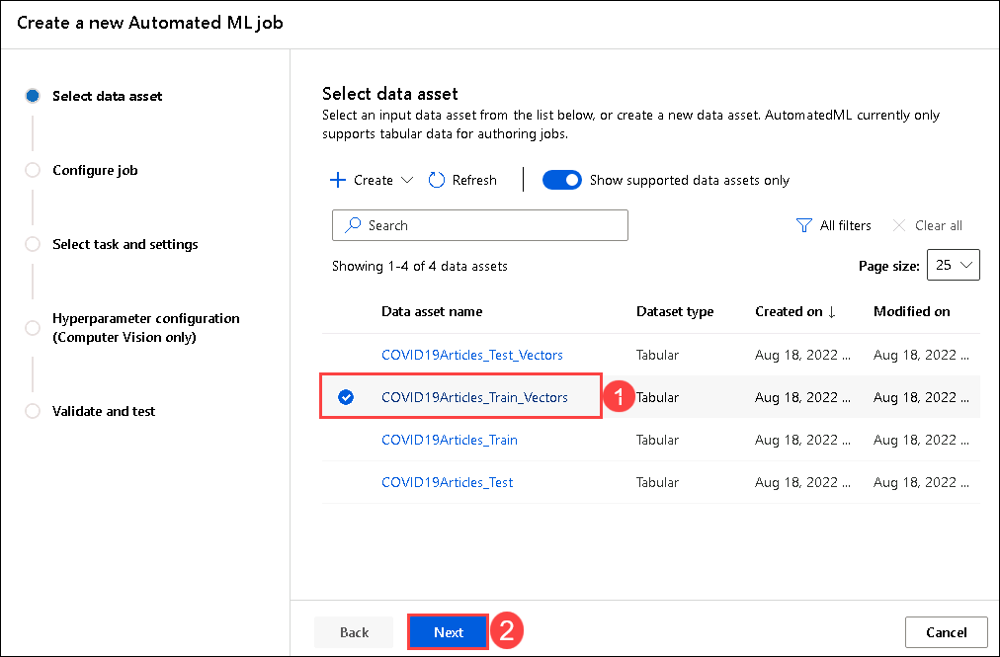

3. In order to be able to launch an Automated ML run we need to provision an Azure ML compute cluster. On the `Configure job` step select `aml-compute-cpu` **(1)** from the list of clusters. If the list is empty select `+ New` **(2)** link.

    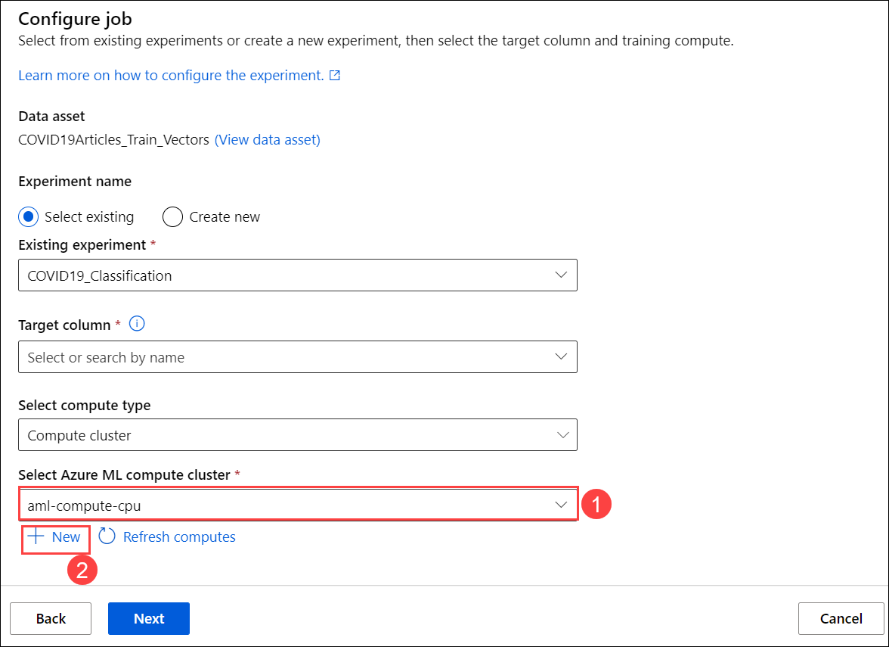

   >**Note**: If you already have `aml-compute-cpu` cluster provisioned, feel free to skip to step 6.

4. On the `Create compute cluster` screen set the values listed below:

    - **Virtual machine priority (1)**: Dedicated
    - **Virtual machine type (2)**: CPU
    - **Virtual machine Size (3)**: Standard_DS3_v2

    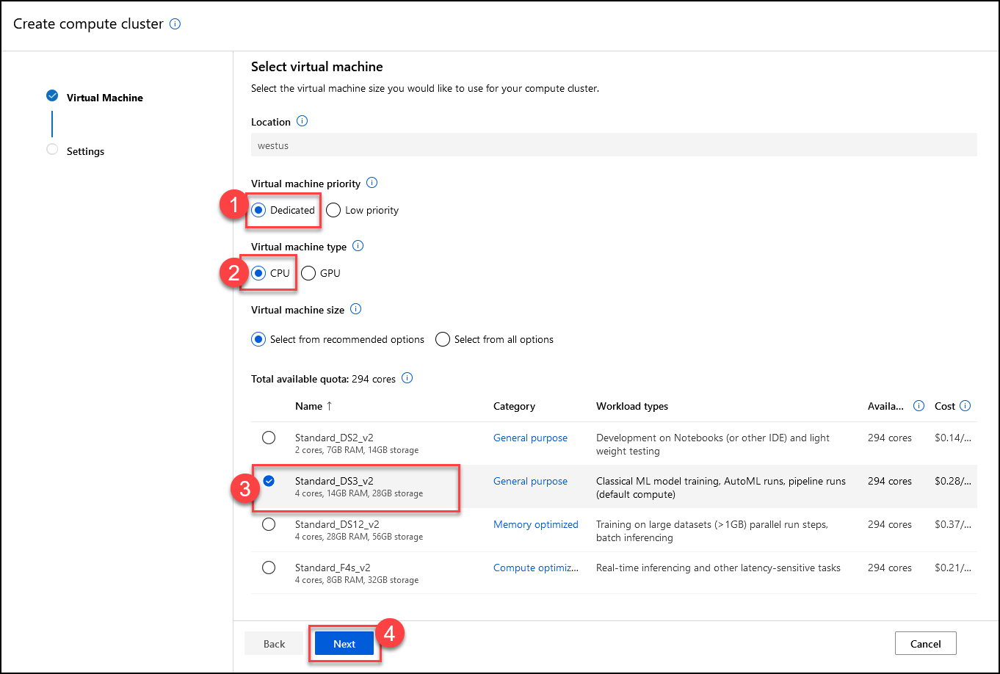

    Select `Next` **(4)** to continue.

5. To configure cluster settings set the values given below:

    - **Compute name (1)**: aml-<inject key="DeploymentID" enableCopy="false"/>
    - **Minimum number od nodes (2)**: 0
    - **Maximum number of nodes (3)**: 4  

    Setting the number of maximum nodes to a higher value will allow Automated ML to run more experiments in parallel but will also increase your costs.

    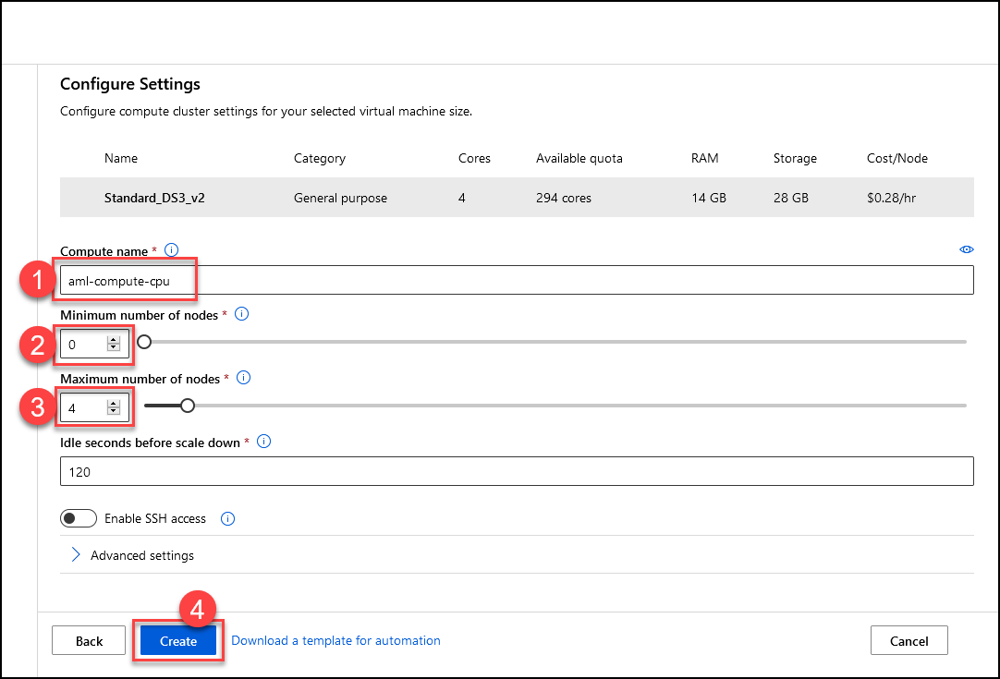

    Select `Create` **(4)** to proceed.

6. Set the experiment name to `COVID19_Classification` **(1)** and Target column to `cluster` **(2)**. The values we're trying to predict are in the `cluster` column. Then for compute type, select `Compute cluster` **(3)**. If your Azure ML compute cluster is not yet selected, make sure `aml-compute-cpu` **(4)** is selected as your compute for the experiment. Select `Next` **(5)** to continue.

    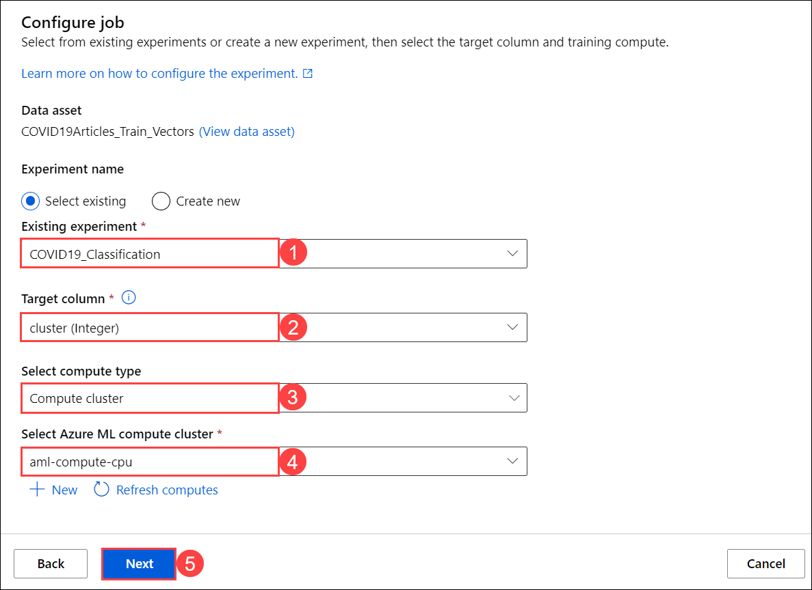

7. On the `Select task and settings` screen, make sure `Classification` **(1)** is selected (confirm with green check). If it is not selected, then select `View additional configuration settings` **(2)** to open a new panel of settings.

    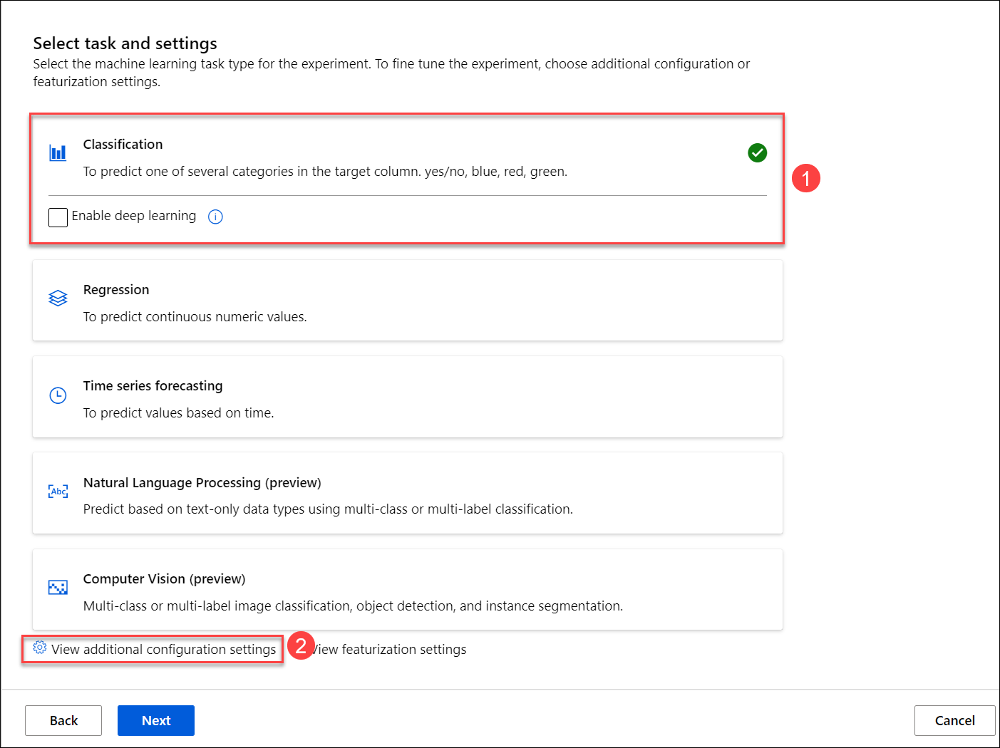

8. On the `Additional configurations` panel, fill in the values listed below:

    - **Primary metric (1)**: AUC weighted
    - Explore **Exit criterion (2)**
    - **Training job time (hours) (3)**: 0.5
    - **Metric score threshold (4)**: 0.95
    - Explore **Concurrency (5)**
    - **Max concurrent iterations (6)**: 4
  
    

    Thanks to the 0.5 hours set for `training job time`, the experiment will stop after 30 minutes to minimize cost. When it comes to `Max concurrent iterations`, Automated ML can try at most four models at the same time, this is also limited by the compute instance's maximum number of nodes.

    Select `Save` **(7)**.
    
9. Now, click on the **Next (1)** button to move on [optional] Validate and test.
 
   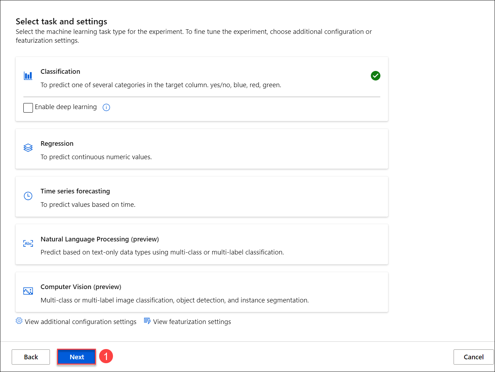

10. On the `Select the validation and test type`, fill in the values listed below:

    - **Validation type (1)**: k-fold cross validation
    - **Number of cross validations (2)**: 5
    - Leave Default for Test dataset (preview)

    Select `Finish` **(3)** to kick off the Automated ML experiment run. If this is the first time you are launching an experiment run in the Azure Machine Learning workspace, the total experiment time will be longer than the `training job time` we have set. This is because of the time needed to start the Compute Cluster and deploy the container images required to execute.

    

11. On the following screen, you will see the progress of your experiment run.

12. Now that you understand the process of launching an AutoML run, let's explore in the next task the results of an already completed AutoML run.

>**Note**: We have already executed in this environment an AutoML run that is very similar to the one you've just launched. This allows you to explore AutoML results without having to wait for the completion of the run.

## Task 6 - Explore AutoML results

1. In the Azure Machine Learning Studio, navigate to the **Jobs (1)** section and locate the **COVID19_Classification** experiment **(2)**. Select the experiment name link.

   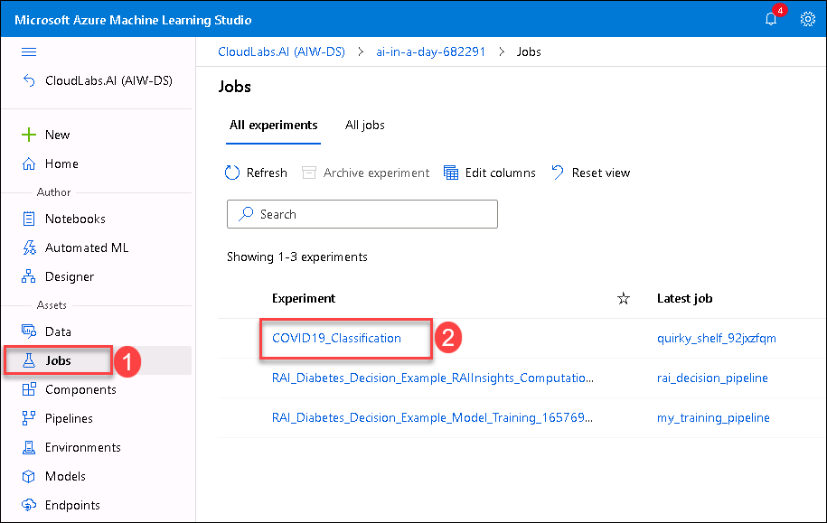

2. You will navigate to the experiment details page, where you should see the list of experiment runs. Locate the first run **(1)** listed here, which has the status **Completed**. The name of the run can be different in your environment and may not match the below screenshot.

   

3. On the **Run details** page, navigate to the **Models (1)** section. Check the values on the  **AUC weighted** column **(2)**, which is the primary metric selected in the AutoML run configuration. See how the best model was selected; this is the one with the maximum metric value. This is also the model for which the explanation was generated. Select **View explanation (3)**.

   

4. On the **Explanations (preview) (1)** section, browse the available explanations **(2)** and investigate the **Model performance (3)** representation.

   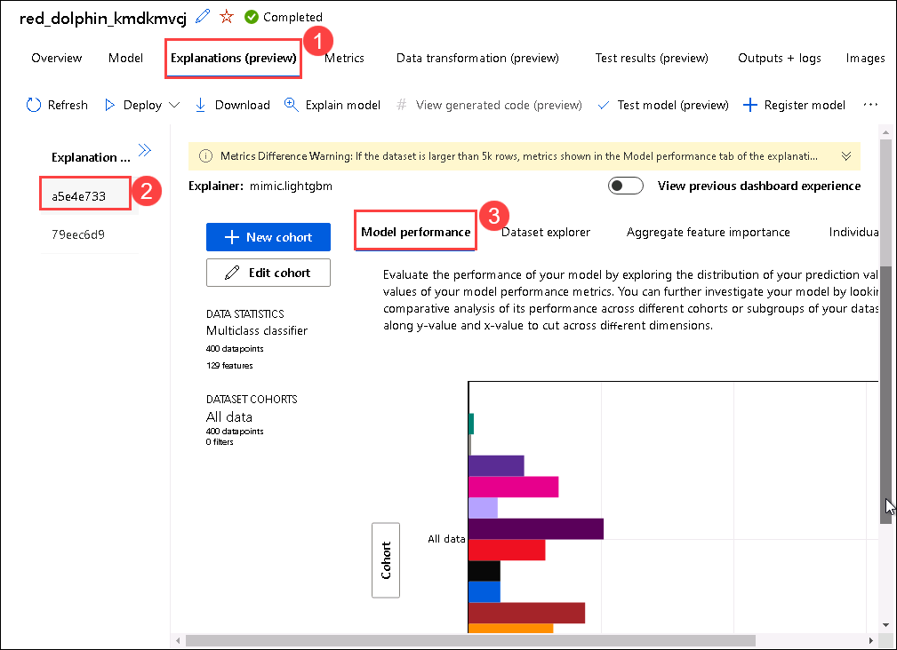

## Task 7 - Generate a Responsible AI dashboard

Responsible AI is a governance framework that documents how a specific organization is addressing the challenges around artificial intelligence (AI) from both an ethical and legal point of view. Resolving ambiguity for where responsibility lies if something goes wrong is an important driver for responsible AI initiatives.

**Principles of responsible AI**: AI and the machine learning models that support it should be comprehensive, explainable, ethical and efficient.

 - Comprehensiveness – comprehensive AI has clearly defined testing and governance criteria to prevent machine learning from being hacked easily.
 - Explainable AI is programmed to describe its purpose, rationale and decision-making process in a way that can be understood by the average end user.
 - Ethical AI initiatives have processes in place to seek out and eliminate bias in machine learning models.
 - Efficient AI is able to run continually and respond quickly to changes in the operational environment.

1. In the Jupyter application, navigate to the given path **\Users\odl_user_<inject key="DeploymentID" enableCopy="false"/>** and open `fairness-dashboard-loan-allocation.ipynb` notebook.

   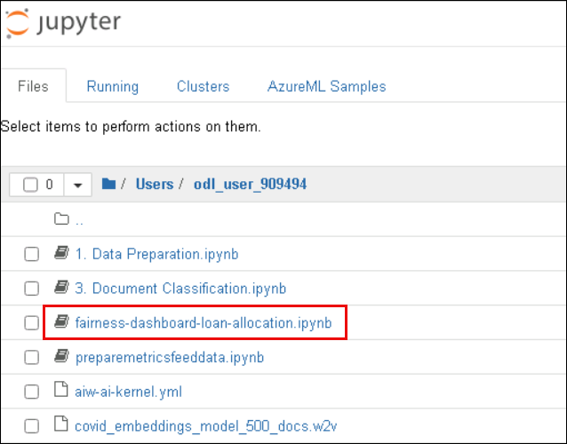
   
2. Once the notebook is opened in the Jupyter application, select **Kernel** **(1)**. Then select **Change kernel** **(2)** and make sure to select **Python (aiw-ai-kernel) **(3)**.

   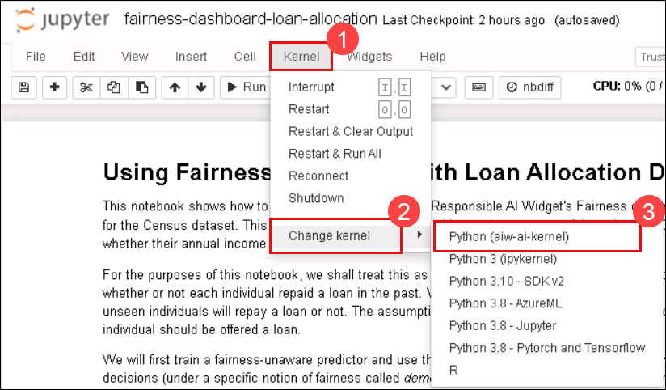

3. Execute the cells inside `fairness-dashboard-loan-allocation.ipynb` notebook one by one (Click on the **Run** button or by using either Ctrl + Enter to stay on the same cell, or Shift + Enter to advance to the next cell or) and observe the results of each cell execution.

   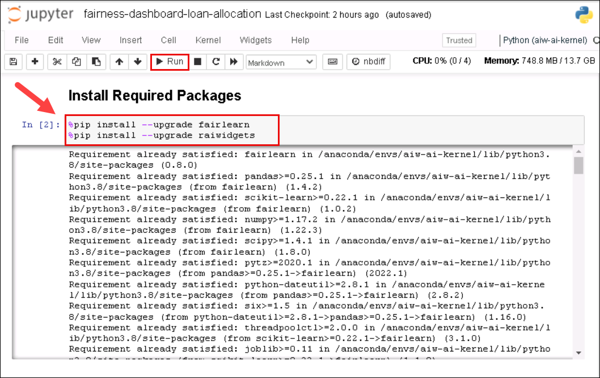
   
4. Please make sure to read the cells carefully and run them one by one. Click on **Endpoint** URL at the end of the notebook before moving the next task.

     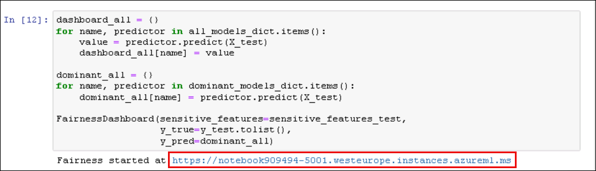

## Task 8 -  Explore the Responsible AI dashboard

1. Once you click on the endpoint, you will be navigated to the Welcome to the Fairness dashboard page in the new tab. You can go through the features mentioned in the page and click on **Get started** to start the assessment.

    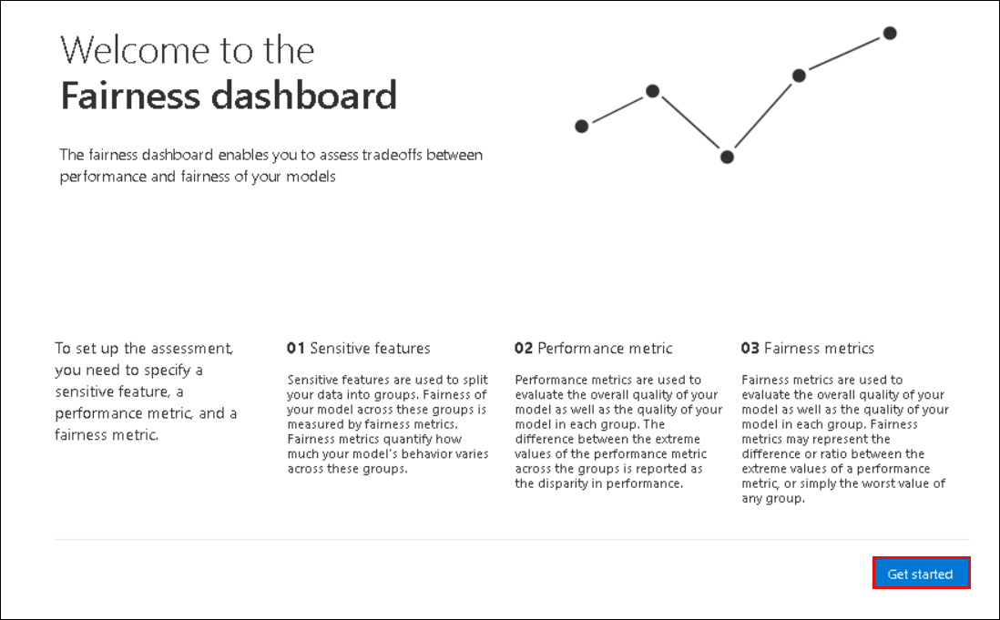
 
1. On the Sensitive features page, select anyone of the available sensitive feature (In this we are selecting sex) and click on **Next**.

    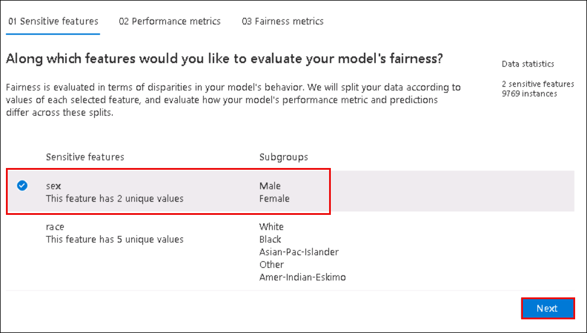

1. On the Performance metrics page, select anyone of the available performance metric from the list (In this we are selecting Accuracy) and click on **Next**.

    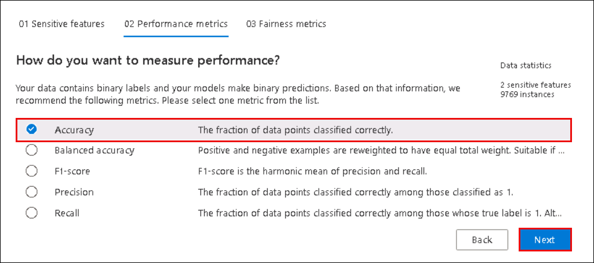

1. On the Fairness metrics page, select anyone of the fairness metric from the list (In this we are selecting Demographic parity difference) and click on **Next**.

    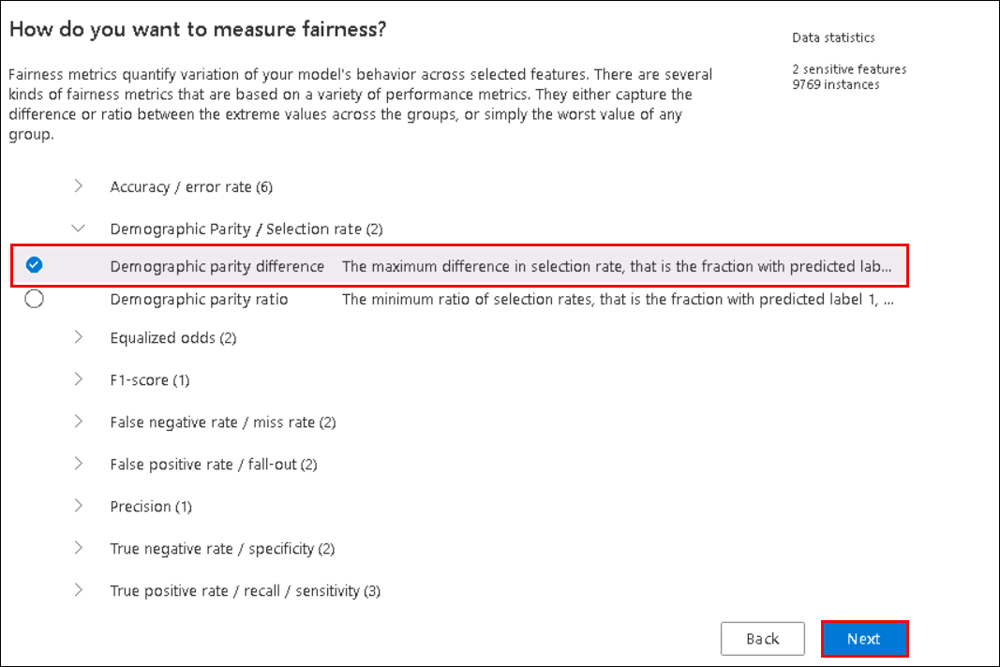

1. You will see the chart of Model comparison assessment and refer the key insights displayed in the same page.

    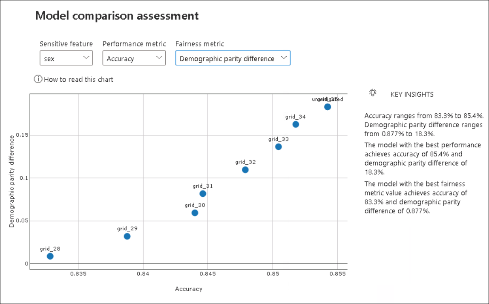

 
