# Lab 1 - Azure Machine Learning Model Training

This lab covers clustering with Azure Machine Learning, Automated ML, and model explainability.

## Task 1 - Explore dashboard of COVID-19 data

Understanding the source datasets is very important in AI and ML. To help you expedite the process, we have created a Power BI dashboard you can use to explore them at the beginning of each lab.

To get more details about the source datasets, check out the [Data Overview](https://github.com/CloudLabsAI-Azure/ai-in-a-day/blob/main/data-overview.md) section.

To explore the dashboard of COVID-19 data, open the `Azure-AI-in-a-Day-Data-Overview` file located on the desktop (**C:\Users\public\desktop**) 💻 of the virtual machine provided with your environment. If you see `Introducing the updated mobile layout` popup screen, then close it by click on `Got it`. Collapse the **Fields** and **Visualizations** tabs to see the clear report.

> **Note:** Please close and reopen the Power BI Desktop document if it throws an error in the first attempt.

 

## Task 2 - Explore lab scenario

Given the magnitude of the COVID-19 problem, it comes naturally to have a lot of research on the topic. In fact, in 2020 alone, tens of thousands of papers have been published on COVID-19 alone. The sheer amount of communication on the subject makes it difficult for a researcher to grasp and structure all the relevant topics and details. Furthermore, pre-defined catalogs and papers classification might not always reflect their content in the most effective way possible.

Based on a set of existing research papers, we will use Natural Language Processing and Machine Learning to identify these papers' natural grouping. For each new document that gets into our system, we will use Machine Learning to classify it into one of the previously identified groups. We will use Automated ML (a feature of Azure Machine Learning) to train the best classification model and explain its behavior.

The following diagram highlights the portion of the general architecture covered by this lab.

The high-level steps covered in the lab are:

- Explore dashboard of COVID-19 data
- Explore lab scenario
- Run word embedding process on natural language content of research papers
- Explore results of word embedding
- Run clustering of research papers and explore results
- Use the newly found clusters to label the research document and run the Auto ML process to train a classifier
- Run the classifier on "new" research papers
- Explain the best model produced by AutoML

## Task 3 - Prepare Azure Machine Learning workspace

1. In the **LabVM**, click on the **Azure Portal** shortcut of Microsoft Edge browser which is created on the desktop 💻.
  
    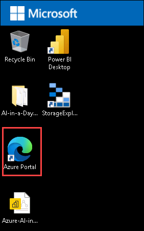
    
1. On the **Sign into Microsoft Azure** tab you will see the login screen, in that enter following **Email/Username** and then click on **Next**. 
   * Email/Username: <inject key="AzureAdUserEmail"></inject>
   
1. Enter the following **Password** and click on **Sign in**. 
   * Password: <inject key="AzureAdUserPassword"></inject>
   
1. If you see the pop-up **Stay Signed in?**, click **No**. Also, if you see a **Save Password** popup, close that.

1. If you see the pop-up **You have free Azure Advisor recommendations!**, close the window to continue the lab.

1. If **Welcome to Microsoft Azure** popup window appears, click **Maybe Later** to skip the tour.

1. Navigate to `All Resources`.

    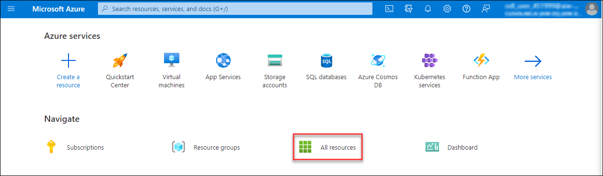
        
1. Locate **Machine Learning** resource **ai-in-a-day-<inject key="DeploymentID" enableCopy="false"/>**, select that.

    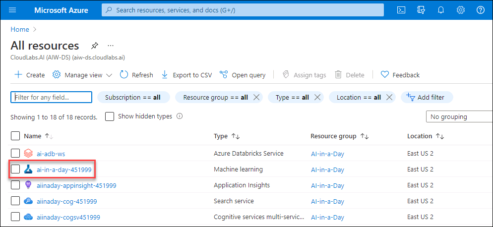
    
1. If you are prompted to sign-in again, use the same lab credentials you used to login to Azure portal. Close the welcome **pop-up** if any with cross icon.  
    
    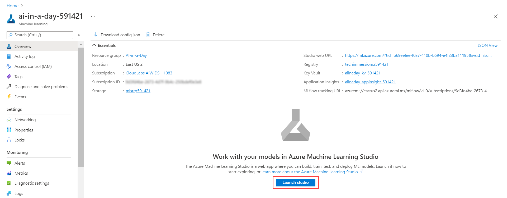

1. In Azure Machine Learning Studio, select `Compute` **(1)** from the left side menu and verify that your compute instance is running **(2)**.
   * Compute instance name: notebook<inject key="DeploymentID" enableCopy="false"/>

    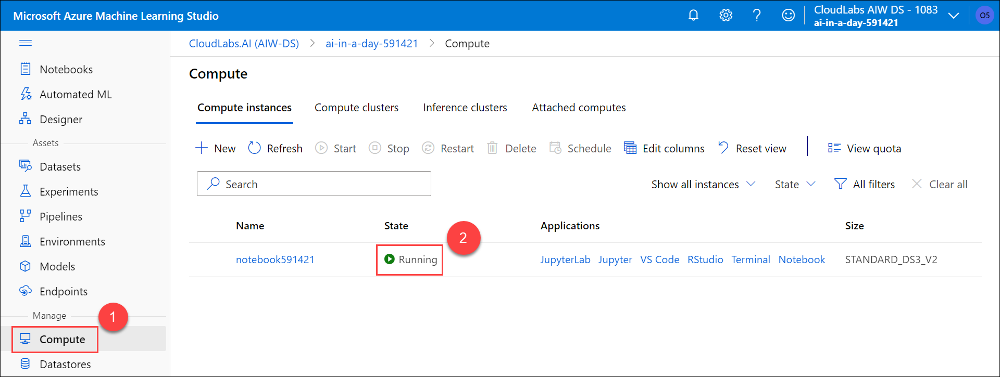

    >**Note**: If you launched Azure Machine Learning Studio right after your lab environment was provisioned, you might find the compute instance in a provisioning state. In this case, wait a few minutes until it changes its status to `Running`.

1. In the Azure Machine Learning Studio under **Compute** (1), open the **Terminal** (2) environment.
    
   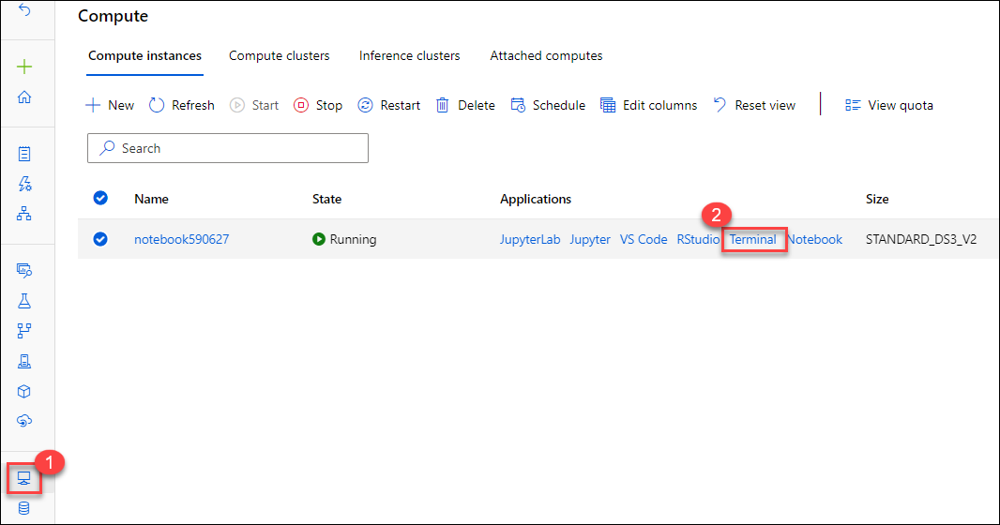
   
1. Run following commands and make sure all commands will execute successfully.

        conda env create -f aiw-ai-kernel.yml
        conda activate aiw-ai-kernel
        ipython kernel install --user --name aiw-ai-kernel --display-name "Python (aiw-ai-kernel)"

   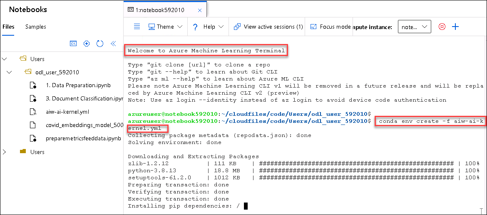
   
   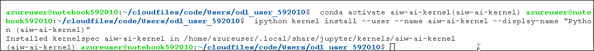

1. From the `Application` section associated with the compute instance, select `Jupyter` **(1)**. 

    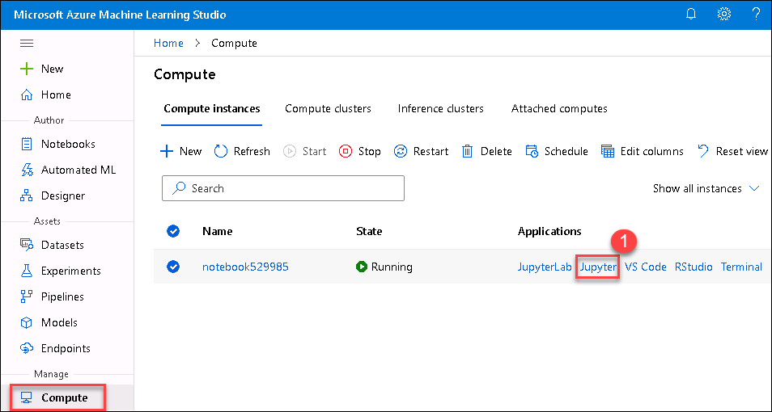

1. If you see **IMPORTANT NOTE: Always use trusted code** then check on **Yes, I Understand** and then click **Continue**.

    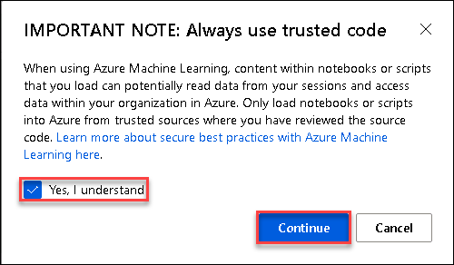
    
## Task 4 - Prepare data for the Machine Learning process

1. In the Azure Machine Learning Studio, open the Jupyter notebook environment. You might get a pop-up of important note, check the box and click on continue.

   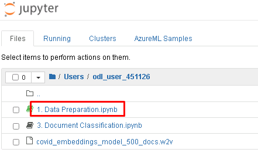
   
2. On Jupiter page, select **Kernel** *(1)*, then **Change kernel** *(2)* and make sure **Python (aiw-ai-kernel)** *(3)* is selected.

   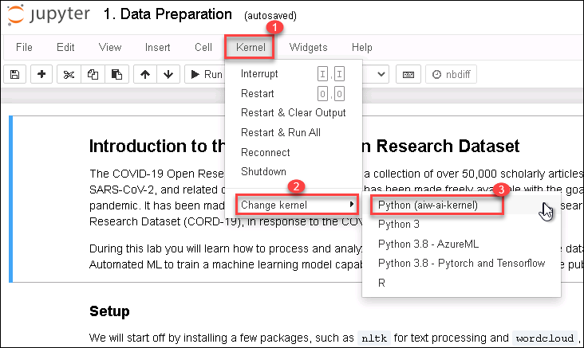

3.  Open `1. Data Preparation.ipynb` notebook and execute the cells one by one (Click on 'Run' button or by using either Ctrl + Enter to stay on the same cell, or Shift + Enter to advance to the next cell or ) and observe the results of each cell execution.

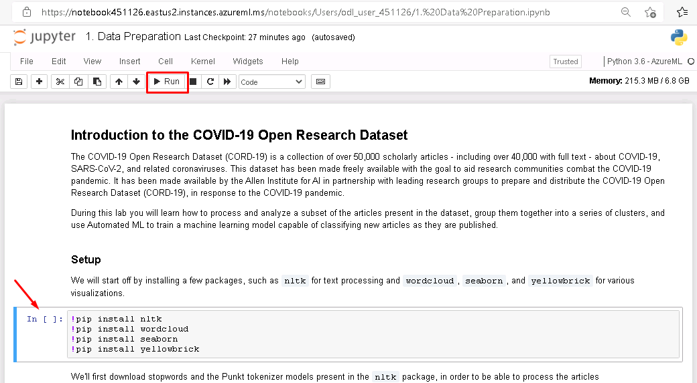
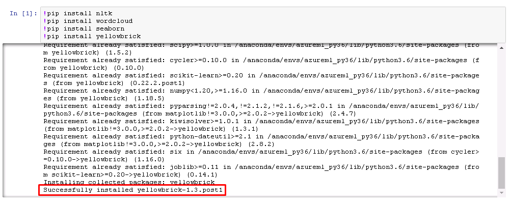

## Task 5 - Train a Machine Learning model with Automated ML

In this task, we'll use Azure Automated ML to train a machine learning model capable of determining the best cluster for a COVID-19 scientific article. It builds upon the work done in the Data Preparation notebook.

1. In the Azure Machine Learning studio, switch to the `Automated ML` **(1)** section and select `+ New Automated ML run` **(2)** to start the Automated ML.

    

2. In the `Create a new Automated ML run` wizard pick `COVID19Articles_Train_Vectors` **(1)** as your dataset and select `Next` **(2)** to proceed.

    

3. In order to be able to launch an Automated ML run we need to provision a Azure ML compute cluster. On the `Configure run` step select `aml-compute-cpu` **(1)** from the list of clusters. If the list is empty select `+ New` **(2)** link.

    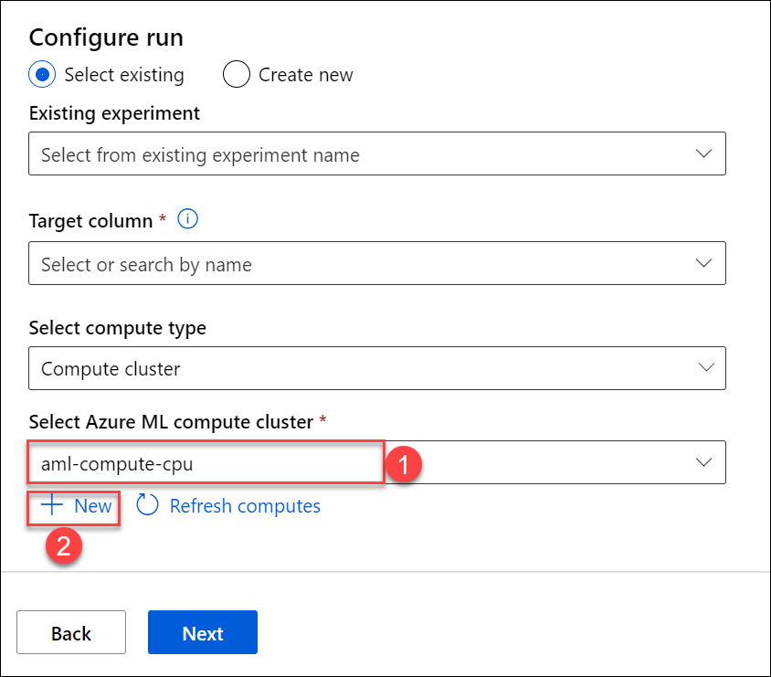

    > **Note:** If you already have `aml-compute-cpu` cluster provisioned, feel free to skip to step 6.

4. On the `Create compute cluster` screen set the values listed below:

    - **Virtual machine priority (1)**: Dedicated
    - **Virtual machine type (2)**: CPU
    - **Virtual machine Size (3)**: Standard_DS3_v2

    

    Select `Next` **(4)** to continue.

5. To configure cluster settings set the values given below:

    - **Compute name (1)**: aml-<inject key="DeploymentID" enableCopy="false"/>
    - **Minimum number od nodes (2)**: 0
    - **Maximum number of nodes (3)**: 4  

    Setting the number of maximum nodes to a higher value will allow Automated ML to run more experiments in parallel, but will also increase your costs

    

    Select `Create` **(4)** to proceed.

6. Set the experiment name to `COVID19_Classification` **(1)** and Target column to `cluster` **(2)**. The values we're trying to predict are in the `cluster` column. Then for compute type select `Compute cluster` **(3)**. If your Azure ML compute cluster is not yet selected, make sure `aml-compute-cpu` **(4)** is selected as your compute for the experiment. Select `Next` **(5)** to continue.

    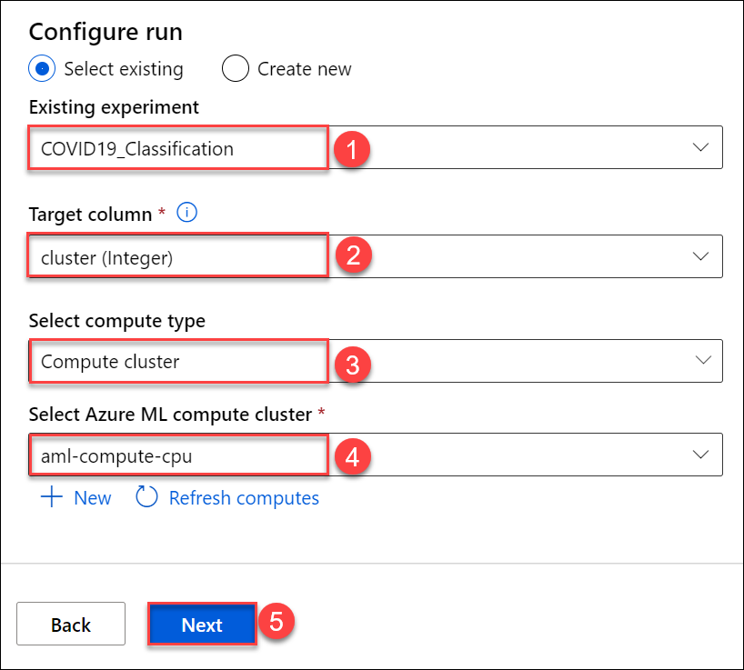

7. On the `Select task and settings` screen, make sure `Classification` **(1)** is selected (confirm with green check), if it is not selected and then select `View additional configuration settings` **(2)** to open a new panel of settings.

    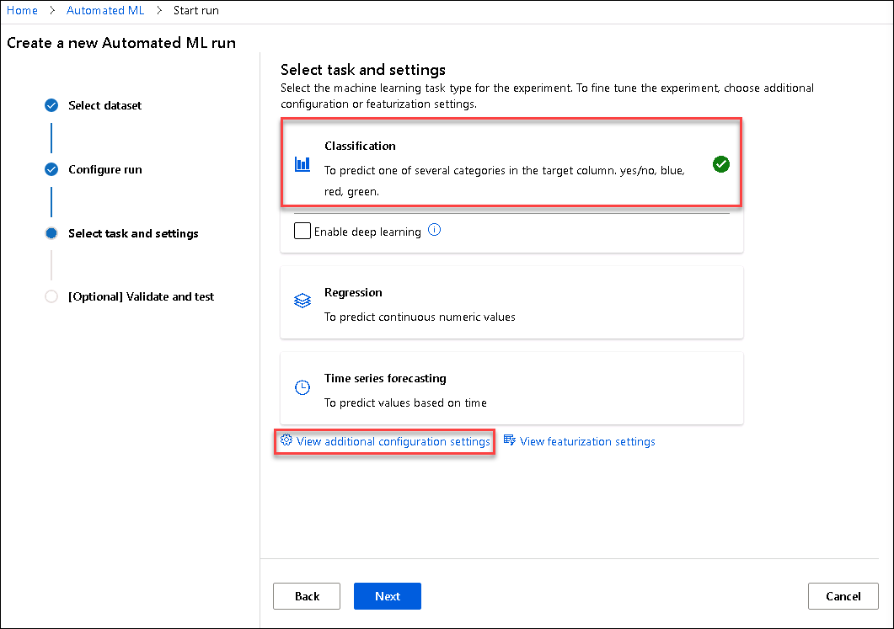

8. On the `Additional configurations` panel, fill in the values listed below:

    - **Primary metric (1)**: AUC weighted
    - Explore **Exit criterion (2)**
    - **Training job time (hours) (3)**: 0.5
    - **Metric score threshold (4)**: 0.95
    - Explore **Concurrency (5)**
    - **Max concurrent iterations (6)**: 4
  
    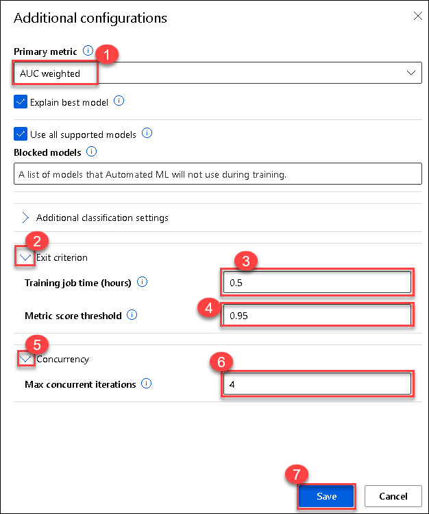

    Thanks to the 0.5 hours set for `training job time`, the experiment will stop after 30 minutes to minimize cost. When it comes to `Max concurrent iterations`, Automated ML can try at most four models at the same time, this is also limited by the compute instance's maximum number of nodes.

    Select `Save` **(7)**.
    
9. Now click on the **Next** button to move on [optional] Validate and test.
 
   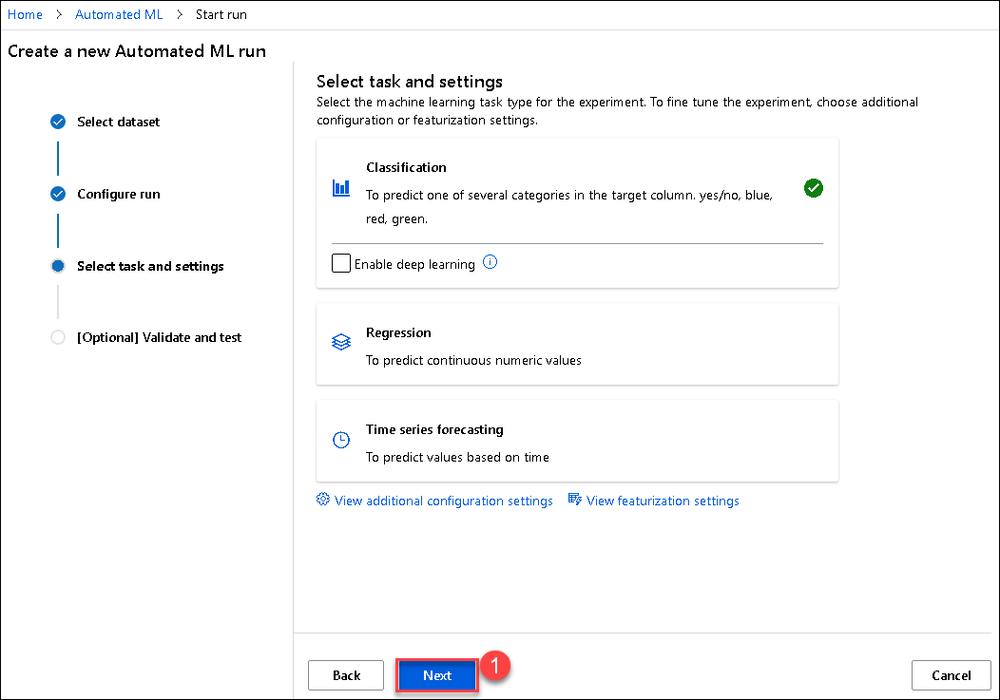

10. On the `Select the validation and test type`, fill in the values listed below:

    - **Validation type (1)**: k-fold cross validation
    - **Number of cross validations (2)**: 5
    - Leave Default for Test dataset (preview)

    Select `Finish` **(3)** to kick off the Automated ML experiment run. If this is the first time you are launching an experiment run in the Azure Machine Learning workspace, the total experiment time will longer than the `training job time` we have set. This is because of the time needed to start the Compute Cluster and deploy the container images required to execute.

    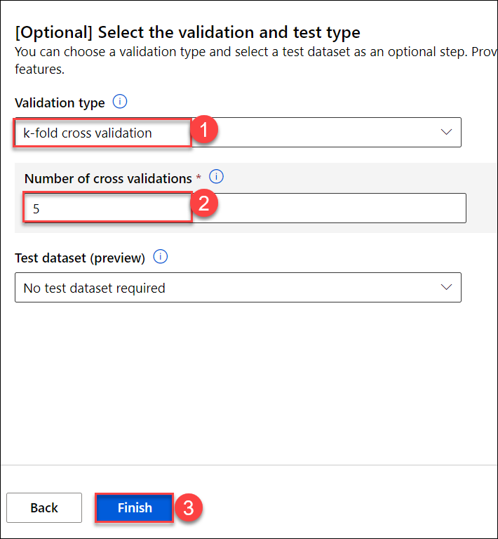

11. On the following screen, you will see the progress of your experiment run.

12. Now that you understand the process of launching an AutoML run, let's explore in the next task the results of an already completed AutoML run.

>**Note**: We have already executed in this environment an AutoML run that is very similar to the one that you've just launched. This allows you to explore AutoML results without having to wait for the completion of the run.

## Task 6 - Explore AutoML results

1. In the Azure Machine Learning Studio, navigate to the **Experiments (1)** section and locate the **COVID19_Classification** experiment **(2)**. Select the experiment name link.

    

2. You will navigate to the experiment details page where you should see the list of experiment runs. Locate the first run **(1)** listed here, the one that has the status **Completed**. Name of the run can be diffent in your environment and may not match with below screesnshot.

    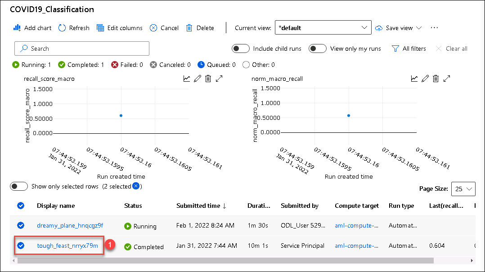

3. On the **Run details** page, navigate to the **Models (1)** section. Check the values on the  **AUC weighted** column **(2)**, which is the primary metric selected in the AutoML run configuration. See how the best model was selected, this is the one with the maximum metric value. This is also the model for which the explanation was generated. Select **View explanation (3)**.

    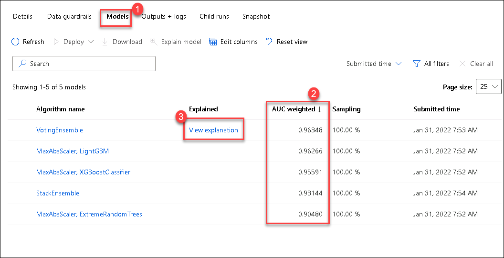

4. On the **Explanations (1)** section, browse  the available explanations **(2)** and investigate the **Model performance (3)** representation.

    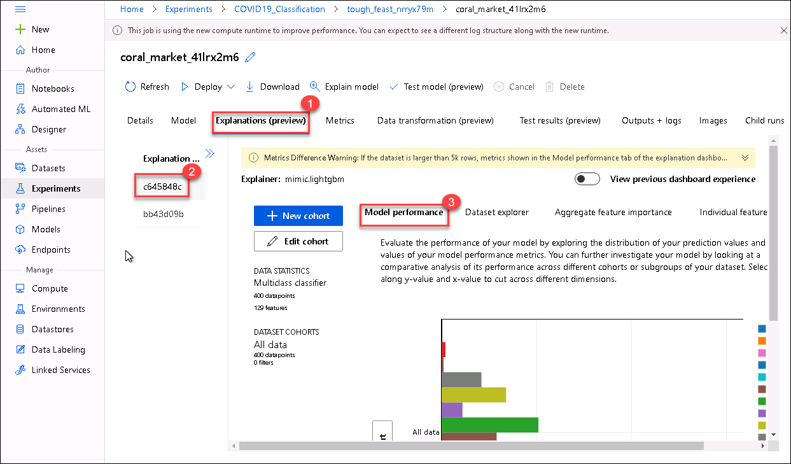

