# Lab 2 - Knowledge Mining with Azure Cognitive Search and Text Analytics

This lab covers Azure Cognitive Services, particularly [Azure Cognitive Search](https://azure.microsoft.com/services/search/) and the [Form Recognizer](https://azure.microsoft.com/services/cognitive-services/form-recognizer/) service.

## Task 1 - Explore dashboard of COVID-19 data

Understanding the source datasets is very important in AI and ML. To help you expedite the process, we have created a Power BI dashboard you can use to explore them at the begining of each lab.


To get more details about the source datasets, check out the [Data Overview](https://github.com/CloudLabsAI-Azure/ai-in-a-day/blob/main/data-overview.md) section.

To explore the dashboard of COVID-19 data, open the `Azure-AI-in-a-Day-Data-Overview` file located on the desktop (**C:\Users\public\desktop**) 💻 of the virtual machine provided with your environment. If you see `Introducing the updated mobile layout` popup screen, then close it by click on `Got it`. Collapse the **Fields** and **Visualizations** tabs to see the clear report.

 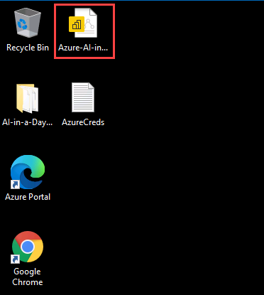

> **Note:** Please close and reopen the Power BI Desktop document if it throws an error in the first attempt.

## Task 2 - Explore lab scenario

Another critical problem to deal with when it comes to the volumes of research documents covering COVID-19 is the problem of advanced indexing and searching their content. The specific internal structure of research papers (including citations, contributors, and various entities like diagnosis, forms of examination, family relations, genes, medication, symptom or signs, and treatments) form a reach semantic graph that goes way beyond simple document categorization. An analyst would benefit significantly from exploring the corpus of documents in a way that takes all these complex relationships into account.

Using the Cognitive Search capabilities, we will create a complex index of documents that allows an analyst to perform an advanced search and explore the inter-document graph relationships.

The following diagram highlights the portion of the general architecture covered by this lab.


The high-level steps covered in the lab are:

- Explore dashboard of COVID-19 data
- Explore lab scenario
- Explore document search process
- Explore graph search process
- Add a set of new documents and trigger the index update process
- Explore the document and graph search and identify updated results

## Task 3 - Creating Azure Search Indexes

1. Navigate to [the Azure portal](https://portal.azure.com) and log in with your credentials.  Then, select **Resource groups**.

    

2. Select the **AI-in-a-Day** resource group.

3. Select the Search service resource.

    

4. Copy the search service URL and paste this into a text file.  Also make note of the service account name, which comes before `.search.windows.net`.

    

5. Navigate to the Keys setting and copy the Primary admin key. Paste this into a text file.

    

6. Download the `schemas.zip` from https://github.com/CloudLabsAI-Azure/ai-in-a-day/raw/main/03-knowledge-mining/schemas.zip. Unzip `schemas.zip`.  There are six files, three prefixed with `abstracts` and three with `covid19temp`.  Save these to a directory such as `C:\Temp\AzureSearch\`.

7. Open the `abstracts_datasource.schema` file with a text editor and replace the segment starting `<< TODO:` with **<inject key="storageAccountConnectionString" enableCopy="true"/>** and then save the file.  Do the same for `covid19temp_datasource.schema`.

    

8. Open a new PowerShell prompt.  Enter the following code, which will create an Azure Search data source, index, and indexer.

    ```powershell
    cd C:\Temp\AzureSearch\
    function Create-AzureSearchIndex {
        param
        (
            [string]$DataSourceFilePath,
            [string]$IndexFilePath,
            [string]$IndexerFilePath,
            [string]$AccountName,
            [string]$ApiKey
        )
        
        $Header = @{
            "api-key" = $ApiKey
        }
        $BaseUri = "https://" + $AccountName + ".search.windows.net"
        
        # Create Data Source
        $Uri = $BaseUri + "/datasources?api-version=2020-06-30"
        Invoke-RestMethod -Method Post -Uri $Uri -Header $header -ContentType "application/json" -InFile $DataSourceFilePath
        
        # Create Index
        $Uri = $BaseUri + "/indexes?api-version=2020-06-30"
        Invoke-RestMethod -Method Post -Uri $Uri -Header $header -ContentType "application/json" -InFile $IndexFilePath
        
        # Create Indexer
        $Uri = $BaseUri + "/indexers?api-version=2020-06-30"
        Invoke-RestMethod -Method Post -Uri $Uri -Header $header -ContentType "application/json" -InFile $IndexerFilePath
    }
    ```

    

9. In the same PowerShell prompt, call this function for the `abstracts` index and for the `covid19temp` index.  Then, fill in your Azure Search account name and Azure Search API key.
    - Azure Search Account Name: **aiinaday-cog-<inject key="DeploymentID" enableCopy="false"/>**
    - Azure Search API key: You saved Primary admin key in text editor in step 7, use that

    ```powershell
    Create-AzureSearchIndex "C:/Temp/AzureSearch/abstracts_datasource.schema" "C:/Temp/AzureSearch/abstracts.schema" "C:/Temp/AzureSearch/abstracts_indexer.schema" "AZURE SEARCH ACCOUNT NAME" "API KEY"

    Create-AzureSearchIndex "C:/Temp/AzureSearch/covid19temp_datasource.schema" "C:/Temp/AzureSearch/covid19temp.schema" "C:/Temp/AzureSearch/covid19temp_indexer.schema" "AZURE SEARCH ACCOUNT NAME" "API KEY"
    ```

    

## Task 4 - Querying Azure Search Indexes

1. Navigate to [the Azure portal](https://portal.azure.com) and log in with your credentials.  Then, select **Resource groups**.

    

2. Select the **AI-in-a-Day** resource group.

3. Select the Search service.

    

4. Select the **Indexes** tab and ensure that you have two indexes created.  If the Document Count is 0 for either, wait a couple of minutes and select **Refresh** until the document count appears.

    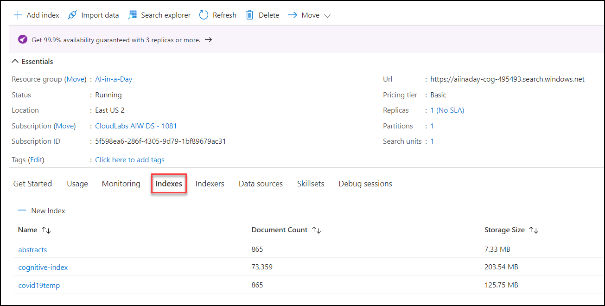

5. Once documents are available, select **Search Explorer** to open up the Search Explorer.

    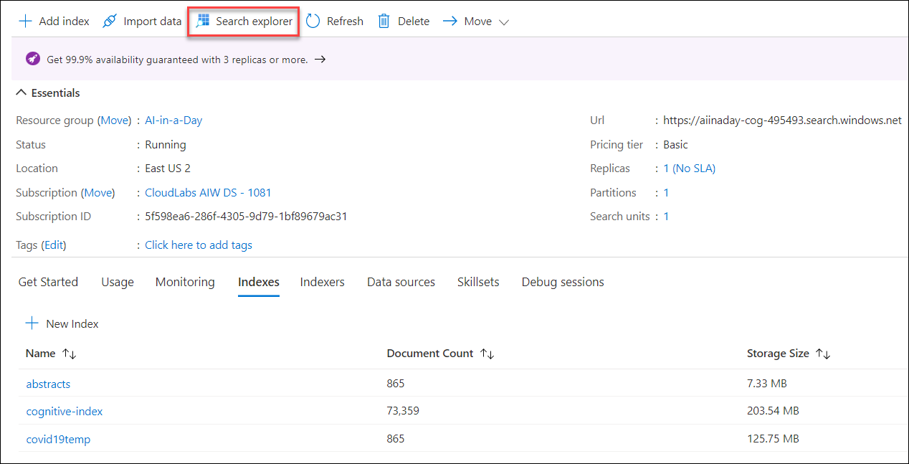

6. Choose the **covid19temp** index and enter `RNA interference` into the Query string input box, and then select **Search**.  This will return the documents which include the phrase "RNA interference."

    

7. We can also see how many articles match a certain search string.  In the Query string input box, enter the phrase `Brazil&$count=true` and then select **Search**.  This will return 53 documents.

    

8. Each document returns a large number of fields, but we can specify the fields we would like to see.  In the Query string input box, enter the phrase `UNC Chapel Hill&$select=metadata/authors, metadata/title` and then select **Search**.  This will return the title as well as detailed information on each author.

    

9. The Azure Search service can also generate a demo application.  Return to the search service and select the **covid19temp** index.

    

10. Select the **Create Demo App** option.

    

11. On the first tab select `metadata.title` for the Title and `abstract.text` for the Description.  Then select **Create Demo App**.  After the prompt, select **Download** to download an HTML file named `AzSearch.html`.

    

12. Open the demo app HTML file.  In the search box, enter the phrase "RNA interference" and select the Search icon.  This will return 497 papers relating to RNA interference.

    

## Task 5 - Updating Azure Search Indexes

1. On the desktop select the Azure Storage Explorer.  

    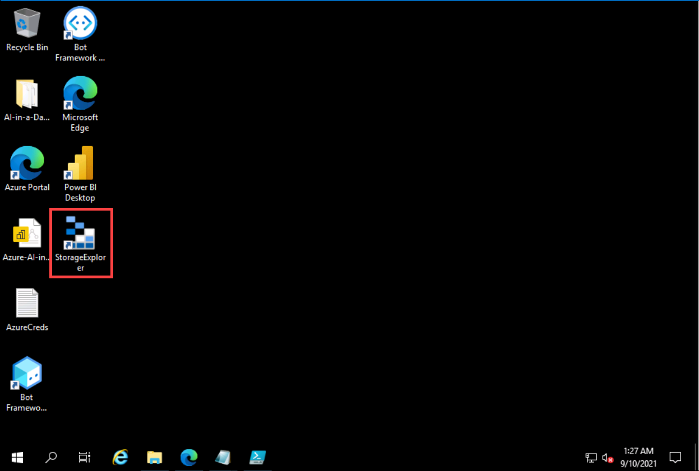

2. Select the **Connect** option and then click on **Storage account or service**.

    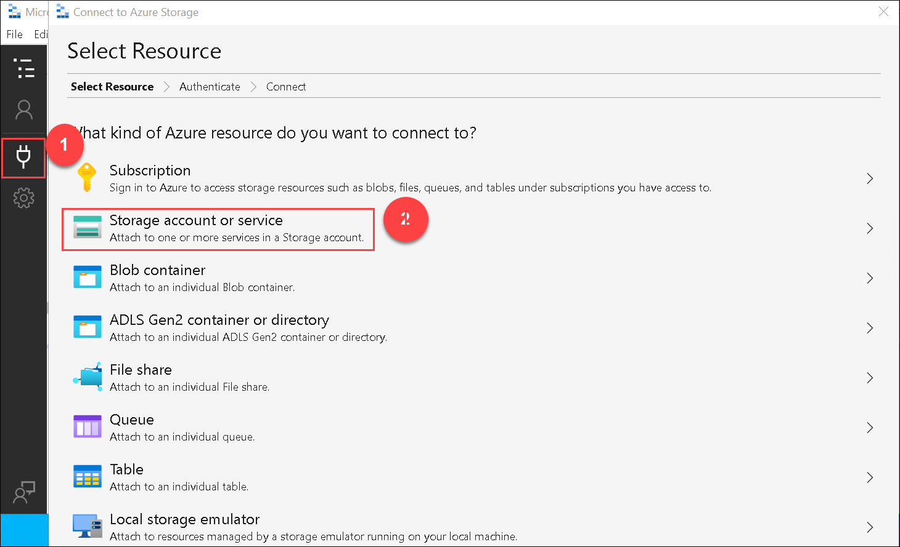

3. Select **Connection String(Key or SAS)** under Select Connection Method Window and then select **Next**

    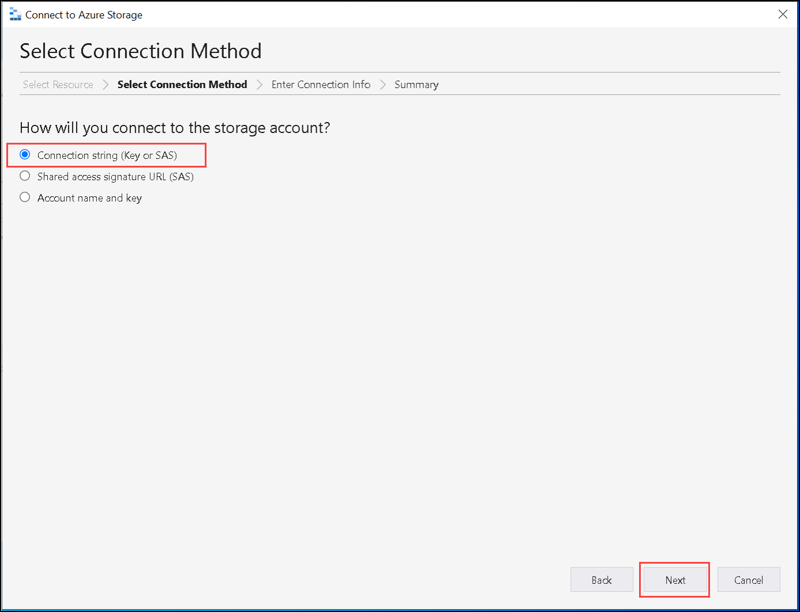

4. Enter **lab03** as the Display name and paste in your storage account connection string **<inject key="storageAccountConnectionString" enableCopy="true"/>**.  Then, select **Next** to continue and **Connect** to complete the operation.

    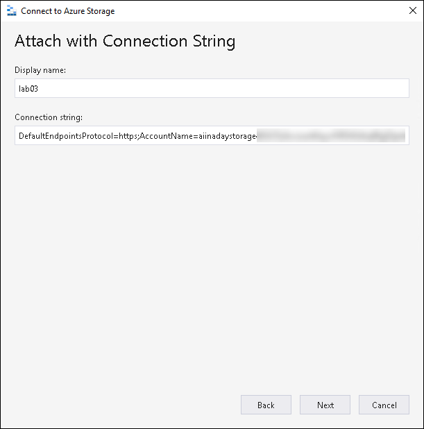

    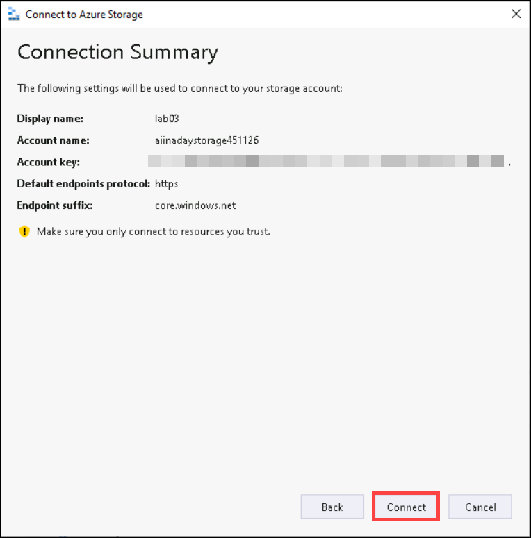

5. In Azure Storage Explorer, navigate down the **(1)  lab03** attached storage and expand **(2) Blob containers** select the **(3) `covid19temp` blob container**.  Double-click the **(4)  comm_use_subset** to enter that folder.

    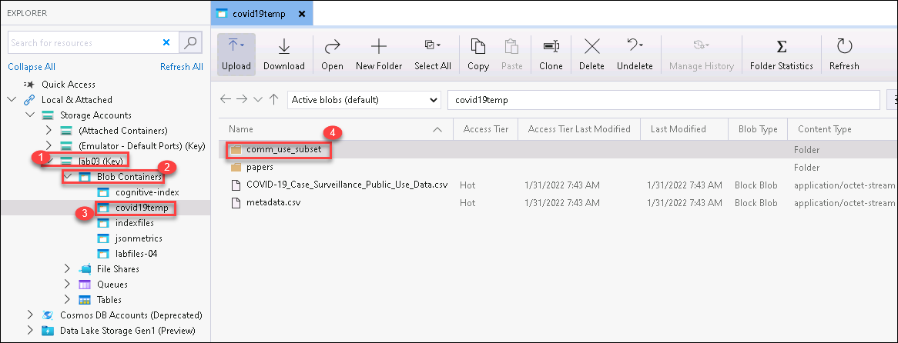

6. Enter the **pdf_json_refresh** folder.  Then, in the **(1) Select All** menu, choose **Select All Cached**.  This will highlight all 100 records in the folder.  Select **Copy** to copy these documents.

    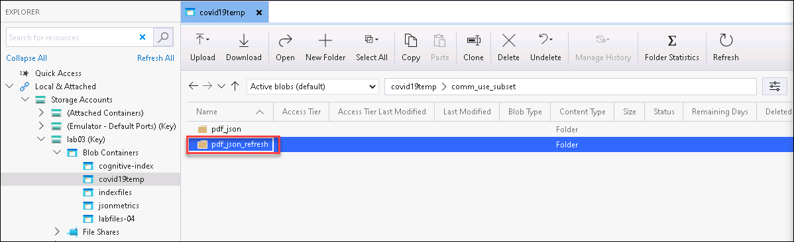
    
    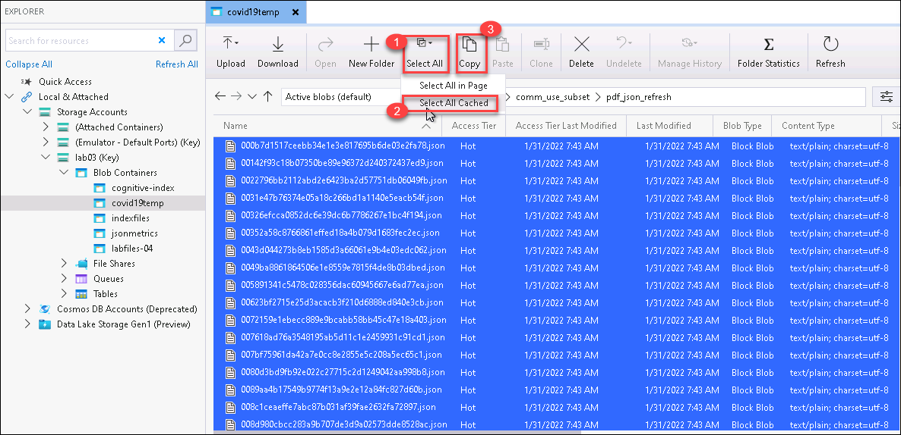

7. Navigate up to **comm_use_subset** by selecting the upward arrow and then double-click **pdf_json**.  Inside this folder, select **Paste (2)** to paste the 100 documents into the **pdf_json** folder.  When it finishes, you should have **965 total documents (3)** .

    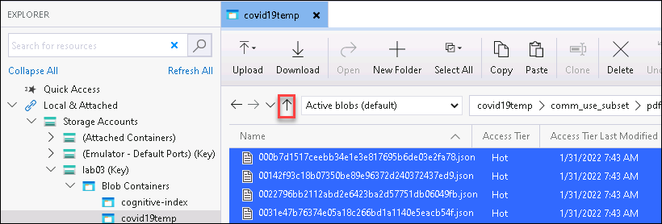

    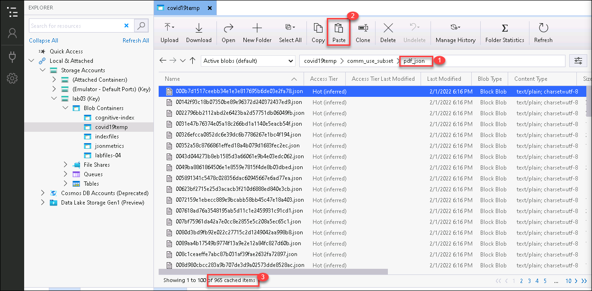

8. Navigate to [the Azure portal](https://portal.azure.com) and log in with your credentials, if not loggedin already.  Then, select **Resource groups**.

    

9. Select the **AI-in-a-Day** resource group.

10. Select the Search service.

    

11. Navigate to the **Indexers** section and select the **covid19temp** indexer.

    

12. Select the **Run** option to process the 100 documents.  Although we can configure an indexer to run periodically, this indexer will only run when manually engaged.  Select **Yes** to run the indexer.

    

13. The indexer will run.  It should complete within 15-30 seconds to process the 100 new documents.  You may need to select **Refresh** to see the indexer's progress.

    

14. Return to the **Indexes** tab for the Search service and ensure that the **covid19temp** index has 965 documents.  If it still reads 865, wait 30 seconds and select **Refresh** to check again.

    

15. Select the **covid19temp** index to return to the Search explorer.  When we had 865 documents, 53 of them pertained to Brazil.  We can confirm that this update was successful by entering `Brazil&$count=true` and selecting **Search**.  This will now return 57 results instead of the prior 53.

    

## Task 6 - Using the Form Recognizer

1. Navigate to [the Azure portal](https://portal.azure.com) and log in with your credentials.  Then, select **Resource groups**.

    

2. Select the **AI-in-a-Day** resource group.

3. Select the Storage account.

    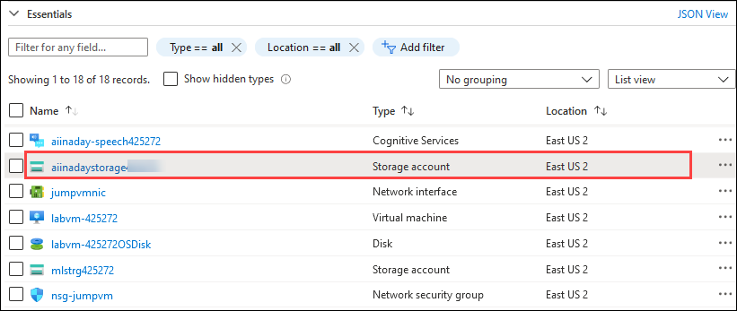

4. Under **Settings** navigate to the **Resource sharing(CORS)** page. Ensure that you are on the **Blob service** tab and then enter the following values into the table.

    

   | Parameter                   | Value                                |
   | --------------------------- | -------------------------------------|
   | Allowed origins             | Enter `*`                            |
   | Allowed methods             | Select all of the available methods. |
   | Allowed headers             | Enter `*`                            |
   | Exposed headers             | Enter `content-length`               |
   | Max age                     | Enter `200`                          |

   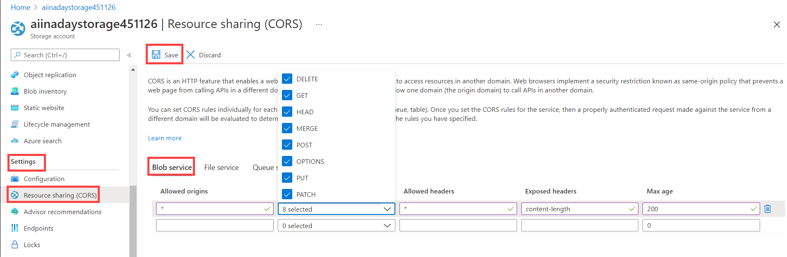

5. Select **Save** to save the CORS settings.

6.  Open Azure Storage Explorer and navigate to **lab03**, and then to **Blob Containers**.  Right-click on **covid19temp** and select the **Get Shared Access Signature...** option.

    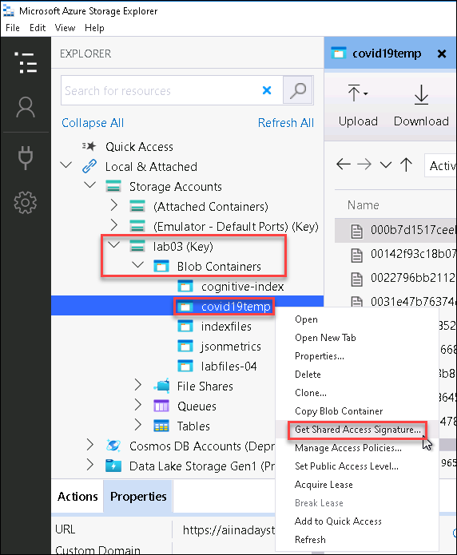

7. Change the **Expiry time** to the year 2099, select all of the possible permissions, and then select **Create** to create a Shared Access Signature.

    

8. Copy the Shared Access Signature URI to a text file and then select **Close**.

    

9. Return to Azure Portal page with your storage account.  Navigate back to the **AI-in-a-Day** resource group and select the Cognitive services multi-service account **aiinaday-cogsv<inject key="DeploymentID" enableCopy="false"/>**.

    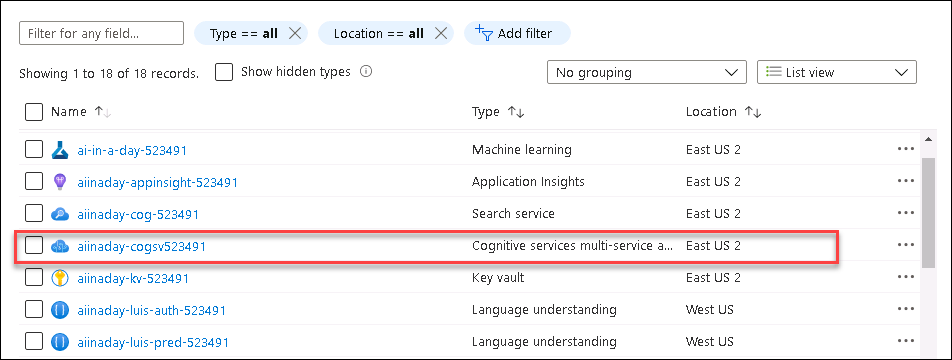

10. Select the **Keys and Endpoint** option under Resource Management.  Then, copy the value for **KEY 1** and the **Endpoint**.  Paste these into a text file.

    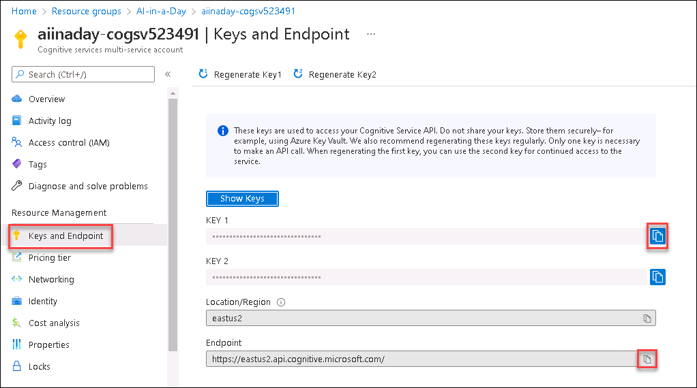

11. Click [here](https://github.com/CloudLabsAI-Azure/ai-in-a-day/raw/main/03-knowledge-mining/pdf/2020.09.25.20201616v1.pdf) to download the pdf file named `2020.09.25.20201616v1.pdf` for this lab. Save this to a directory such as `C:\Temp\AzureSearch\`.

> **Note!** : You can follow this link to download the file. (https://github.com/CloudLabsAI-Azure/ai-in-a-day/raw/main/03-knowledge-mining/pdf/2020.09.25.20201616v1.pdf)

12. Navigate to the Form OCR Testing Tool (https://fott-preview.azurewebsites.net/) an Azure-hosted website for form recognition.  Select the **Connections** option and then choose **+** to create a new connection.  Fill in the parameters as in the table below and then select **Save Connection**.

    | Parameter                   | Value                                |
    | --------------------------- | -------------------------------------|
    | Display name                | Enter `papers`                       |
    | Description                 | Leave blank                          |
    | Provider                    | Select `Azure blob container`        |
    | SAS URI                     | Paste your Azure SAS URI             |

    

13. Return to the home screen.  Select **Use Custom to Train a model with labels and get key value pairs**.  This will pop up a dialog.  Choose **New Project** to create a new project.
  
    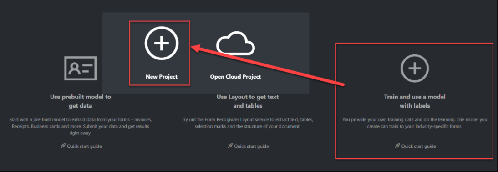

14. Enter the following values for your project.  Then, select **Save Project**.

    | Parameter                   | Value                                |
    | --------------------------- | -------------------------------------|
    | Display name                | Enter `covid19abstract`              |
    | Security token              | Select `Generate New Security Token` |
    | Source connection           | Select `papers`                      |
    | Folder path                 | Enter `papers`                       |
    | Form recognizer service URI | Enter your Cognitive Services service URI (endpoint) |
    | API key                     | Enter your Cognitive Services API key |
    | API version                 | Leave at the default value           |
    | Description                 | Leave blank                          |

    

15. After creating a new project, you will be sent to the project for tagging.  In the **Tags** section, select **+** to create a new tag, which we will call `Abstract`.

    

16. Wait for the layout to be run for the first document and locate the document's abstract.  Note that for some documents, the abstract is on the second page.  Then, move on to the next document.  We will tag each of the five papers, so navigate to each in turn, allowing the layout to be run.  In order for tagging to be successful, we must first run the layout of a document, navigate to another document, and return to this first document before we begin tagging.  Layout generation happens once per document, after which point we can return to it and tag our abstract.

    

17. Return to the second PDF and select each word in the **Abstract** section.  After highlighting this, select the **Abstract** tag to tag this section.  Note that you will need to select each word individually rather than selecting a box.  After selecting the **Abstract** tag, you should see a tag logo next to the PDF.  If you see the tag logo, this means that tagging was successful for this document.

    

18. Return to the first PDF and highlight the word **ABSTRACT** as well as the abstract.  If the abstract is lengthy, as in this example, it is okay to include just the first paragraph.  Then, select the **Abstract** tag to tag this document.  Ensure that the viewed icon (an eye) changes to a tag icon.  If it does not change to a tag but instead changes to a blank spot without any icons, tagging was unsuccessful.  In the event that tagging is unsuccessful, select another document, wait for it to have its layout run, and then return to the prior document and try tagging again.

    

19. Continue tagging until all five of the top papers are tagged.

    

20. Once we have tagged five documents, select the **Train** menu option, enter `Abstracts` as the model name, and select the **Train** option.

    

21. After the model has finished training, we will see results.  Although the estimated accuracy is not great, we will use this model.

    

22. Return to the **Tags Editor** and select a new document, one you have not already tagged.  After the layout has been run, navigate to the **Actions** menu and select **Auto-label the current document**.

    

23. We will see the results of auto-labeling and an estimated likelihood of success.  Furthermore, the document has an auto-labeled icon next to it.  If this is good enough, we can continue.

    

24. In this case, auto-labeling was okay but missed a few words.  We can select all of the words in the abstract and then select the **Abstract** label.  This will show a new icon, representing an auto-labeled document with manual corrections.

    

25. We can update our model by returning to the **Train** page and re-training the `Abstracts` model.  The resulting estimated accuracy is slightly lower, but there is now another document available to improve model quality.  In this case, estimated accuracy is misleading.

    

26. After training the new model, select the **Analyze** menu option.  Select **Browse** and navigate to `C:\Temp\AzureSearch\` and select `2020.09.25.20201616v1.pdf`.  Select **Run Analysis** to see the results.  Note that the abstract is on page 2 of the PDF.

    

27. Select **Download** to download a Python script.  We will use this script in the next task.  Find the location where the script was downloaded and move it to `C:\Temp\AzureSearch\`.

    
    
> **Note! :** If you get a warning while downloading the Python file, select the ellipsis and select "Keep" to download the file. 

   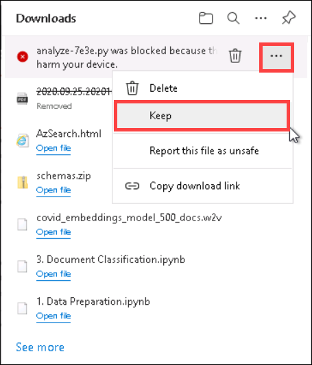

## Task 7 - Indexing a New Abstract

1. Open a command prompt (`cmd.exe`).  To do this, open the Windows menu, type in `cmd`, and select the **Command Prompt** application.

    

2. Run the command `pip install requests`.  To run this, you must have Python installed on the machine.  If `python.exe` is not accessible as part of the path--meaning you get an error when trying to run `pip`, navigate to where Python is installed.  The `pip.exe` program is inside the `\Scripts\` folder.

    

3. Navigate to `C:\Temp\AzureSearch\` in the command prompt by running `cd C:\Temp\AzureSearch\` and then run the analyzer script you downloaded at the end of Task 4.  The command to execute is `python analyze-843d.py 2020.09.25.20201616v1.pdf -o 2020.09.25.20201616v1.json`.  You will need to replace `analyze-843d` with the name of the script you downloaded.

    

4. Inside the `C:\Temp\AzureSearch\` directory, there is a JSON file with the results of this analysis.  The file is fairly large and contains a detailed breakdown of the text analysis.  We will take the abstract text from this JSON file and write it to an Azure Search index.  To do this, open the Windows menu, type in **PowerShell** and select the PowerShell application.

    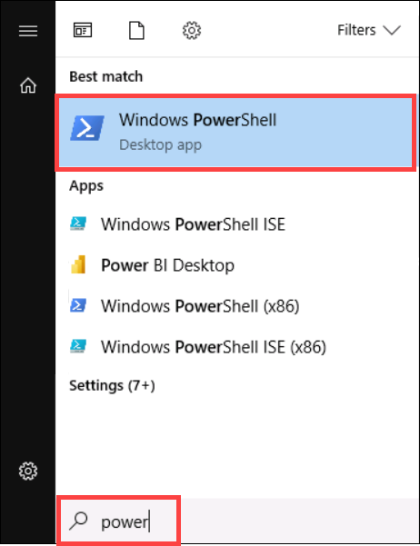

5. Navigate to `C:\Temp\AzureSearch\` by running `cd C:\Temp\AzureSearch\`. Then, create the following function.

    ```powershell
    function Add-Abstract {
        param (
            [string]$AnalysisFile,
            [string]$AccountName,
            [string]$ApiKey
        )
        
        $paper_id = $AnalysisFile.Replace(".","_")
        $doc = Get-Content $AnalysisFile | ConvertFrom-Json
        $txt = $doc.analyzeResult.documentResults.fields.Abstract.valueString
        
        $jsonobj=@{
            value=@(
                @{
                    paper_id=$paper_id
                    abstract=@(@{
                        text=$txt
                        }
                    )
                }
            )
        }
        $json = $jsonobj | ConvertTo-Json -Depth 4
        $json | Out-File -FilePath WriteToIndex.json
        
        Write-Host $json
        
        $Header = @{
            "api-key" = $ApiKey
        }
        $Uri = "https://$AccountName.search.windows.net/indexes/abstracts/docs/index?api-version=2020-06-30"
            
        Invoke-RestMethod -Method Post -Uri $Uri -Header $header -ContentType "application/json" -InFile "WriteToIndex.json"
        
        Remove-Item "WriteToIndex.json"
    }
    ```

    

5. Run the following to create a new abstract.  Be sure to replace the Azure Search account name **aiinaday-cog-<inject key="DeploymentID" enableCopy="false"/>** and Azure Search API key references with the correct values.

    ```powershell
    Add-Abstract 2020.09.25.20201616v1.json <<Account Name>> <<API Key>>
    ```

    

6. Navigate to [the Azure portal](https://portal.azure.com) and log in with your credentials.  Then, select **Resource groups**.

    

7. Select the **AI-in-a-Day** resource group.

8. Select the Search service.

    

9. Select the **Indexes** tab and then choose the **abstracts** index.

    

10. in the **Search explorer** tab, enter `soccer` and select **Search**.  This will return one result:  the abstract we just added.

    

11. Note that the number of documents may not update to 866 immediately but given enough time, it will update to reflect the addition we made.  If you would like to see the correct number of documents and you still see 865, select **Refresh** to refresh the page.  You may need to wait a minute or two before the numeric update occurs, but in the meantime the new document is searchable.

    
