# Lab 4 - Conversational AI with Bot Service using Power Virtual Agents

This lab covers Power Virtual Agents as the hero bot service and demonstrates how to use Copilot option to create bot.

## Task 1 - Explore lab scenario

The power of Machine Learning also comes into play when dealing with human-to-machine interfaces. While classical interfaces like native or web applications are ubiquitous, the new approaches based on conversational AI are becoming increasingly popular. Having the capability to interact with intelligent services using natural language is quickly becoming the norm rather than the exception. Using Conversational AI, analysts can find the research of interest by using simple natural language phrases.

With Machine Learning (ML) and Natural Language Processing (NLP), Human Machine Interface (HMI) technologies are enjoying an increased adoption year over year. By 2021, [the growth of chatbots in this space is expected to be 25.07%](https://www.technavio.com/report/chatbot-market-industry-analysis).


The way organizations are building conversational systems is evolving, with bots being built and maintained by a mix of technical and non-technical roles. Power Virtual Agents has the capability to extend its capabilities by allowing pro-code users to create dialogs / topics using the Azure Bot Framework Composer today. This experience allows technical and non-technical teams to build and host their solutions on a single platform.


## Task 2 - Setting up Power Virtual Agents and Create your first Chatbot

1. Navigate to **[Power Virtual agents page](https://powervirtualagents.microsoft.com/en-us/)** and select **Start Free**.

   

2. On the **Let's get you started**, verify that you are logged-in with your azure username **(1)** and select **Continue (2)**. 

   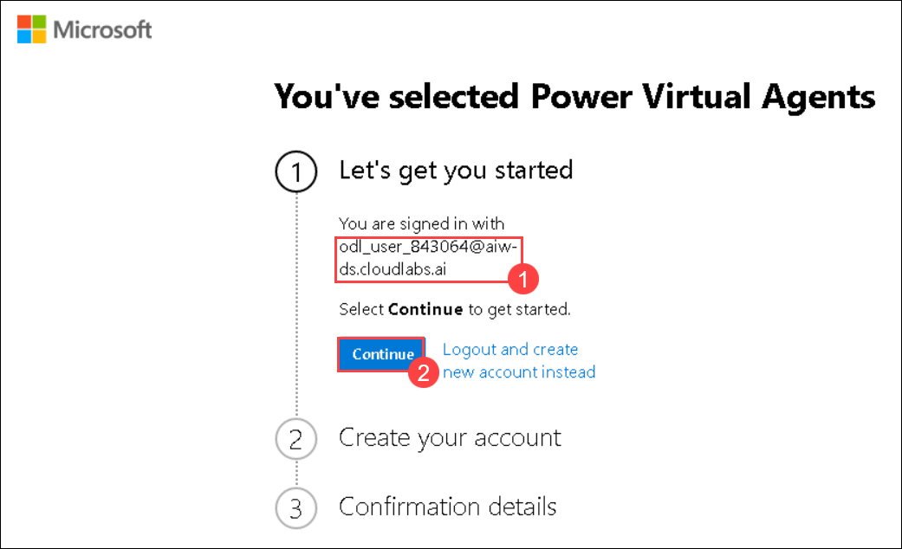

3. Once **Signed in**, under Create your account, **choose your respective region (1)** from the drop-down menu and click on **Get Started (2)**.
   
   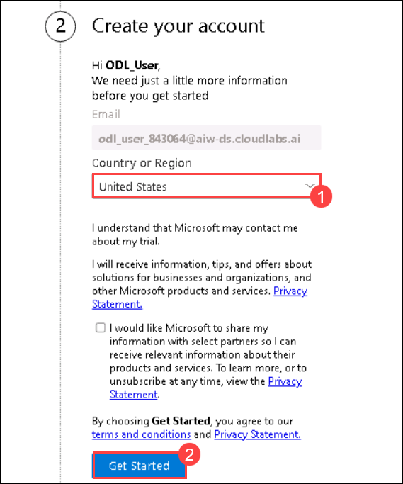
   
4. Under the **Confirmation details (1)**, click on **Get Started (2)**.

    

5. You have now successfully signed up for **Power Virtual Agents**.

6. On the **Welcome to Power Virtual Agents (1)** page, choose your respective region and select **Get Started (2)**.

   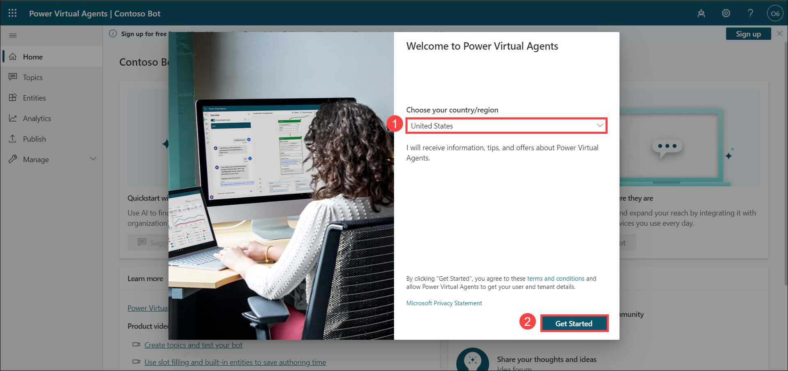

7. On the **Create a Chatbot** page enter the following details:

   - **Name of your bot (1)**: Enter **AI-Bot-<inject key="DeploymentID" enableCopy="false"/>**.
   - **What language will your bot speak? (2)**: Select **English (US)** from the dropdown.

   Now select **Create (3)**.

   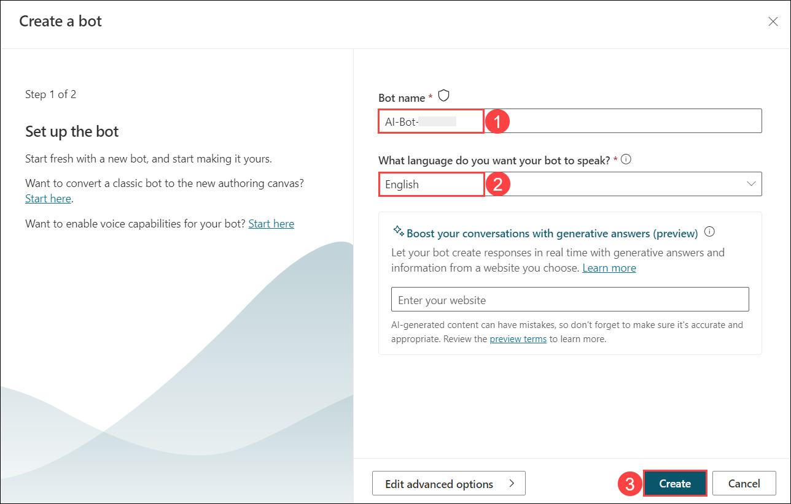

8. Once the Bot is created you will see the Power virtual agents page.

   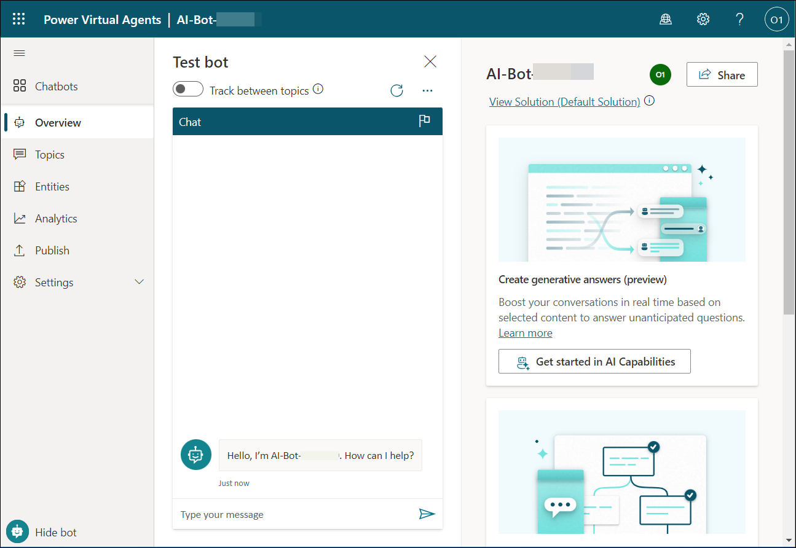

## Task 3 - Create a new Topic

1. One the **Power Virtual Agents** page, select **Topics** **(1)**, **New Topic** **(2)** and select **Create with Copilot** **(3)**.

   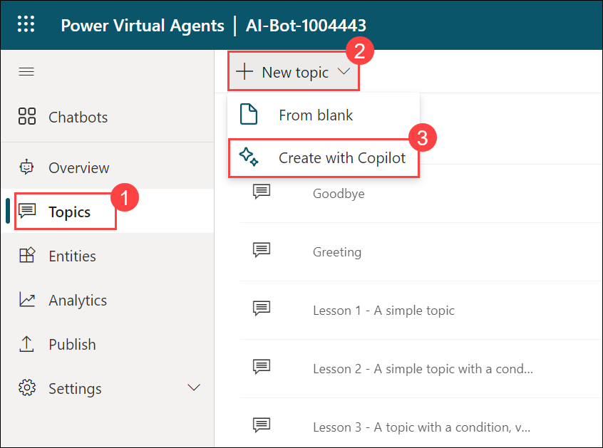

2. In Create it with Copilot pane, Name your topic as **Meal delivery options** **(1)**. In Create a topic to ..., enter the given phrase "**Checking for food options based on the city you are in**" **(2)**, then click on **Create** **(3)**.

   

3. Once you are in the topic pane, **close** **(1)** the edit with copilot pane from right-side. Scroll-down to the **Message** node, click on **eclipse** button **(2)** and select **Delete** **(3)** to remove the message node.

   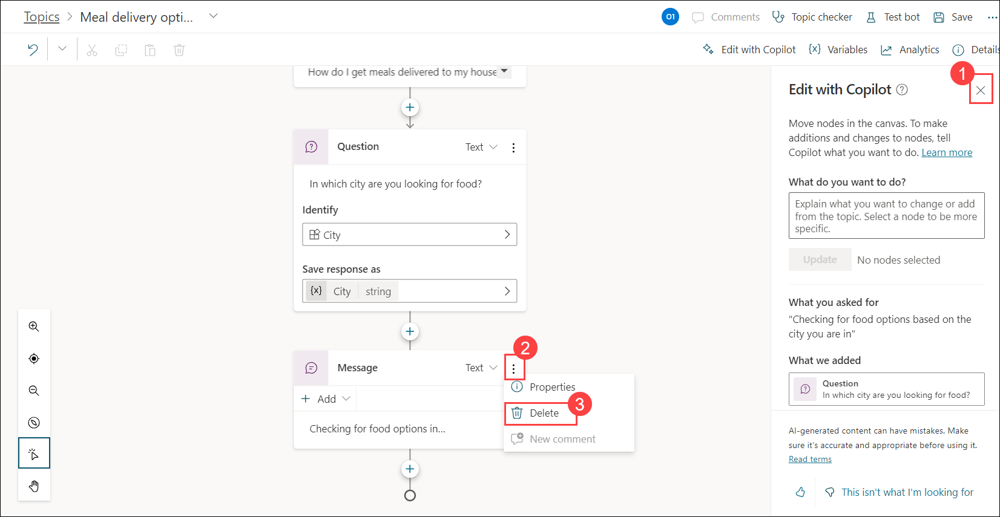

4. On the **topic** pane, click on **+** at the bottom to **Add node**.

   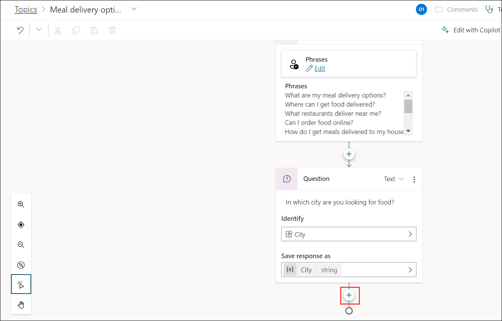

5. Select **Ask a question** from drop-down while adding a node.

   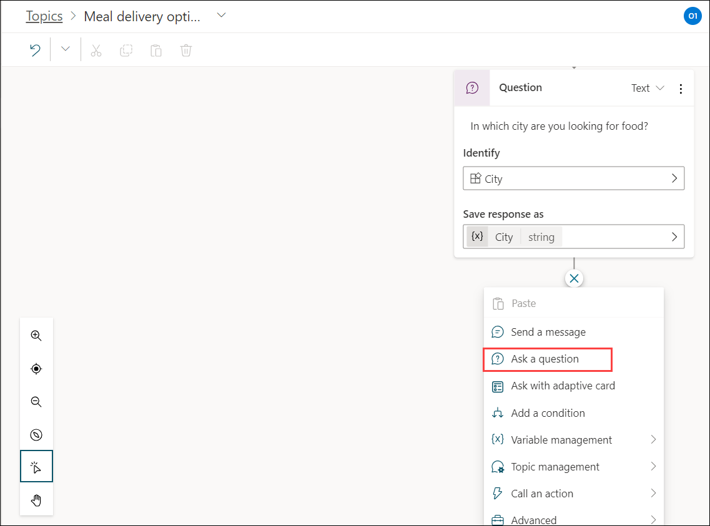

6. Enter the question as "**What type of food would you like to order?**" **(1)** and under options for users, click on **New option** **(2)** to add types of food. Add **Chinese** and **Italian** **(3)** as shown in the below screenshot.

    
   
7. Now under Condition of Chinese, click on **+** to Add node.

   

8. Select **Send a message** from drop-down while adding a node.

   

9. Enter the Chinese food items given here in message section: **Noodles, Spring Rolls, Fried Chicken**

   

10. Now under Condition of Italian, click on **+** to Add node.

    

11. Select **Send a message** from drop-down while adding a node.

    

12. Enter the Italian food items given here in message section: **Pizza, Pasta, Truffles**

    

13. Review the topic trigger, click on **Save** from right-top corner to save the topic.

    

## Task 4 - Test your Bot

1. Once the Topic is saved, click on **Test bot** from right-top corner.

   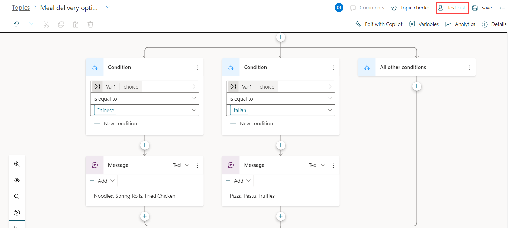

2. In the Test bot pane, enter the given phrase ```What are my meal delivery options?``` and then enter city name as ```Seattle```. 

   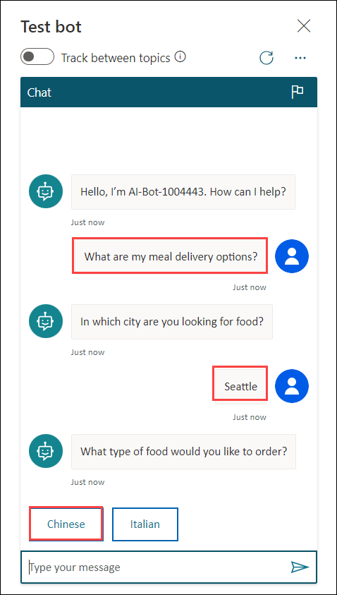

3. You can select the type of food that you are looking for i.e, Chinese or Italian. 

4. Your chatbot should display names of the meals as shown below.

   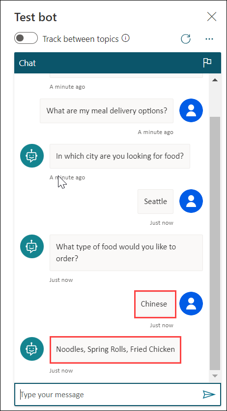

Now you have successfully created and tested Power Virtual Agents bot
