# Lab 4 - Conversational AI with Azure Bot Service and Cognitive Services

This lab covers Power Virtual Agents as the hero bot service and demonstrates how to use Copilot option to create bot.

## Task 1 - Explore dashboard of COVID-19 data

Understanding the source datasets is very important in AI and ML. To help you expedite the process, we have created a Power BI dashboard you can use to explore them at the beginning of each lab.


To get more details about the source datasets, check out the [Data Overview](https://github.com/CloudLabsAI-Azure/ai-in-a-day/blob/main/data-overview.md) section.

To explore the dashboard of COVID-19 data, open the `Azure-AI-in-a-Day-Data-Overview` file located on the desktop (**C:\Users\public\desktop**) 💻 of the virtual machine provided with your environment. If you see `Introducing the updated mobile layout` popup screen, then close it by click on `Got it`. Collapse the **Fields** and **Visualizations** tabs to see the clear report.

> **Note:** Please close and reopen the Power BI Desktop document if it throws an error in the first attempt.

 

## Task 2 - Explore lab scenario

The power of Machine Learning also comes into play when dealing with human-to-machine interfaces. While classical interfaces like native or web applications are ubiquitous, the new approaches based on conversational AI are becoming increasingly popular. Having the capability to interact with intelligent services using natural language is quickly becoming the norm rather than the exception. Using Conversational AI, analysts can find the research of interest by using simple natural language phrases.

With Machine Learning (ML) and Natural Language Processing (NLP), Human Machine Interface (HMI) technologies are enjoying an increased adoption year over year. By 2021, [the growth of chatbots in this space is expected to be 25.07%](https://www.technavio.com/report/chatbot-market-industry-analysis).


The way organizations are building conversational systems is evolving, with bots being built and maintained by a mix of technical and non-technical roles. Power Virtual Agents has the capability to extend its capabilities by allowing pro-code users to create dialogs / topics using the Azure Bot Framework Composer today. This experience allows technical and non-technical teams to build and host their solutions on a single platform.


## Task 3 - Setting up Power Virtual Agents and Create your first Chatbot

1. Navigate to **[Power Virtual agents page](https://powervirtualagents.microsoft.com/en-us/)** and select **Start Free**.

   

2. On the **Let's get you started**, verify that you are logged-in with your azure username **(1)** and select **Continue (2)**. 

   

3. Once **Signed in**, under Create your account, **choose your respective region (1)** from the drop-down menu and click on **Get Started (2)**.
   
   
   
4. Under the **Confirmation details (1)**, click on **Get Started (2)**.

    

5. You have now successfully signed up for **Power Virtual Agents**.

6. On the **Welcome to Power Virtual Agents (1)** page, choose your respective region and select **Get Started (2)**.

   

7. On the **Create a Chatbot** page enter the following details:

   - **Name of your bot (1)**: Enter **AI-Bot-<inject key="DeploymentID" enableCopy="false"/>**.
   - **What language will your bot speak? (2)**: Select **English (US)** from the dropdown.

   Now select **Create (3)**.

   

8. Once the Bot is created you will see the Power virtual agents page.

   

## Task 4 - Create a new Topic

1. One the **Power Virtual Agents** page, select **Topics** **(1)**, **New Topic** **(2)** and select **Create with Copilot** **(3)**.

   

2. In Create it with Copilot pane, Name your topic as **Meal delivery options** **(1)**. In Create a topic to ..., enter the given phrase "**Checking for food options based on the city you are in**" **(2)**, then click on **Create** **(3)**.

   

3. Once you are in the topic pane, **close** **(1)** the edit with copilot pane from right-side. Scroll-down to the **Message** node, click on **eclipse** button **(2)** and select **Delete** **(3)** to remove the message node.

   

4. On the **topic** pane, click on **+** at the bottom to **Add node**.

   

5. Select **Ask a question** from drop-down while adding a node.

   

6. Enter the question as "**What type of food would you like to order?**" **(1)** and under options for users, click on **New option** **(2)** to add types of food. Add **Chinese** and **Italian** **(3)** as shown in the below screenshot.

    
   
7. Now under Condition of Chinese, click on **+** to Add node.

   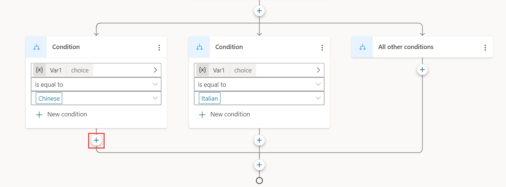

8. Select **Send a message** from drop-down while adding a node.

   

9. 


## Task 5 - Create an adaptive card using Bot Framework Composer

1. When Bot Framework Composer application launches, you will be prompted to sign in. Sign in with the provided credentials.

   >**Note**: You can find the credentials in the environment details tab.

2. Once you sign in, you will be asked to import your bot to a new project. The **Name** field will be auto-populated. If it's empty, fill the name field with the name of your bot **AI-Bot-<inject key="DeploymentID" enableCopy="false"/> (1)** which you created on the **Power virtual agents** page. Then, click **Create (2)**.

   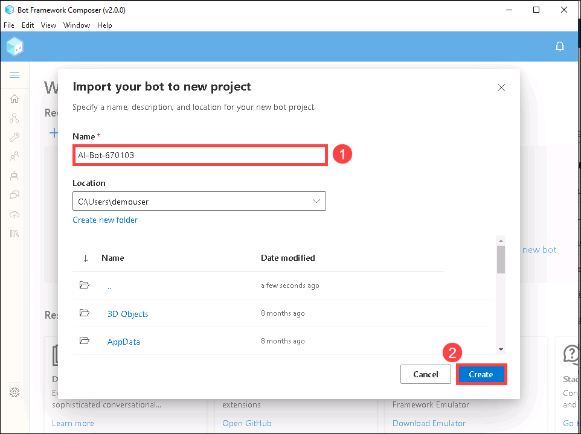

   >**Note**: In the occasion where the following screen does not appear in Composer on launch, you will need to close the application and launch it again from Power Virtual Agents.

3. Once you see your project appear in Composer. On the left side of the screen, click on **Create (1)** and click on the three dots **(2)**. Then, select **+ Add a dialog (3)**.

   

4. On the **Create a dialog** pop up, specify the name of your new dialog as **Meals (1)**, then click **OK (2)**.

   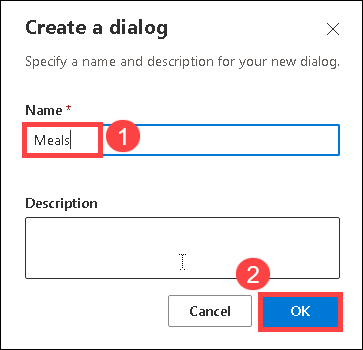
   
5. From the left navigation menu, click on the **Bot Responses (1)** tab. With the **Meals (2)** dialogue selected click on **Show code (3)**. This is where we will enter the **JSON** text to create the adaptive card.

   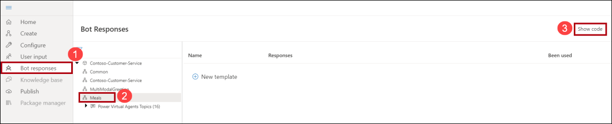

6. Paste in the following LG (Language Generation) Template. This template sets out the names of the meals and their related image that will be displayed in the adaptive card.

   ```
   # Chicken()
   -Chicken
   # Steak()
   -Steak
   # Tofu()
   -Tofu
   # SteakImageURL()
   -https://raw.githubusercontent.com/CloudLabsAI-Azure/ai-in-a-day/FY-23-AI-Updates/04-conversational-ai/media/steak.png
   # ChickenImageURL()
   -https://raw.githubusercontent.com/CloudLabsAI-Azure/ai-in-a-day/FY-23-AI-Updates/04-conversational-ai/media/chicken.png
   # TofuImageURL()
   -https://raw.githubusercontent.com/CloudLabsAI-Azure/ai-in-a-day/FY-23-AI-Updates/04-conversational-ai/media/tofu.png
   ```
   
   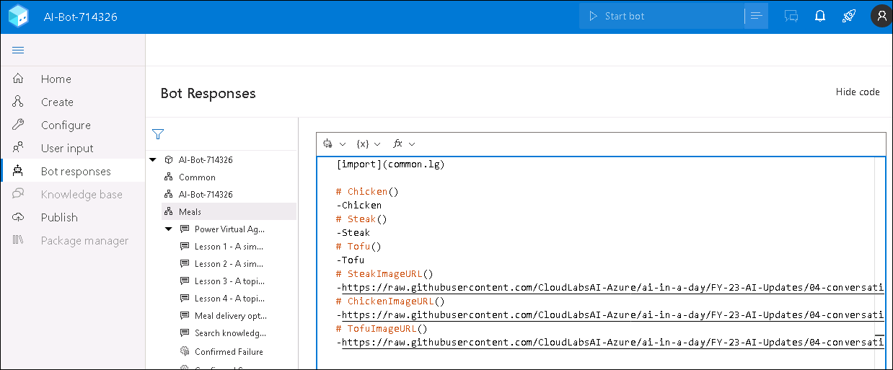

7. Next, paste in the following JSON code into the same window, underneath the code entered previous step.

   ````
   # adaptivecardjson_meals(location) 
   - ```
   { 
      "type": "AdaptiveCard", 
      "$schema": "http://adaptivecards.io/schemas/adaptive-card.json", 
      "version": "1.1", 
      "body": [ 
               { 
               "type": "TextBlock", 
               "text": "Meal delivery options for ${location}:", 
               "size": "Medium", 
               "weight": "Bolder" 
         }, 
         { 
               "type": "ColumnSet", 
               "columns": [ 
                  { 
                     "type": "Column", 
                     "width": "stretch", 
                     "items": [ 
                           { 
                              "type": "Image", 
                              "url": "${SteakImageURL()}", 
                              "size": "Stretch", 
                              "spacing": "Medium", 
                              "horizontalAlignment": "Center" 
                           } 
                     ] 
                  }, 
                  { 
                     "type": "Column", 
                     "width": "stretch", 
                     "items": [ 
                           { 
                              "type": "Image", 
                              "url": "${ChickenImageURL()}", 
                              "horizontalAlignment": "Center" 
                           } 
                     ] 
                  }, 
                  { 
                     "type": "Column", 
                     "width": "stretch", 
                     "items": [ 
                           { 
                              "type": "Image", 
                              "url": "${TofuImageURL()}", 
                              "horizontalAlignment": "Center" 
                           } 
                     ] 
                  } 
               ] 
         }, 
         { 
               "type": "ColumnSet", 
               "columns": [ 
                  { 
                     "type": "Column", 
                     "width": "stretch", 
                     "items": [ 
                           { 
                              "type": "TextBlock", 
                              "text": "${Steak()}", 
                              "wrap": true, 
                              "horizontalAlignment": "Center"                             
                           } 
                     ] 
                  }, 
                  { 
                     "type": "Column", 
                     "width": "stretch", 
                     "items": [ 
                           { 
                              "type": "TextBlock", 
                              "text": "${Chicken()}", 
                              "wrap": true, 
                              "horizontalAlignment": "Center" 
                           } 
                     ] 
                  }, 
                  { 
                     "type": "Column", 
                     "width": "stretch", 
                     "items": [ 
                           { 
                              "type": "TextBlock", 
                              "text": "${Tofu()}", 
                              "wrap": true, 
                              "horizontalAlignment": "Center" 
                           } 
                     ] 
                  } 
               ] 
         } 
      ] 
   } 
   ```
   ````
   
   

8. The last code to enter is the activity that will display this **adaptive card** in the Bot Framework dialog. Paste in the following code in the same window in composer, underneath the code entered in previous step.

   ```
   # AdaptiveCardMeals(location)
   [Activity
   Attachments = ${json(adaptivecardjson_meals(location))}
   ]

   ```
   
   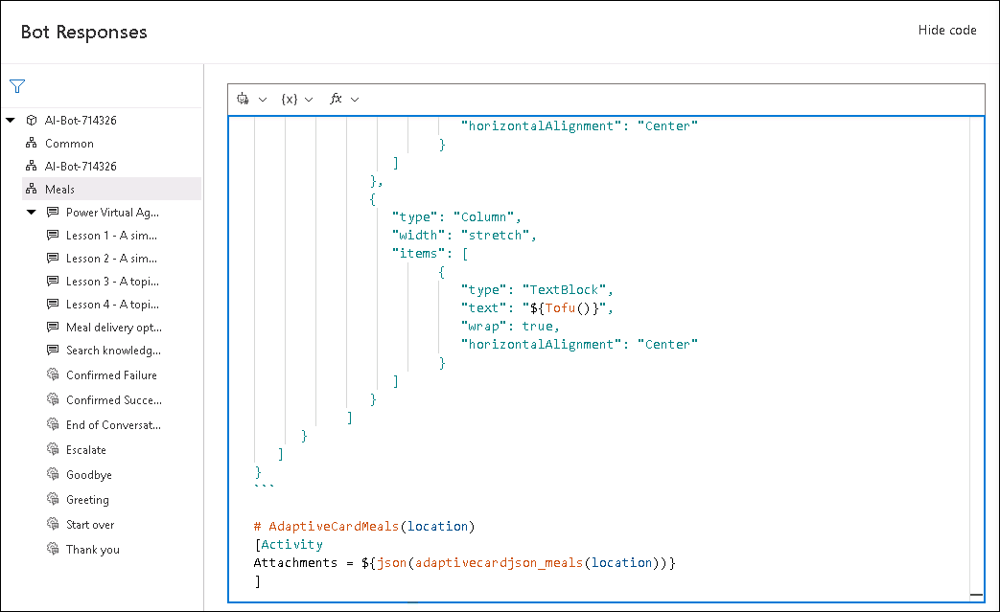

9. From the left navigation bar, click on the **Create (1)** tab and select **BeginDialog (2)**.

   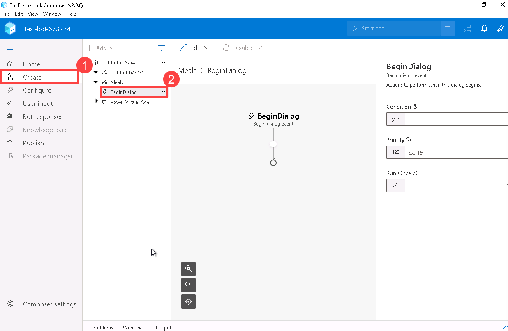

10. Click on the **'+' (1)** button, and select **Send a response (2)**.

    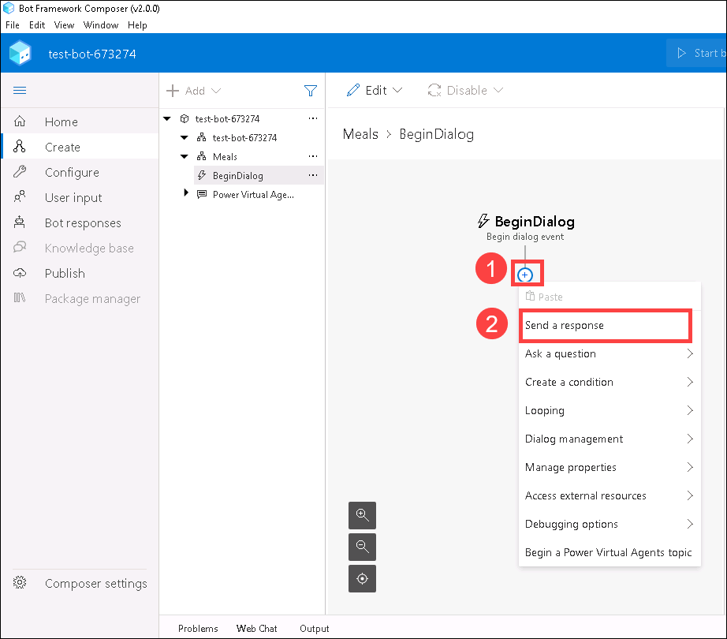

11. In the Bot responses box that appears on the right side of the screen, select **Show Code** and enter the following JSON code.

    

    ```
    ${AdaptiveCardMeals(virtualagent.user_city)}
    ```

    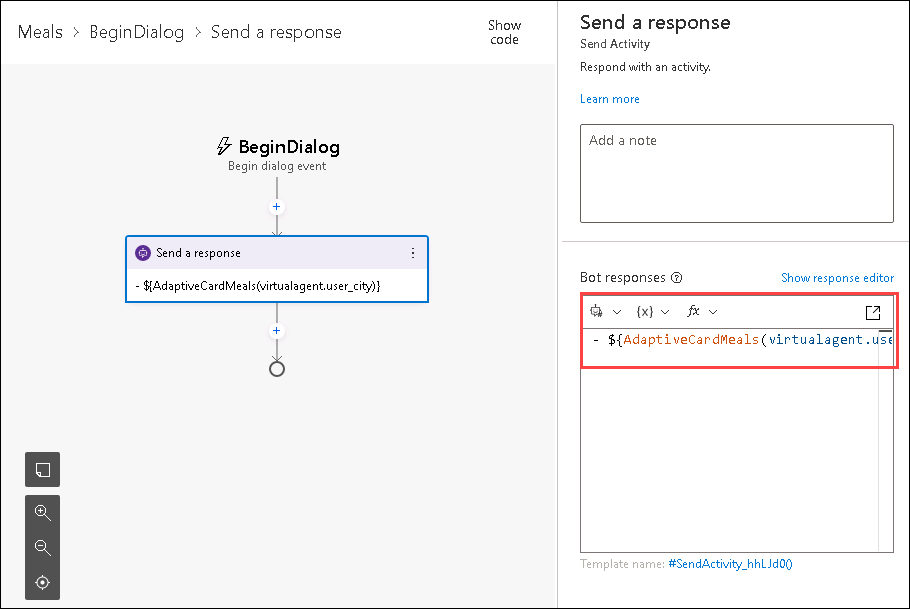   

    >**Note**: Ensure there is only one – symbol at the start of the code.

12. On the left navigation menu select **Publish (1)**.  Select your **bot (2)**, then click on **Publish selected bots (3)**. 

    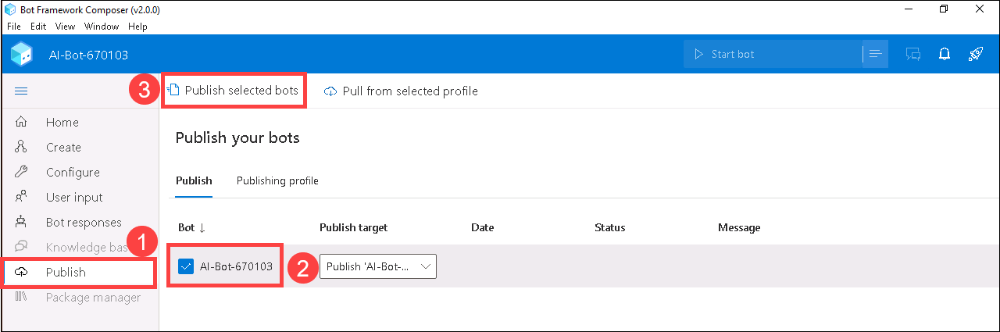   

13. You need to provide the Email/Username: <inject key="AzureAdUserEmail"></inject> in the signup popup for publishing bot. Confirm that you want to publish the bot by clicking on **Okay**. The bot should now be in the process of publishing.

      

14. You will get a confirmation message in Composer once the bot has been published.

     

## Task 6 - Add your composer content to Power Virtual Agents bot

1. Go back to the **Power Virtual Agents** page.

2. On the **Topics** tab notice the adaptive card action you just published from Composer is visible in your list of topics. 

   >**Note**: You may need to refresh the screen your page to see it.

3. Open the topic: **Meal delivery options**.

   

4. Click on **+** to add a node at the bottom of the Topic. Then select **Redirect to another topic (1)** and select **Meals (2)**.

   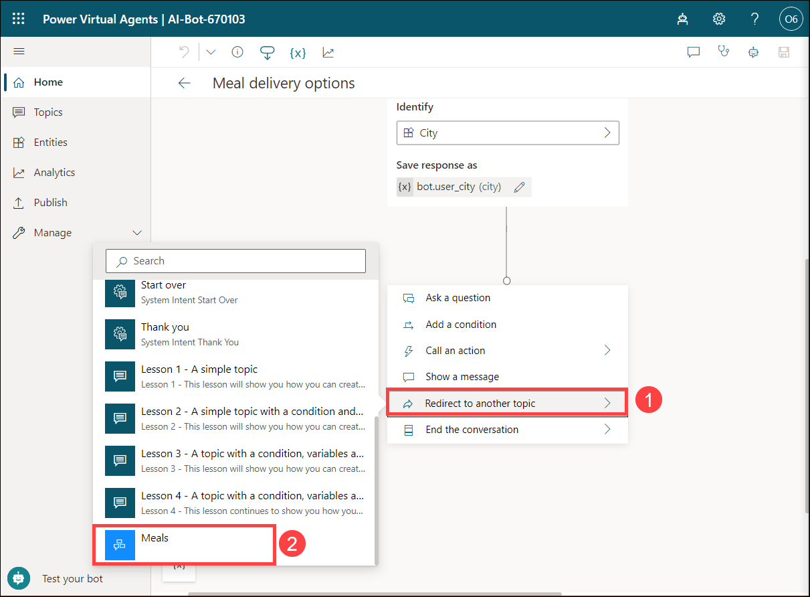

5. Your Power Virtual Agents bot will call the Bot Framework dialog to display an adaptive card. Click on **Save** icon at the top right.

   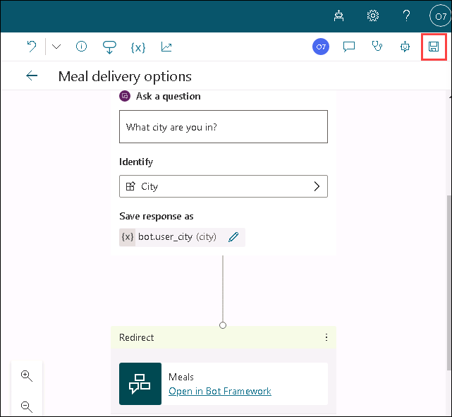

## Task 7 - Test your Bot

1. While on the **Meal delivery options**, select the **Bot** icon on the top right corner.

   

2. In the Test bot pane, enable the **Track between topics**.

   

3. Enter the below phrase in a trigger phrase in Test bot. 

   ```what meals can I order```

   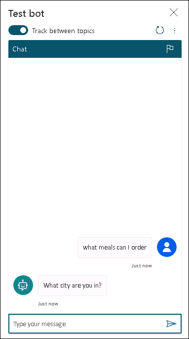

4. Then enter the name of the city as **Seattle**. Your chatbot should display images of the meals in an adaptive card as show below.

   

Now you have successfully created and tested Power Virtual Agents bot
