# Lab 3 - Conversational AI with Azure Bot Service and Cognitive Services

This lab covers Power Virtual Agents as the hero bot service and demonstrates how to extend your PVA bot using Bot Framework Composer.

## Task 1 - Explore dashboard of COVID-19 data

Understanding the source datasets is very important in AI and ML. To help you expedite the process, we have created a Power BI dashboard you can use to explore them at the beginning of each lab.


To get more details about the source datasets, check out the [Data Overview](https://github.com/CloudLabsAI-Azure/ai-in-a-day/blob/main/data-overview.md) section.

To explore the dashboard of COVID-19 data, open the `Azure-AI-in-a-Day-Data-Overview` file located on the desktop (**C:\Users\public\desktop**) 💻 of the virtual machine provided with your environment. If you see `Introducing the updated mobile layout` popup screen, then close it by click on `Got it`. Collapse the **Fields** and **Visualizations** tabs to see the clear report.

> **Note:** Please close and reopen the Power BI Desktop document if it throws an error in the first attempt.

 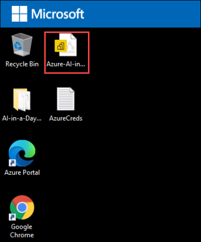

## Task 2 - Explore lab scenario

The power of Machine Learning also comes into play when dealing with human-to-machine interfaces. While classical interfaces like native or web applications are ubiquitous, the new approaches based on conversational AI are becoming increasingly popular. Having the capability to interact with intelligent services using natural language is quickly becoming the norm rather than the exception. Using Conversational AI, analysts can find the research of interest by using simple natural language phrases.

With Machine Learning (ML) and Natural Language Processing (NLP), Human Machine Interface (HMI) technologies are enjoying an increased adoption year over year. By 2021, [the growth of chatbots in this space is expected to be 25.07%](https://www.technavio.com/report/chatbot-market-industry-analysis).


The way organizations are building conversational systems is evolving, with bots being built and maintained by a mix of technical and non-technical roles. Power Virtual Agents has the capability to extend its capabilities by allowing pro-code users to create dialogs / topics using the Azure Bot Framework Composer today. This experience allows technical and non-technical teams to build and host their solutions on a single platform.

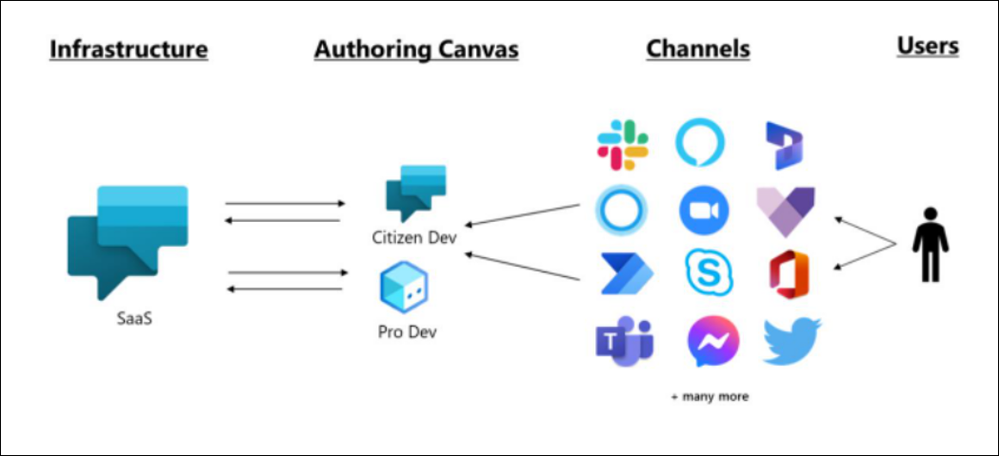

## Task 3 - Setting up Power Virtual Agents and Create your first Chatbot

1. Navigate to **[Power Virtual agents page](https://powervirtualagents.microsoft.com/en-us/)** and select **Start Free**.

   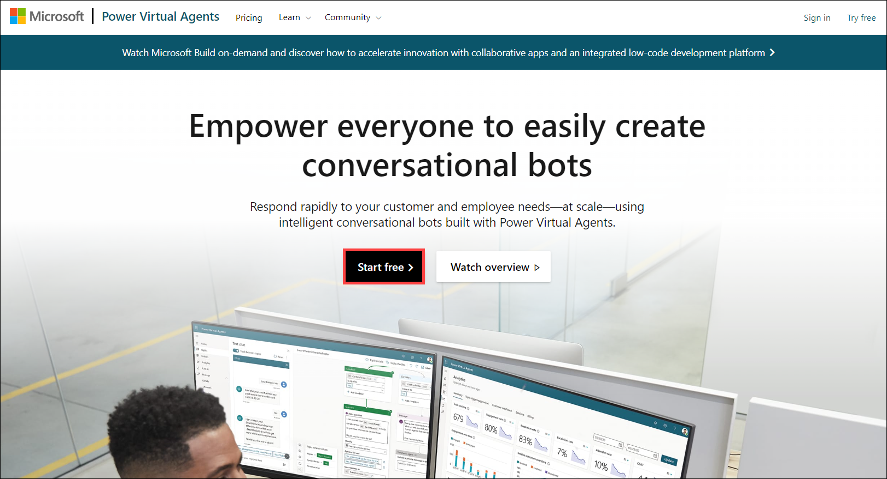

2. Enter your email on the **Let's get you started** and select **Next**. 

   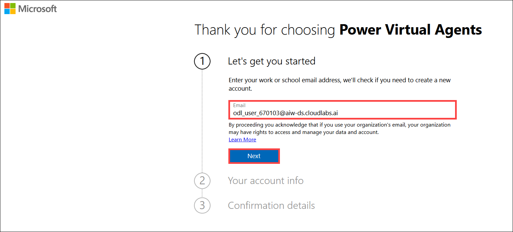

   > **Note**: You can retrieve your Email/username and Password from the environment details tab.

3. Select **Sign in** and enter your Password and select **sign in**.

4. Once **Signed in**, select **Get started** under the **Confirmation Details**.

   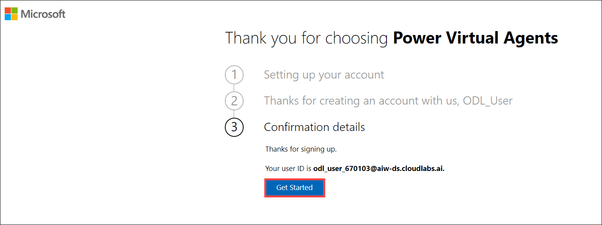

5. You have now successfully signed up for **Power Virtual Agents**

6. On the **Welcome to Power Virtual Agents** page, choose your respective region and select **Get Started**.

   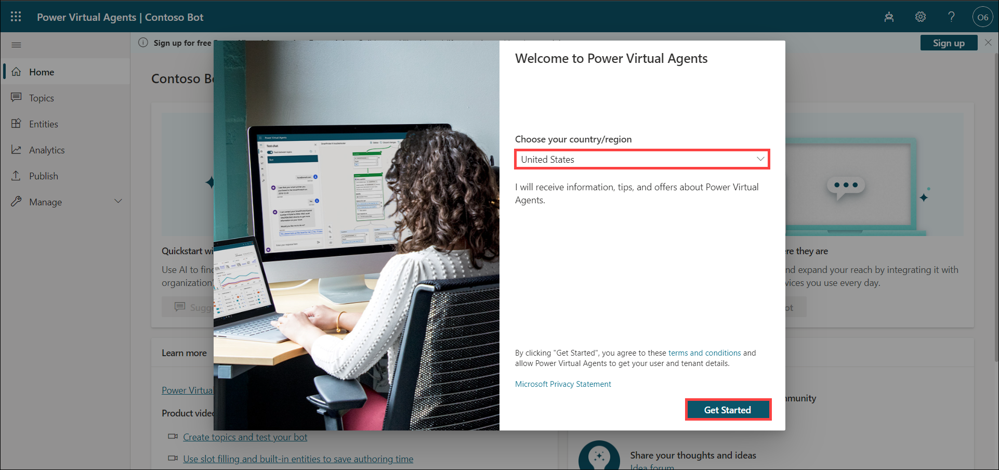

7. On the **Create a Chatbot** page enter the following details :

   - **Name of your bot** : Enter **AI-Bot-<inject key="DeploymentID" />**.
   - **What language will your bot speak?** : Select **English (US)** from the dropdown.
   - **Select an environment** : Select the default **Cloudlabs.AI (AIW-DS) (default) - United States**

   Now select **Create**.

    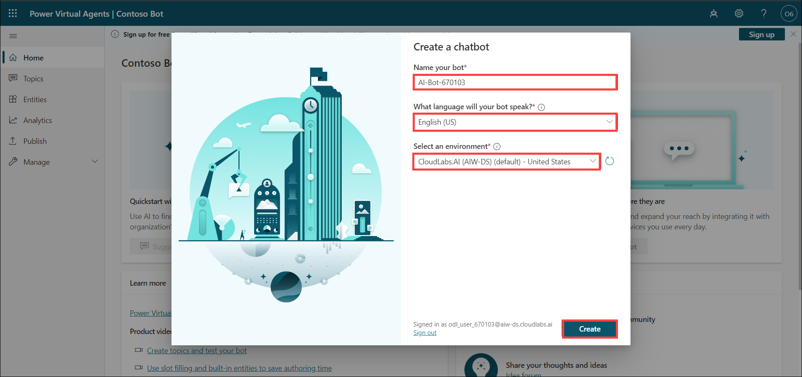


8. Once the Bot is created you will see the Power virtual agents page.

   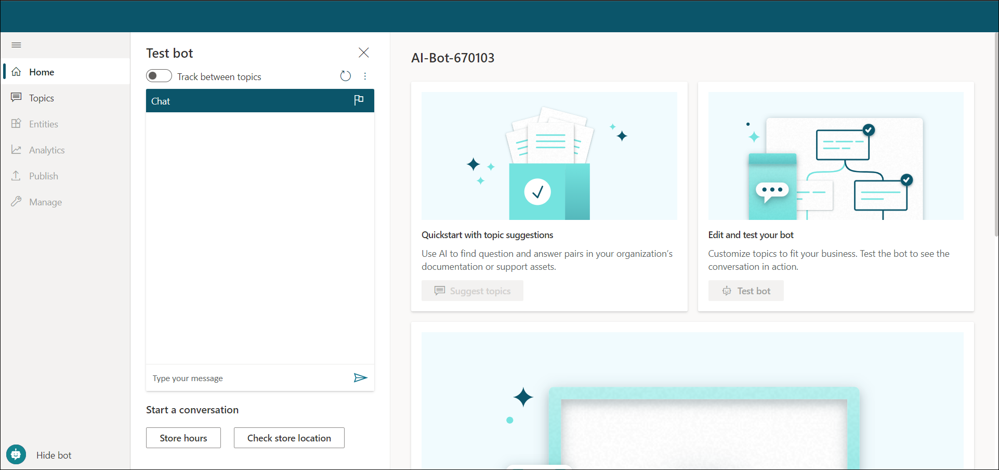

## Task 4 - Create a new Topic

1. One the **Power Virtual Agents** page, select **Topics** and **New Topic**.

   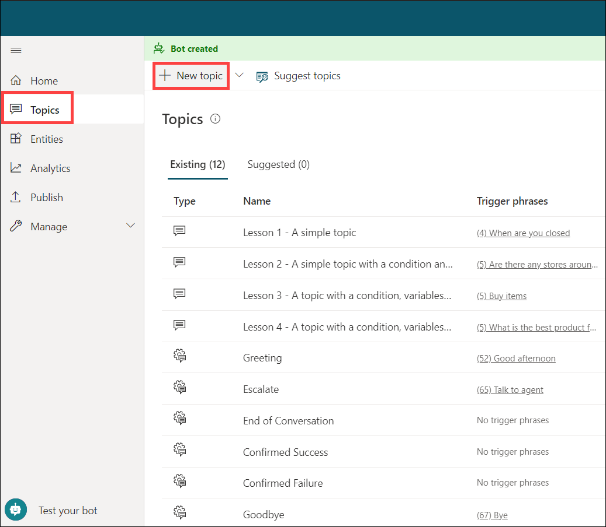

2. Name the topic as **Meal delivery options**, and on the **Trigger phrases** pane, add the following trigger phrases : 

   ```
   what meals can I order
   ```
   ```
   what meal options do you have
   ```
   ```
   what dishes do you deliver
   ```
   ```
   entrees available for delivery
   ```

   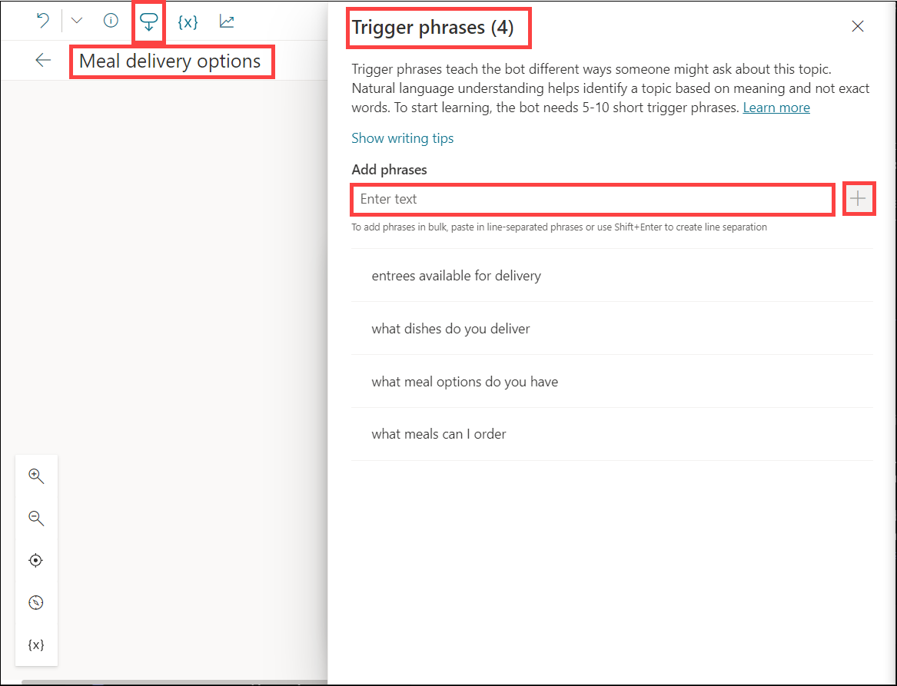


3. Delete the blank message node under the trigger phrases on the authoring canvas.

   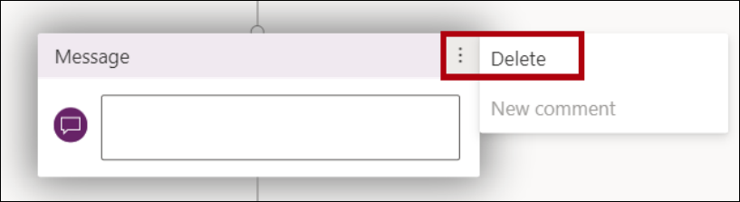

4. Now select the **'+'** under the trigger phrase and add **Ask a question** node.

   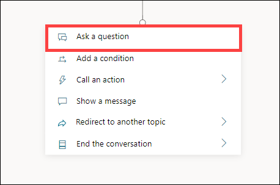

5. On the **Question** node, add the following details :

      - **Ask a question** : ```What city are you in?```
      - **Identify** : ```City```
      - **Save Response as** : On the **Variable properties** tab that opens up, set the name of the variable as ```user_city``` and **usage** as **Bot (Any topic can access)**

   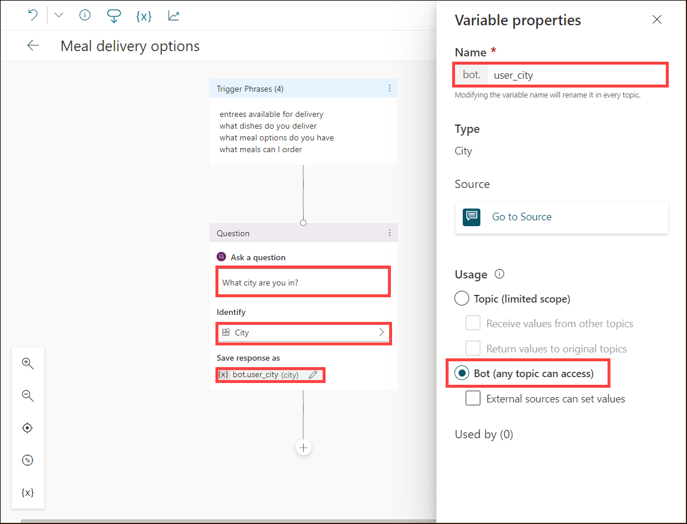

   >**Note** : The variable just created will be used in the adaptive card. For the variable to be used within Bot Framework Composer, it must be set with Bot scope rather than Topic scope.

6. Save the **topic**, then return to the list of topics. 

   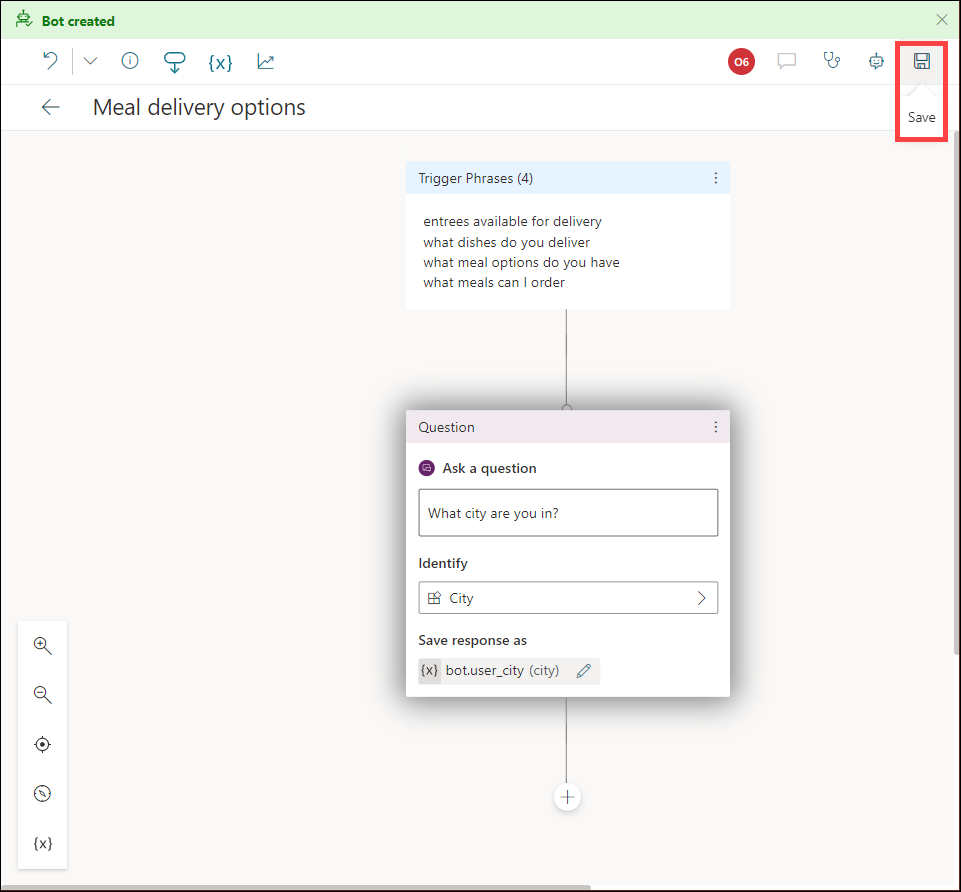

7. Click on the downward arrow and select **Open in Bot Framework Composer**

    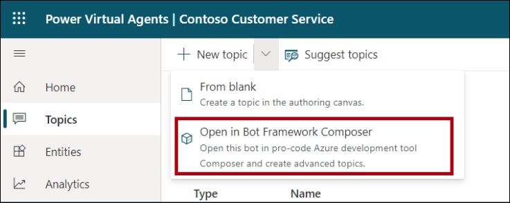

    >**Note**: If you can’t launch composer automatically from Power Virtual Agents, you can launch it manually from your browser. Click on Copy link to copy the link and paste it into the URL in your web browser. 

8. Make sure to open Bot Framework Composer from within Power Virtual Agents. This ensures that Composer has all the necessary plugins needed for 
integration with Power Virtual Agents


## Task 5 - Create an adaptive card using Bot Framework Composer

1. When Bot Framework Composer application launches, you will be prompted to sign in. Sign in with the provided credentials.

   >**Note** : You can find the credentials in the environment details tab.

2. Once you sign in, you will be asked to import your bot to a new project. The **Name** field will be auto-populated. If it's empty, fill in the name field with the name of your 
bot which we created on the **Power virtual agents** page. Then, click **Create**.

   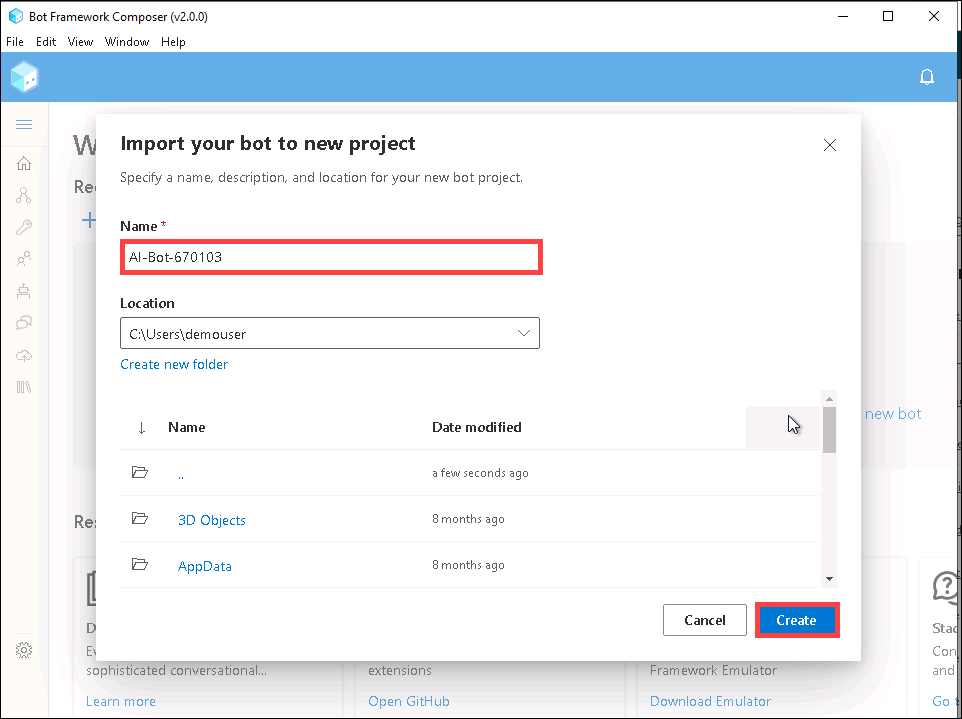

   >**Note**: In the occasion where the following screen does not appear in Composer on launch, you will need to close the application and launch it again from Power Virtual Agents.

3. Once you see your project appear in Composer. On the left side of the screen, click on **Create** and click on the three dots. Then, select **+ Add a dialog**.

   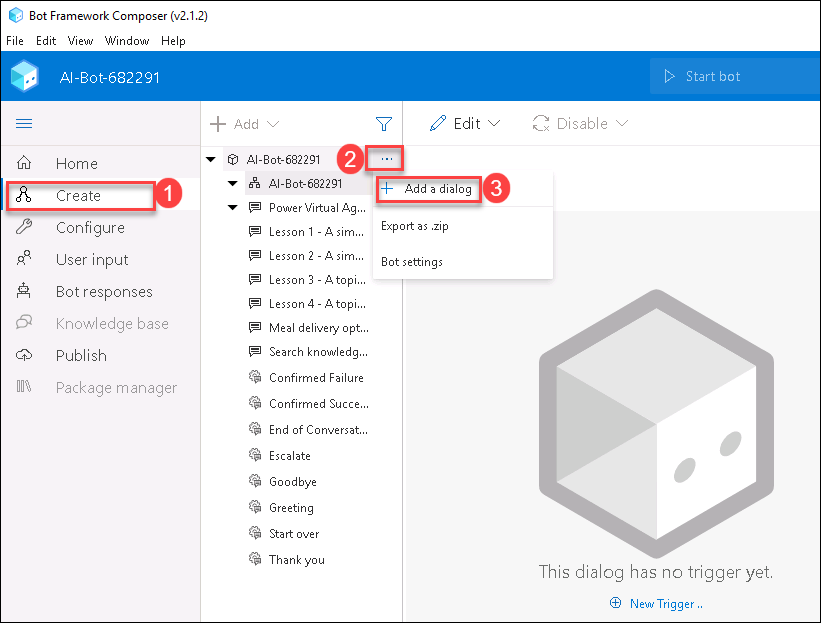

4. On the **Create a dialog** pop up, specify the name of your new dialog as **Meals**, then click **OK**.

   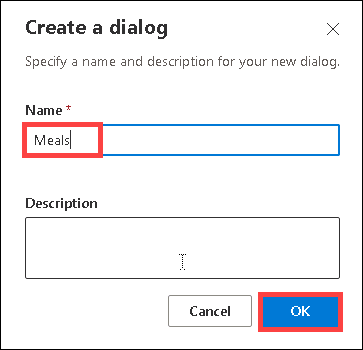
   
5. From the left navigation menu, click on the **Bot Responses** tab. With the **Meals** dialogue selected click on **Show code**. This is where we will enter the **JSON** text to create the adaptive card.

   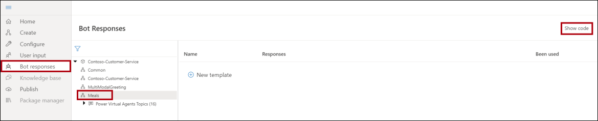

6. Paste in the following LG (Language Generation) Template. This template sets out the names of the meals and their related image that will be displayed in the adaptive card.

   ```
   # Chicken()
   -Chicken
   # Steak()
   -Steak
   # Tofu()
   -Tofu
   # SteakImageURL()
   -https://raw.githubusercontent.com/CloudLabsAI-Azure/ai-in-a-day/FY-23-AI-Updates/04-conversational-ai/media/steak.png
   # ChickenImageURL()
   -https://raw.githubusercontent.com/CloudLabsAI-Azure/ai-in-a-day/FY-23-AI-Updates/04-conversational-ai/media/chicken.png
   # TofuImageURL()
   -https://raw.githubusercontent.com/CloudLabsAI-Azure/ai-in-a-day/FY-23-AI-Updates/04-conversational-ai/media/tofu.png
   ```
   
   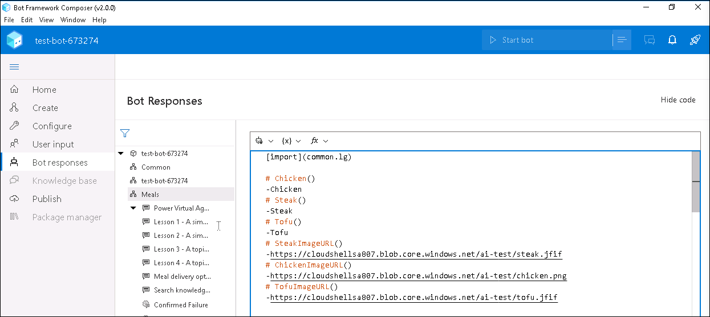

7. Next, paste in the following JSON code into the same window, underneath the code entered previous step.

   ```
   # adaptivecardjson_meals(location) 
   - ```
   { 
      "type": "AdaptiveCard", 
      "$schema": "http://adaptivecards.io/schemas/adaptive-card.json", 
      "version": "1.1", 
      "body": [ 
               { 
               "type": "TextBlock", 
               "text": "Meal delivery options for ${location}:", 
               "size": "Medium", 
               "weight": "Bolder" 
         }, 
         { 
               "type": "ColumnSet", 
               "columns": [ 
                  { 
                     "type": "Column", 
                     "width": "stretch", 
                     "items": [ 
                           { 
                              "type": "Image", 
                              "url": "${SteakImageURL()}", 
                              "size": "Stretch", 
                              "spacing": "Medium", 
                              "horizontalAlignment": "Center" 
                           } 
                     ] 
                  }, 
                  { 
                     "type": "Column", 
                     "width": "stretch", 
                     "items": [ 
                           { 
                              "type": "Image", 
                              "url": "${ChickenImageURL()}", 
                              "horizontalAlignment": "Center" 
                           } 
                     ] 
                  }, 
                  { 
                     "type": "Column", 
                     "width": "stretch", 
                     "items": [ 
                           { 
                              "type": "Image", 
                              "url": "${TofuImageURL()}", 
                              "horizontalAlignment": "Center" 
                           } 
                     ] 
                  } 
               ] 
         }, 
         { 
               "type": "ColumnSet", 
               "columns": [ 
                  { 
                     "type": "Column", 
                     "width": "stretch", 
                     "items": [ 
                           { 
                              "type": "TextBlock", 
                              "text": "${Steak()}", 
                              "wrap": true, 
                              "horizontalAlignment": "Center"                             
                           } 
                     ] 
                  }, 
                  { 
                     "type": "Column", 
                     "width": "stretch", 
                     "items": [ 
                           { 
                              "type": "TextBlock", 
                              "text": "${Chicken()}", 
                              "wrap": true, 
                              "horizontalAlignment": "Center" 
                           } 
                     ] 
                  }, 
                  { 
                     "type": "Column", 
                     "width": "stretch", 
                     "items": [ 
                           { 
                              "type": "TextBlock", 
                              "text": "${Tofu()}", 
                              "wrap": true, 
                              "horizontalAlignment": "Center" 
                           } 
                     ] 
                  } 
               ] 
         } 
      ] 
   } 
   ```
   
   >**Note**: Add **```** at the end of above code after pasting it to code window.
   
   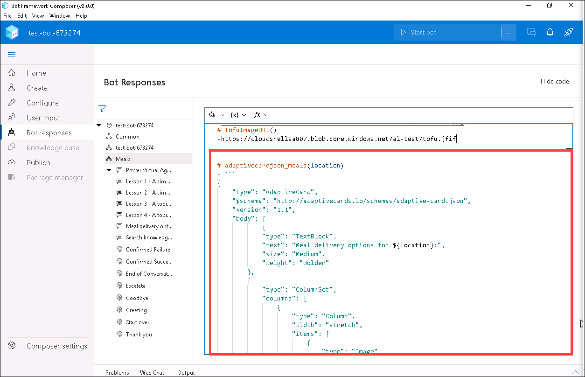

8. The last code to enter is the activity that will display this **adaptive card** in the Bot Framework dialog. Paste in the following code in the same window in composer, underneath the code entered in previous step.

   ```
   # AdaptiveCardMeals(location)
   [Activity
   Attachments = ${json(adaptivecardjson_meals(location))}
   ]

   ```
   
   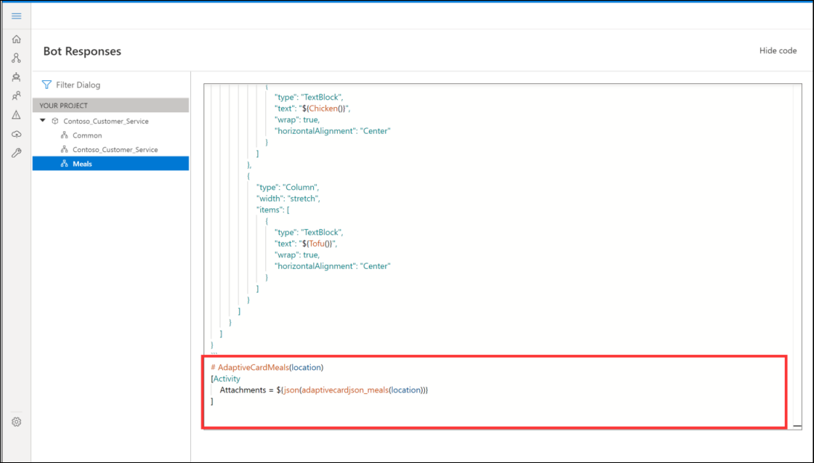

9. From the left navigation bar, click on the **Create** tab and select **BeginDialog**.

   

10. Click on the **'+'** button, and select **Send a response**.

    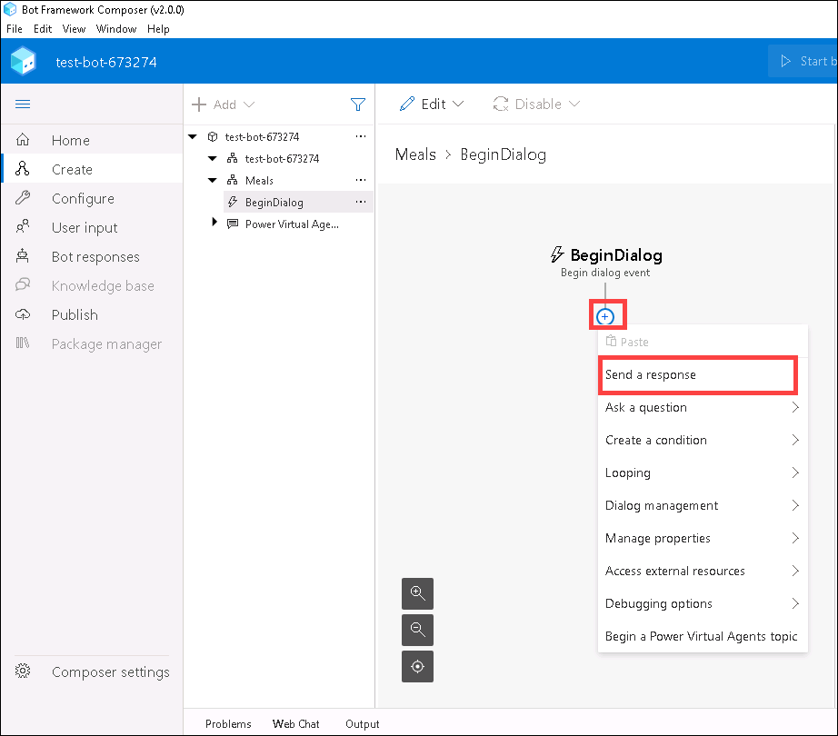

11. In the Bot responses box that appears on the right side of the screen, select **Show Code** and enter the following JSON code.

    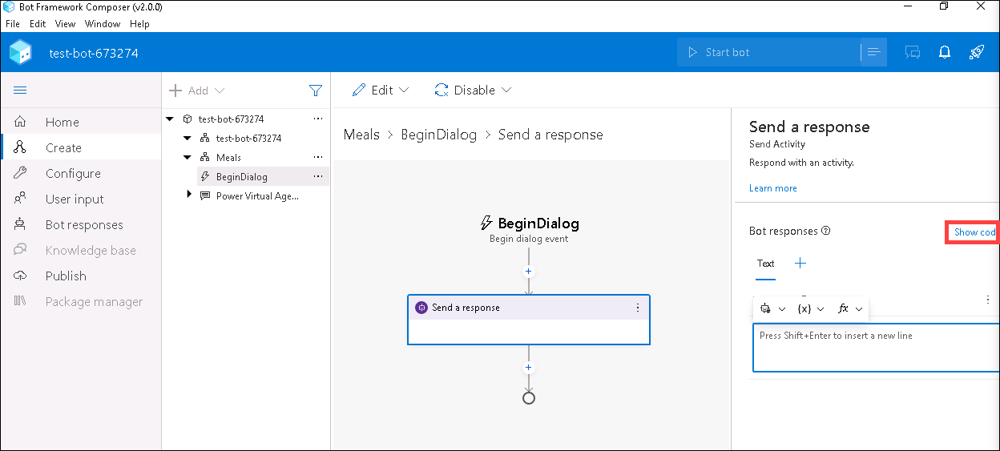

    ```
    ${AdaptiveCardMeals(virtualagent.user_city)}
    ```

    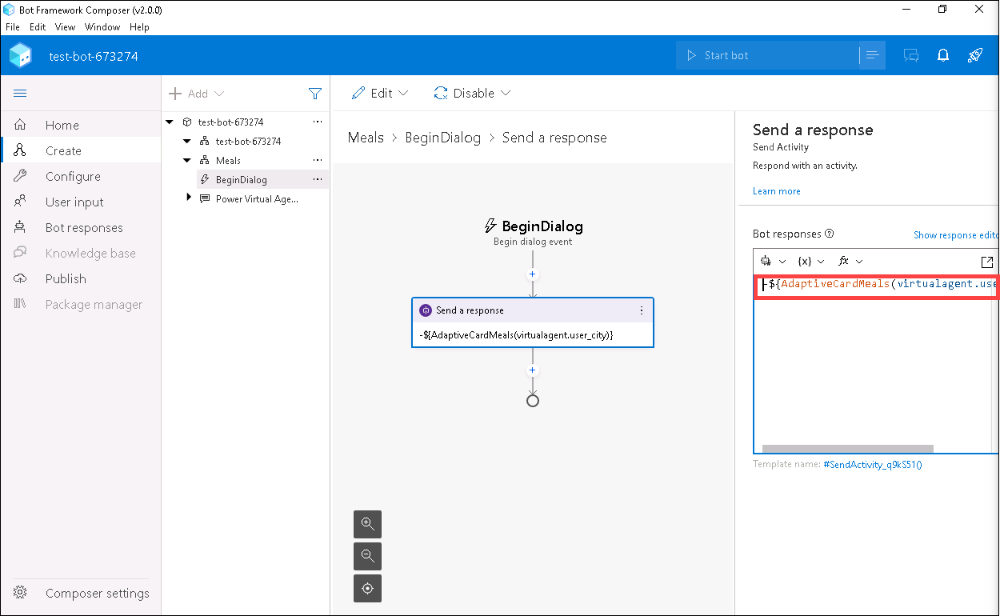   

    >**Note**: Ensure there is only one – symbol at the start of the code.

12. On the left navigation menu select **Publish**.  Select your **bot**, then click on **Publish selected bots**. 

    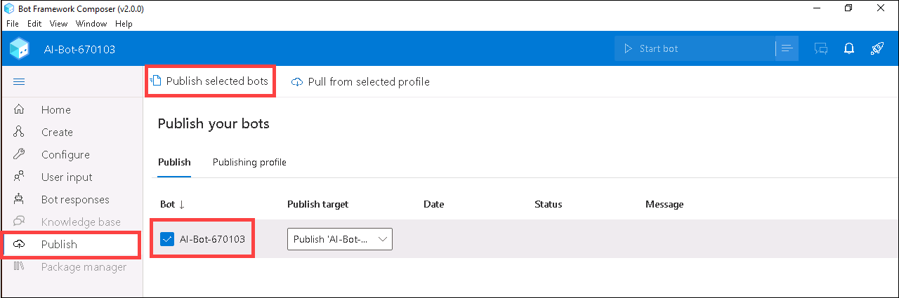   

13. You need to providing the Email/Username: <inject key="AzureAdUserEmail"></inject> in the signup popup for publishing bot. Confirm that you want to publish the bot by clicking on **Okay**. The bot should now be in the process of publishing.

    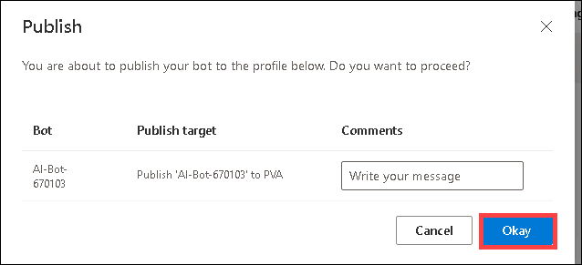  

14. You will get a confirmation message in Composer once the bot has been published.

    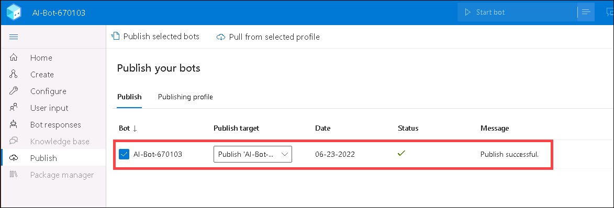 

## Task 6 - Add your composer content to Power Virtual Agents bot

1. Go back to the **Power Virtual Agents** page.

2. On the **Topics** tab notice the adaptive card action you just published from Composer is visible in your list of topics. 

   >**Note**: You may need to refresh the screen your page to see it.

3. Open the topic : **Meal delivery options**.

   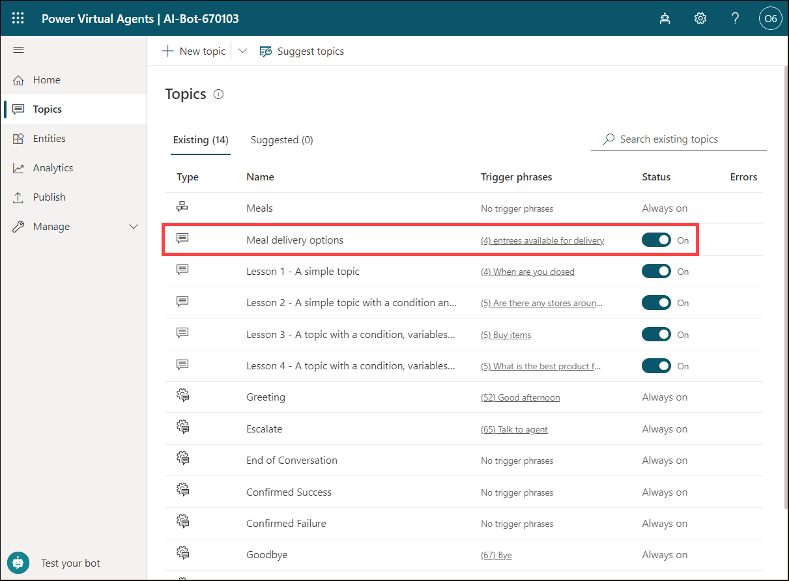

4. Under the **question**, add a node and **select Redirect to another topic** and select **Meals**.

   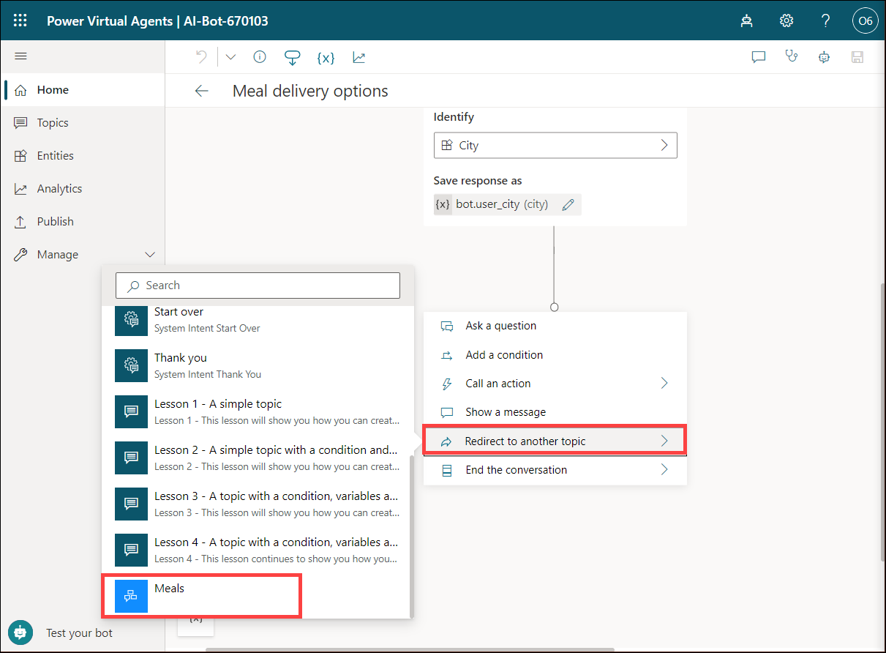

5. Your Power Virtual Agents bot will call the Bot Framework dialog to display an adaptive card. Save your **Topic**.

## Task 7 - Test your Bot

1. While on the **Meal delivery options** select the **Bot** icon on the top right corner.

   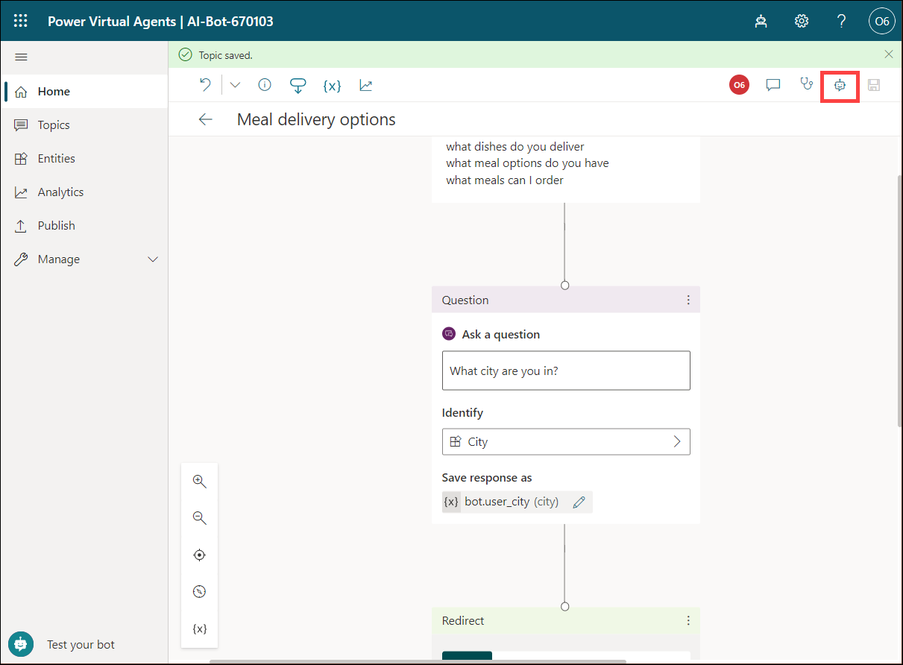

2. Go to the test pane and switch on **Track between topics**.

   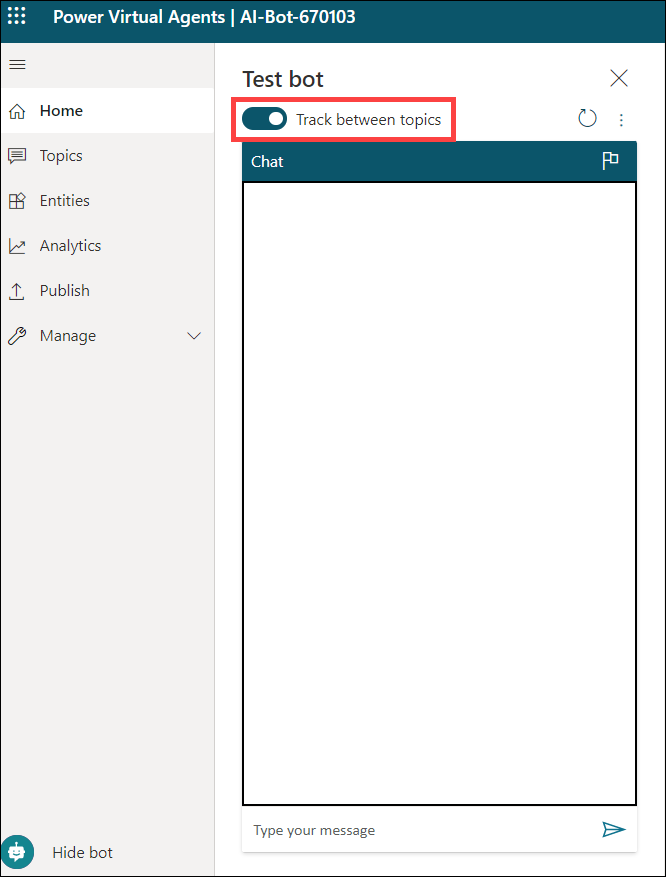

3. Type in a trigger phrase and the name of a city when prompted. 

   ```what meals can I order```

4. Your chatbot should display images of the meals in an adaptive card as show below.

   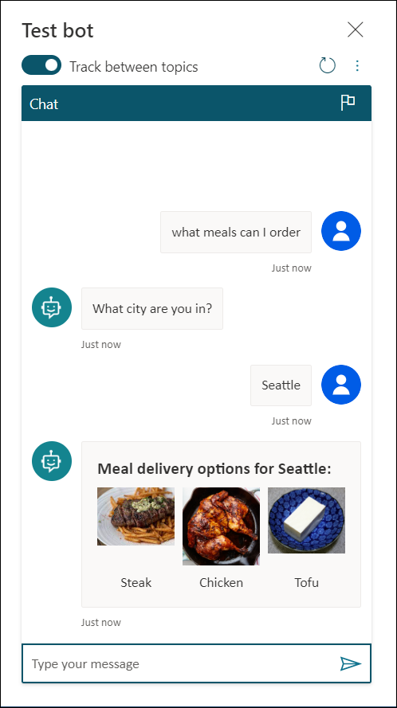


## Task 8 - Enabling Voice Access for Our Bot (Optional)

> **WARNING**: This task requires access to Microphone hardware in your environment. If you are running your lab through a remote desktop connection, additional setup might be required. As an alternative, you can run the VoiceAssistantClient that is used in the lab in your local machine instead of a remote Virtual machine. If both options are not working, you might not be able to demo the functionality after step 5. In this case, you can download a video version of the end-user experience [here](media/DLS-chatbot-demo.mp4).

In this task, we will enable voice access to our Bot through the use of AI. We will use **Azure Cognitive Speech Services** to enable real-time speech to text and text to speech conversion. Thanks to **Bot Channels Registrations** in **Azure Bot Service**, we can use the Direct Line Speech channel to have our Bot drive audio-only conversations with client applications.

1. Switch to the **Channels(deprecated)**(1) tab under settings in the **Azure Bot service**. Select **Direct Line Speech (2)**.

   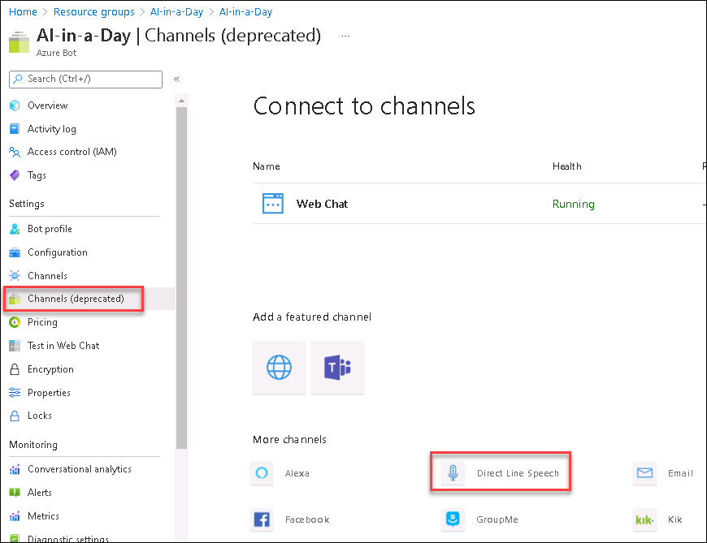

2. Select the Cognitive Speech Service named `aiinaday-speech` **(1)** for your **Cognitive service account** and hit **Save (2)**.

   

   You will now see two channels for your bot.

   

3. Go back to your Resource Group and select the `ai-in-a-day` app service.

   

4. Switch to the **Configuration (1)** tab. Select **General settings (2)**. Check **On (3)** for Web sockets and select **Save (4)**.

   

>  **Note**: Perform the following steps in your local systems/personal computer.
> 

5. In a Microsoft Edge web browser in your PC, navigate to the Github Releases page of the Cognitive-Services-Voice-Assistant project here [https://github.com/Azure-Samples/Cognitive-Services-Voice-Assistant/releases](https://github.com/Azure-Samples/Cognitive-Services-Voice-Assistant/releases) and download the released ZIP file **(1)**. Select **Open (2)** when the download is completed.

   > **Note:** If you are not able to download and install applications to your computer, you can watch a demo of the final result in a [video here](media/DLS-chatbot-demo.mp4).

   

6. Navigate into the folder in the ZIP file and find the **VoiceAssistantClient (1)** application file. Double click to start the program. When prompted, select **Extract all (2)** to temporarily extract the ZIP file's contents.

   

7. Select **Extract**. Once extraction is complete, a folder window will pop up.

   

8. Navigate into the `WindowsVoiceAssistantClient-<date>` folder and find the **VoiceAssistantClient** program. Double click the program to start it.

   

9. Once the program opens, it will show you its **Settings** window. If the **Settings** window does not show up, select **Settings gear button (A)** to open the window. We need two values for the settings page: **Subscriptions key** and **Subscription key region (1)**. These are the Azure Cognitive Speech Service's key and region values in our Azure subscription.

    

10. Back in the Azure Portal, select the `aiinaday-speech` service.

    

11. Switch to the **Keys and Endpoint (1)** tab. Copy **Key 1 (2)** into the **Subscription Key** textbox in the Settings window of the Windows Voice Assistant Client. Copy **Location (3)** into the **Subscription Key Region** textbox in the Settings window of the Windows Voice Assistant Client. Type in a **Connection profile** name **(3)** and select **Save and Apply Profile (4)**.

    

12. Select **Reconnect (1)** to connect to the bot. You will hear the greeting message first. At any point, feel free to select the **Microphone button (2)** and talk to your bot.

   
