# Lab 4 - Data monitoring and anomaly detection using Metrics Advisor in Azure Cognitive Services 

This lab covers the Metrics Advisor service features from Azure Cognitive Services.

## Before the hands-on lab

**Duration**: 30 minutes

You should follow all of the steps provided in this section _before_ taking part in the hands-on lab ahead of time as some of these steps take time.

## Task 1 - Prepare Azure Machine Learning workspace

1. Navigate to [the Azure portal](https://portal.azure.com) and log in with your credentials. Then, select **Resource groups**.

    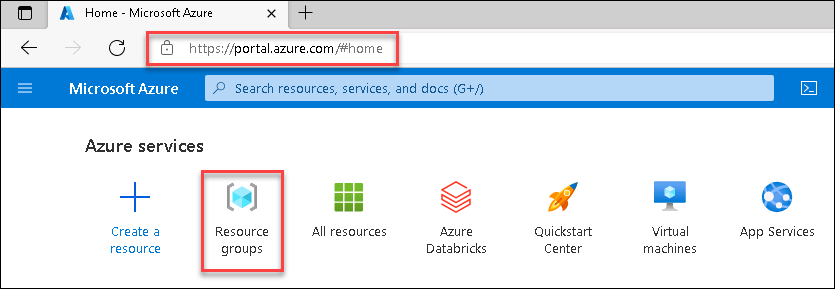

2. Select the **AI-in-a-Day** resource group.

3. Select the storage account named **aiinadaystorage<inject key="DeploymentID" enableCopy="false"/>**.

    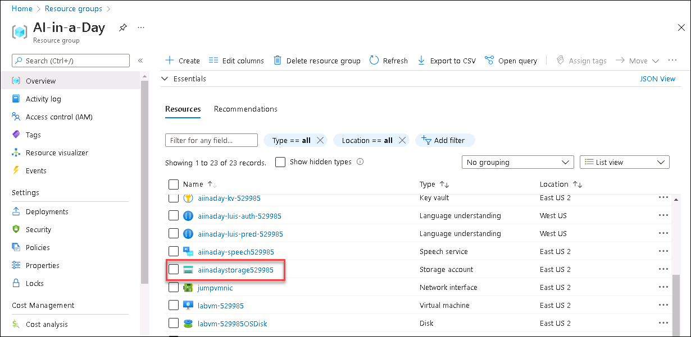

4.  Select `Access keys` from the left side menu, and then select `Show keys`. Save the storage account name, the `key1 Key` value, and the `key1 - Connection string` value for later use.

    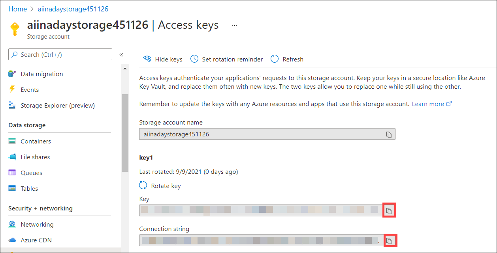

## Task 2 - Prepare the COVID cases per age group dataset

1. Navigate to back to the resource group `AI-in-a-Day`. Select the AML Workspace named **ai-in-a-day-<inject key="DeploymentID" enableCopy="false"/>**
  
    
   
2. Click on **Launch Studio** button.

    

2. In Azure Machine learning studio, select **Notebooks**. If you see any popup `What's New in Notebooks`, close that.

    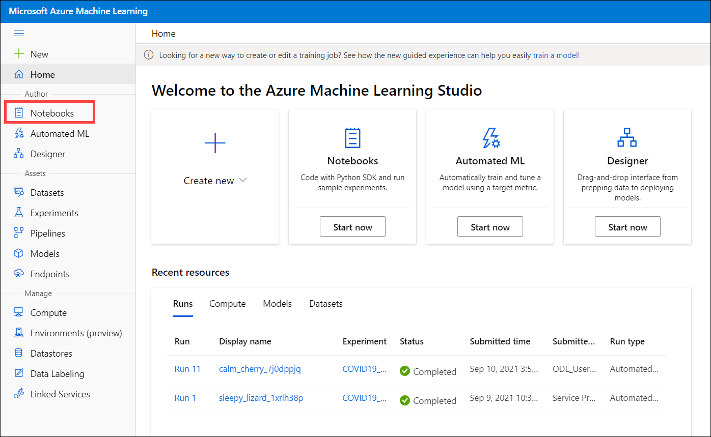

3. In the Notebooks environment, check if `preparemetricsfeeddata.ipynb` is there in **Users\odl_user_<inject key="DeploymentID" enableCopy="false"/>** folder. If it is not there download and import using next steps.

    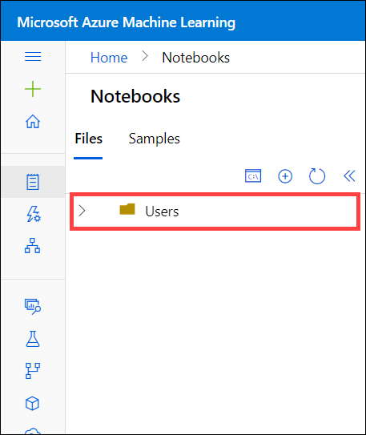

4. If the folder does not contain `preparemetricsfeeddata.ipynb` notebooks, download the following items to your local machine:

    [Prepare metrics feed data](https://aiinadayaiw.blob.core.windows.net/aiinaday/preparemetricsfeeddata.ipynb)

5. Upload the file by selecting the Upload button from the top right corner of the screen, and then selecting the blue Upload button to confirm.

    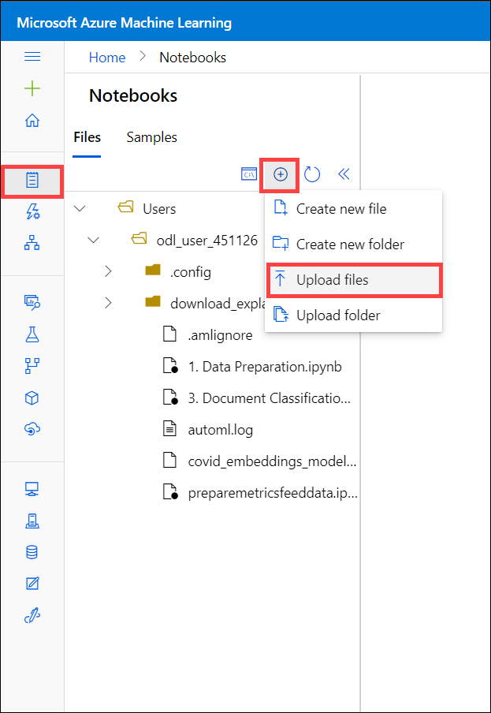
   
   - Click on `Click to browse and select file(s)` and select the file which was just dowloaded.
   - Check the "I trust contents of the File" and select upload. 
   
    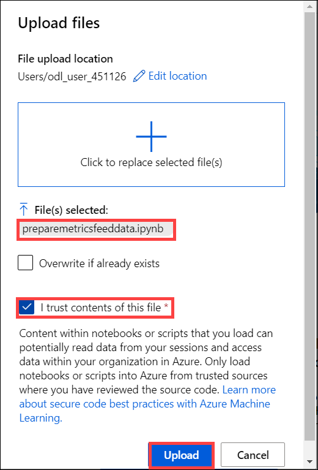

6. With the Azure Machine Learning studio and the Jupyter notebook environment open, select the `preparemetricsfeeddata.ipynb` from **Notebooks** under **Author**.

    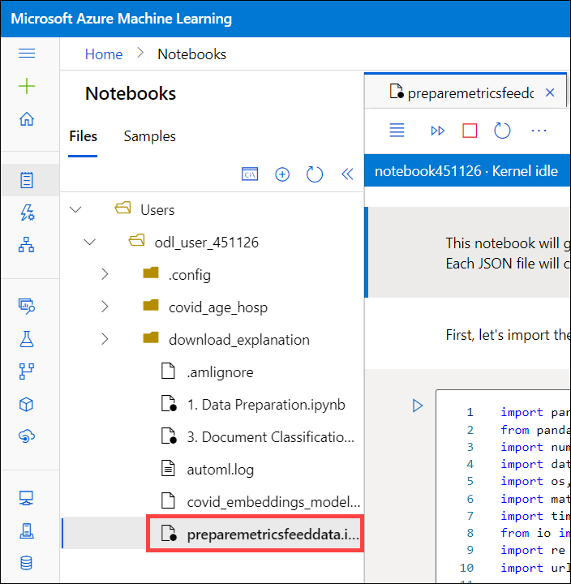

7. You have to **Choose an available Jupyter kernal**, select **Python 3.8 - AzureML** from the drop-down and then select **Start Jupyter kernal**.

    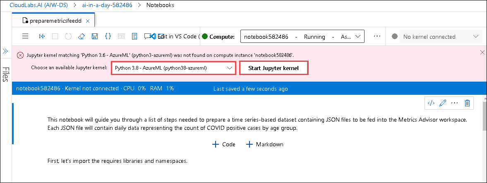
    
>**Note**: Please ensure to click on **Authenticate** button if a pop-up notification comes like below.

   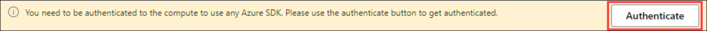
   
8. Make sure **Python 3.8 -AzureML** kernal selected as shown in the below screenshot.

   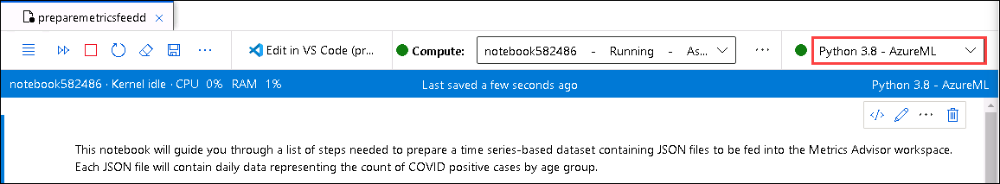 

> **Note**: Make sure you replace the `<BLOBSTORAGE_ACCOUNT_NAME>` and `<BLOBSTORAGE_ACCOUNT_KEY>` values in the variable initialization cell with the values you have noted down at the end of the previous task.

   The notebook will guide you through a list of steps needed to prepare a time series-based dataset containing JSON files to be fed into the Metrics Advisor workspace. Each JSON file will contain daily data representing the count of COVID positive cases by age group.

9. Execute the notebook cell by cell (using either Ctrl + Enter to stay on the same cell, or Shift + Enter to advance to the next cell) and observe the results of each cell execution.

## Hands-on Lab

## Task 1 - Explore dashboard of COVID-19 data

Understanding the source datasets is very important in AI and ML. To help you expedite the process, we have created a Power BI dashboard you can use to explore them at the begining of each lab.

To get more details about the source datasets, check out the [Data Overview](../data-overview.md) section.

To explore the dashboard of COVID-19 data, open the `Azure-AI-in-a-Day-Data-Overview.pbix` file located on the desktop of the virtual machine provided with your environment.

## Task 2 - Explore lab scenario

Besides collecting data about COVID-19 cases, it is also essential to ensure the accuracy of the reporting. Accuracy check is where continuous monitoring of incoming data feeds doubled by automatic detection of anomalies plays a critical role. Data is valid for analysis as long as it is reliable and contains the minimum possible number of errors. With distributed data sources and numerous reporting entities, automatic anomaly detection is the best choice to minimize that number.

Using Cognitive Services Metrics Advisor, we will demonstrate how to improve the case surveillance data quality by identifying as early as possible anomalies in the number of daily reported cases.

The following diagram highlights the portion of the general architecture covered by this lab.

The high-level steps covered in the lab are:

- Explore dashboard of COVID-19 data
- Explore the lab scenario
- Onboard your time series data in the Metrics Advisor
- Explore anomalies detected in your data
- Perform root cause analysis
- Explore anomalies with hard thresholds (optional)

## Task 3 -  Deploy Azure Cognitive Services Metrics Advisior instance

1. Navigate to the Azure portal and click on the menu icon and select **+ Create a resource**

   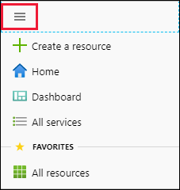  

2. In the search bar type **Metrics Advisor** and then select **Create**

   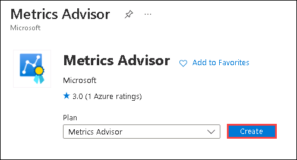  

3. Under Project details on Create Metrics Advisor page provide the following details and click **Review + Create**

    * Subscription : Select the available Subscription
    * Resource Group : **Ai-in-a-Day**
    * Region : Select the available Region from the dropdown
    * Name : **metricsadvisor-<inject key="DeploymentID" enableCopy="false"/>** 
    * Pricing tier: **S0**
    * Make sure to mark checkbox ☑ for **I confirm I have read and understood the notice below**.
   
     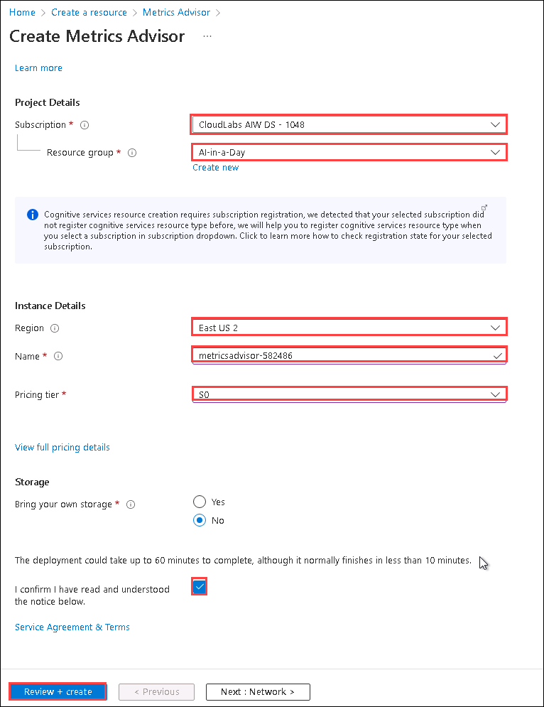

4. Once the validation is passed click on **Create**. The deployment could take up to **60 minutes** to complete, although it normally finishes in less than **10 minutes**. Please wait untill the deployment gets succeeded and then, you can proceed with next task.

## Task 4 - Configure the "COVID cases by age group" Metrics Advisor data feed

1. Back to the Home page in Azure Portal, in the list of your recent resources, locate the Azure Metrics Advisor workspace and select it. If you are prompted to sign-in again, use the same lab Azure credentials you used at the previous step.
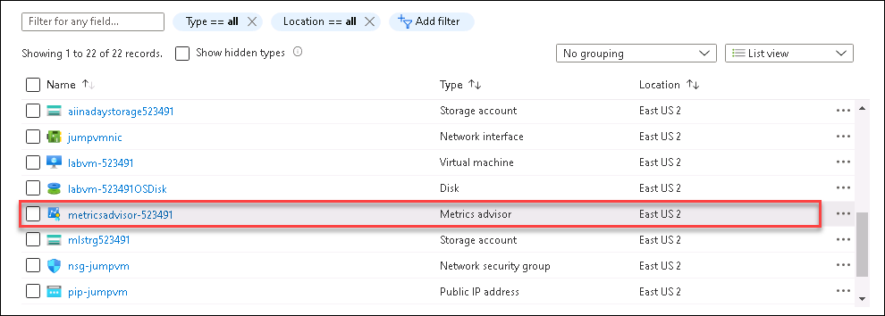

2. On the Metrics Advisor Overview page, select the `Go to workspace` link in the first section to start working with the web-based [Metrics Advisor workspace](https://metricsadvisor.azurewebsites.net/).

    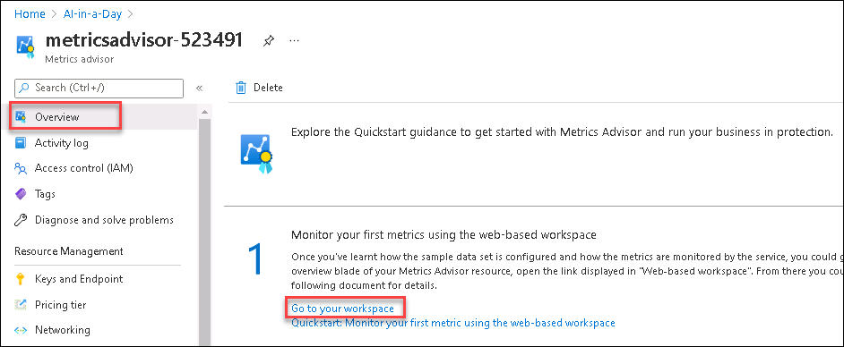

3. On the Metrics Advisor welcome page, select your Directory, subscription and workspace information and select **Get started**. You are now prepared to create your first Data feed.

   > **Note:-** If you see that **Get Started** button is not available for you, it means that the metric advisor service is not fully available yet. Please wait for 20-30 minutes and try again after refreshing the page.

    

4. With the Metrics Advisor workspace opened, select the **Add datafeed** option from the left navigation menu.

5. Add the data feed by connecting to your time-series data source. Start by selecting the following parameters:

    - **Source type**: `Azure Blob Storage (JSON)`
    - **Granularity**: `Daily`
    - **Ingest data since (UTC)**: `2022-02-01`
    - **Connection string**: provide the connection string from the blob storage access keys page. (`key1 - Connection string` copied on **Before the hands-on lab** part or else please  follow Task 1 of Before the hands-on lab) 
    - **Container**: `jsonmetrics`
    - **Blob template**: `%Y-%m-%d.json` (since the daily json files are provided in with naming format)
    - **JSON format version**: `v2` (since we'll be using the age group dimension in our data schema)

    

6. Select the **Load data button** to validate the configured connection, y=you can find **Load Data** option just below the **JSON format version** in right side, so scroll in right to see teh button.  If there is an error at this step, check that your connection string and blob template are correct and your Metrics Advisor instance is able to connect to the data source.

7. Once the data schema is loaded and shown like below, configure the appropriate fields as Dimension, Measure or Timestamp and select **Verify schema**.

    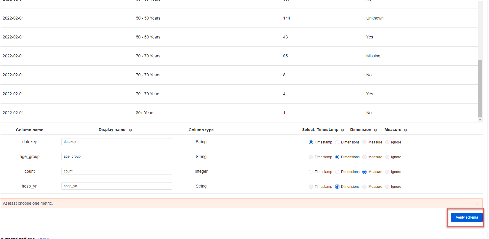

8. Scroll down towards the bottom of the page. For **Automatic roll-up** settings, select the **I need the service to roll-up my data** (1) option, select the link **Set roll-up columns** and include both dimensions (3).

    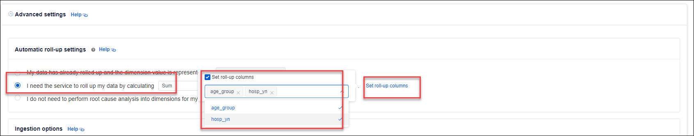

9. In the **Advanced settings** section, inside **Ingestion options**, set **Stop retrying after** to **0** hours to stop the ingestion process after the first run. 
    
    

10. In the **Misc** section, choose the option to **Fill previous** for anomaly detection model.

    

11. Provide the **Data feed name**: `covid-ages` and select **Submit** to confirm and submit the data feed.

    

12. Wait for the ingestion progress dialog and select the **Details** link in order to observe the ingestion log by timestamp. Wait until the ingestion completes with success for all ingested json files.

    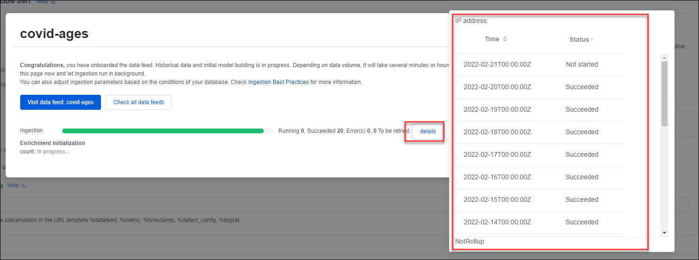

## Task 5 - Explore anomalies detected in data

After the data feed is added, Metrics Advisor will attempt to ingest metric data from the specified start date. It will take some time for data to be fully ingested, and you can view the ingestion status by clicking Ingestion progress at the top of the data feed page. If data is ingested, Metrics Advisor will apply detection, and continue to monitor the source for new data.

When detection is applied, you can select one of the metrics listed in data feed to find the Metric detail page to:

- View visualizations of all time series slices under this metric
- Update detecting configuration to meet expected results
- Set up notification for detected anomalies

1. Select the **Visit data-feed: covid-ages** button to navigate to the data feed overview page.

    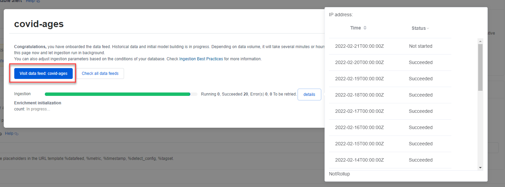

2.  In the data feed page, select the `count` metric under the **Metrics** section.

    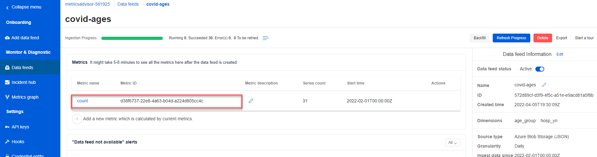

3.  To modify the inspected time window, change the start and end time of the interval from the calendar above the graphic representations.
    
    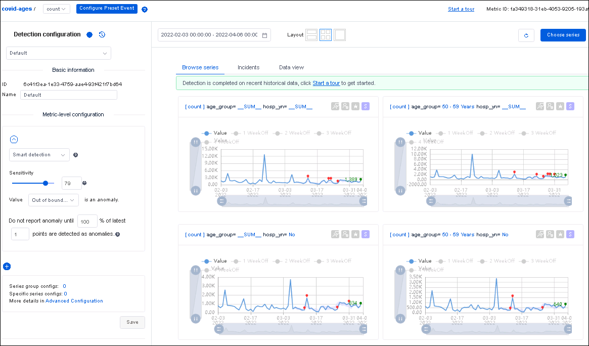

4.  Make sure you see the ingestion process completed on recent historical data **(1)** as illustrated in the picture bellow. When all data is ingested, in the left configuration section, under the **Metric-level configuration** **(2)** change the default metric-level configuration to use Smart detection and set the sensitivity level to 81 and use this configuration:
    - Value **Out of boundary** is anomaly 
    - Do not  report anomaly until **10%** of latest **1** points are detected as anomalies.

    > **Note:-** It can take 30 minutes to completed on recent historical data, so please wait or continue with next lab and come back later and continue this lab.

    

>Note
>
> - To view the diagnostic insights, click on the red dots **(3)** on time series visualizations, which represent detected anomalies and select the link **To incident hub**. 
>
> - Spend a few minutes to change some parameters inside the **Metric-level configuration** section and observe the change of reported anomalies (red points) on the series data representation.

5. In the metrics browser page, select the **Incidents** tab and click on the **Dimension filter**(1) to see the incidents related to number of cases that required hospitalization **hosp_ym = Yes**(2) and **Confirm**(3). 

    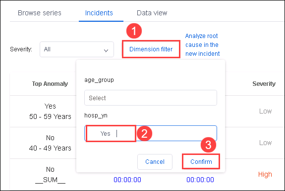

6. From the list select the anomaly reported for SUM of hospitalized cases.
    
    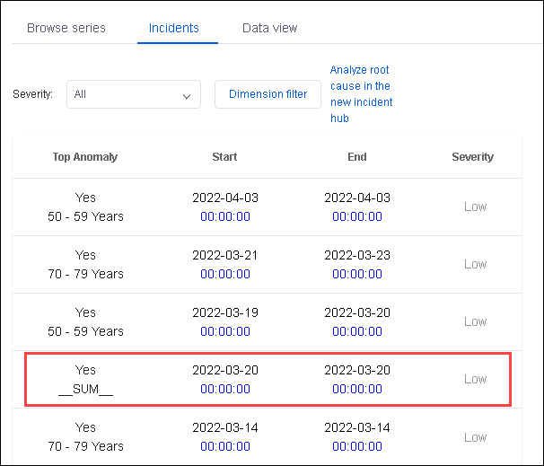

## Task 6 - Perform root cause analysis

1.  In the incidents hub, notice the **Root cause** section where you should find reported the main contributors for the detected anomaly, age groups that contributed to the sum of cases reported as anomaly. Also, in the **Diagnostic** tree, hover on each age group node to investigate its contribution to the incident.
    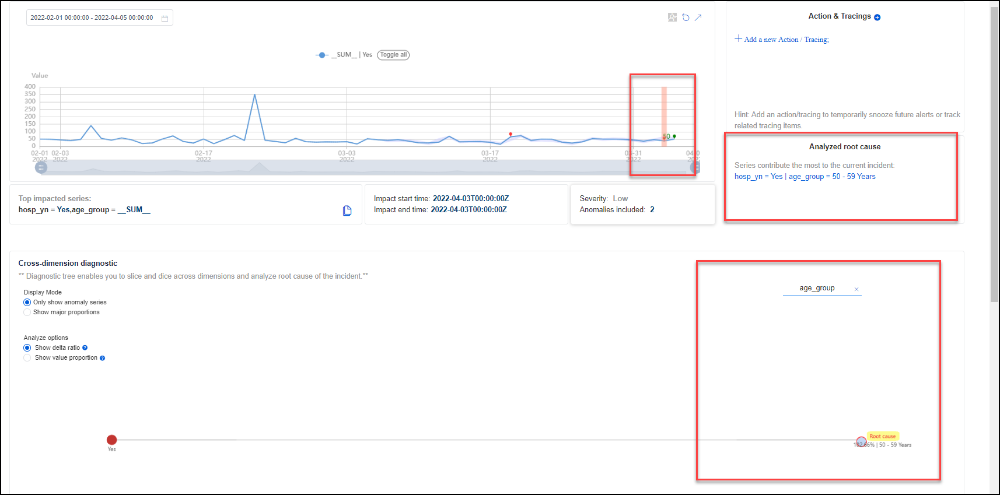

2.  In the **Diagnostics** (1) section, navigate to **Metrics drill-down** (2) and notice the current point Value (number of cases) and the **Diff**  from the identified **Baseline** (3). Choose the **age_group** dimension to drill-down by it and check the same **Delta** percent and **Diff** value from the baseline for the anomalies detected in the current point. 

     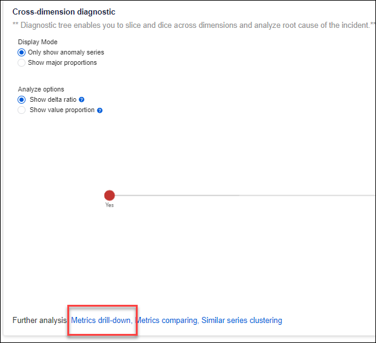

    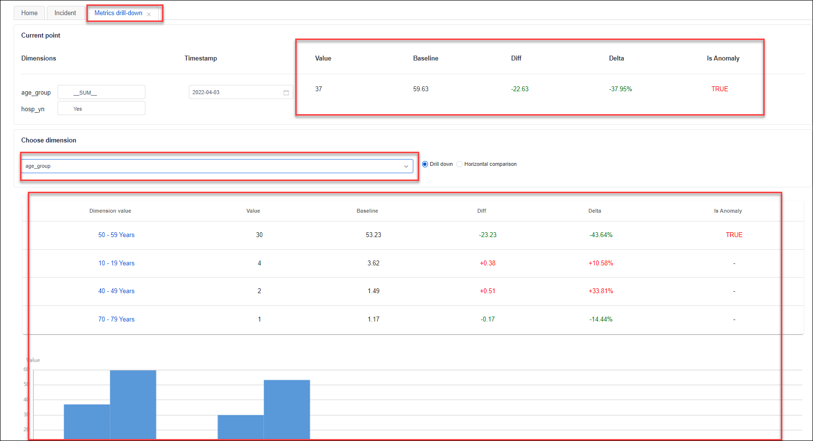

## Task 7 - Explore anomalies with hard thresholds (optional)

As an optional exercise, you can create a different detection configuration, based on hard thresholds rather than smart detection.

To do this, go back to the metric detection configuration screen and try a new configuration as follows **(1)**:

- **Hard threshold**
- Value **Out of range** Min: **1000** and Max: **9000** is an anomaly
- Do not report anomaly until 100% of latest **10** points are detected as anomalies

We should have marked as anomalies the points in time where number of cases is bellow or above a fixed threshold for 10 continous points in time.(Notice the yellow dots **(2)** before the reported anomalies and how the threashold is delimited by the red horizontal lines **(3)**).

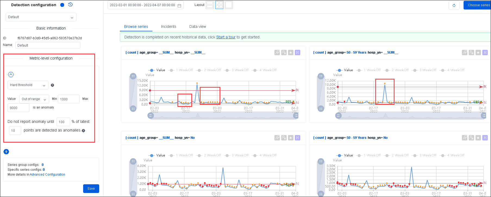

## Task 8 - Anomaly detection methods (Optional)

Metrics Advisor offers multiple anomaly detection methods:  **Hard threshold, Smart detection, Change threshold**.

### Subtask 1 : Smart Detection

Smart detection is powered by machine learning that learns patterns from historical data, and uses them for future detection. When using this method, the  **Sensitivity**  is the most important parameter for tuning the detection results.

1. Under the **Metric-level configuration** select the **Smart detection** configuration. Drag the **Sensitivity** slider to a smaller value and notice the visualization change on the right side. 

    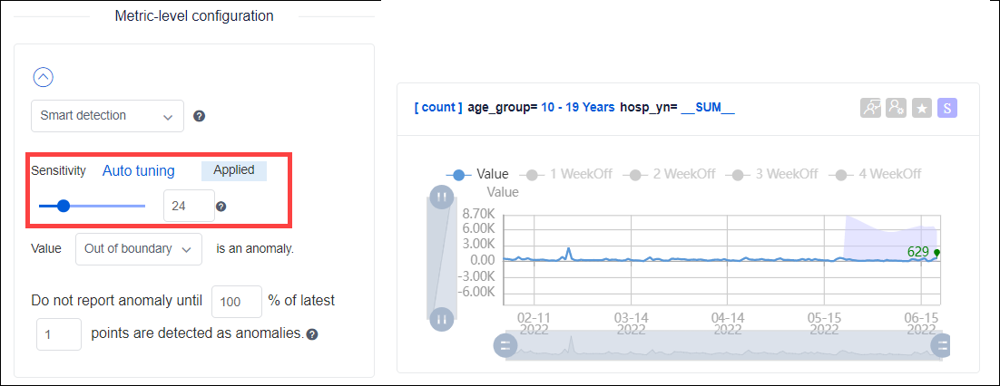

2. Sensitivity can affect the width of the expected value range of each point. Now drag the **Sensitivity** slider to a larger value and notice the expected value range will be tighter and more anomolies will be reported.

    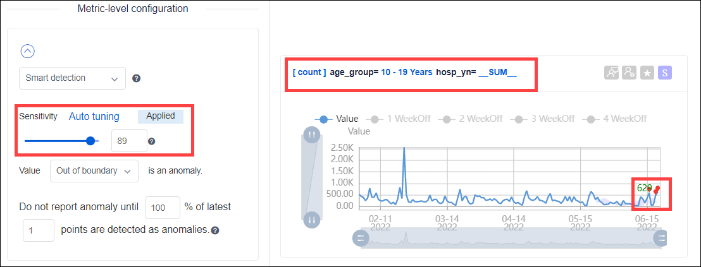

### Subtask 2 : Change threshold

Change threshold is normally used when metric data generally stays around a certain range. The threshold is set according to  **Change percentage**. The **Change threshold**  mode is able to detect anomalies in the scenarios:

-   Your data is normally stable and smooth. You want to be notified when there are fluctuations.
-   Your data is normally unstable and fluctuates a lot. You want to be notified when it becomes too stable or flat.

1.  Under the **Metric-level configuration**, select  **Change threshold** as your anomaly detection method. 

    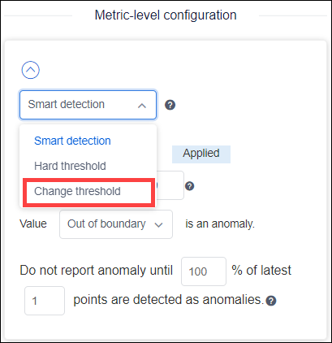
    

2. Select the **out of threshold** to detect fluctuations and set the value to **10%**. Any data point that changes over 10% compared to the previous one will be detected as an outlier.

    

3. Now select **within the threshold** to detect flat lines in your data and set the value to **0.01%**. Any data point that changes within 0.01% compared to the previous one will be detected as an outlier. Because the threshold is so small (0.01%), it detects flat lines in the data as outliers.

    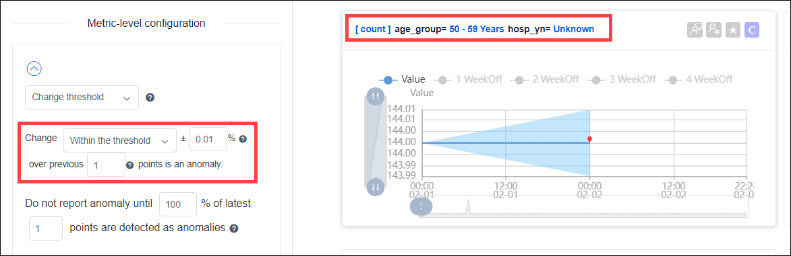

>**Note**: For more information, see [Anomaly detection methods](https://docs.microsoft.com/en-us/azure/applied-ai-services/metrics-advisor/how-tos/configure-metrics#anomaly-detection-methods).

## Task 9 - Configure metrics and fine tune detection configuration

### Metrics

1. To browse the metrics for a specific data feed, go to the  **Data feeds**  page and select **covid-ages** from the feeds. This will display a list of metrics associated with it.

2. Select **count** to see its details. In this view.

   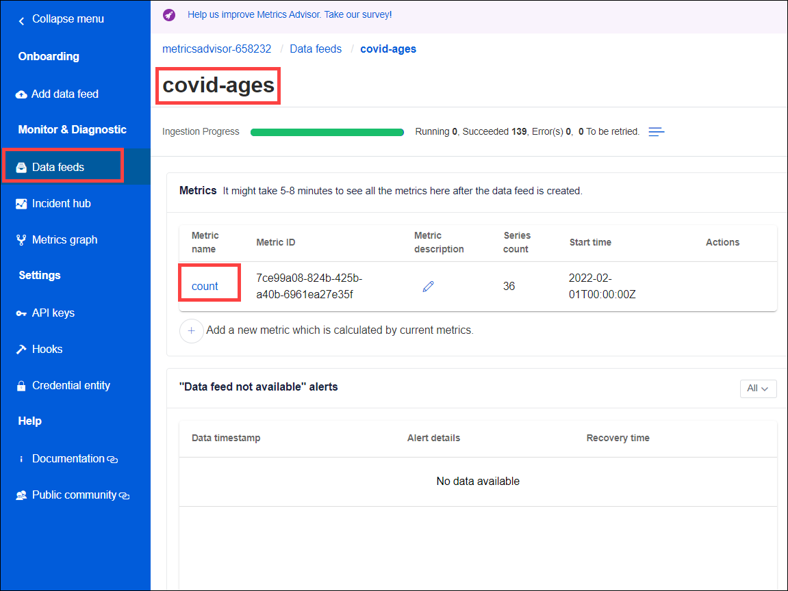

When you first view a metric's details, you can load a time series by letting Metrics Advisor choose one for you, or by specifying values to be included for each dimension.

3. You can also select time ranges, and change the layout of the page (1)

4. You can select the  **Incidents**  tab to view anomalies (2).

    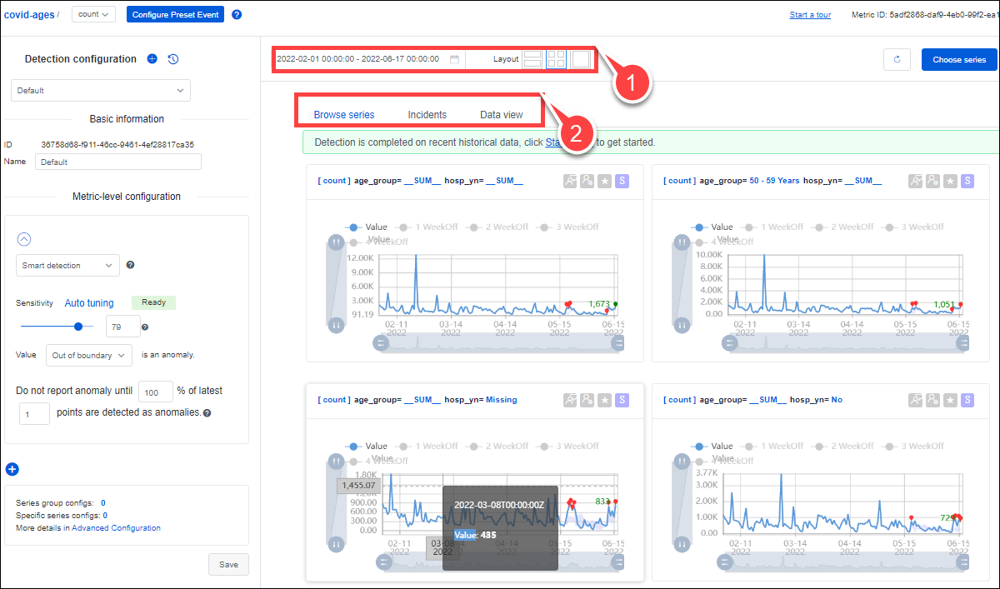

## Task 10 - Tune the detection configuration

A metric can apply one or more detection configurations. There's a default configuration for each metric, which you can edit or add to, according to your monitoring needs. The new auto-tuning feature makes this distinction between anomaly types possible. As of now, there are five supported anomaly patterns:

-   Spike
-   Dip
-   Increase
-   Decrease
-   Steady

>**Note**: The auto-tuning feature is only applied on the 'Smart detection' method.

1. After the metrics are onboarded to Metrics Advisor, the system will try to perform statistics on the metrics to categorize  **anomaly pattern**  types and  **series value**  distribution. By providing this functionality, you can further fine tune the configuration based on their specific preferences. At the beginning, it will show a status of  **Initializing**.

    

### Subtask 1 - Choose to enable auto-tuning on anomaly pattern and series value

1. Once the initializing is completed select the **Auto Tuning** option as shown below.

    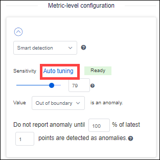

You will be greeted with **Auto tuning preference** page.

1. The **Auto tuning preference** feature enables you to tune detection configuration from two perspectives  **anomaly pattern**  and  **series value**. Based on your specific use case, in our case we will choose the **Anomaly pattern.**

2. For the  **anomaly pattern**  option, the system will list out different anomaly patterns that were observed with the metric. You can choose which ones you're interested in and select them, the unselected patterns will have their sensitivity  **reduced**  by default.

    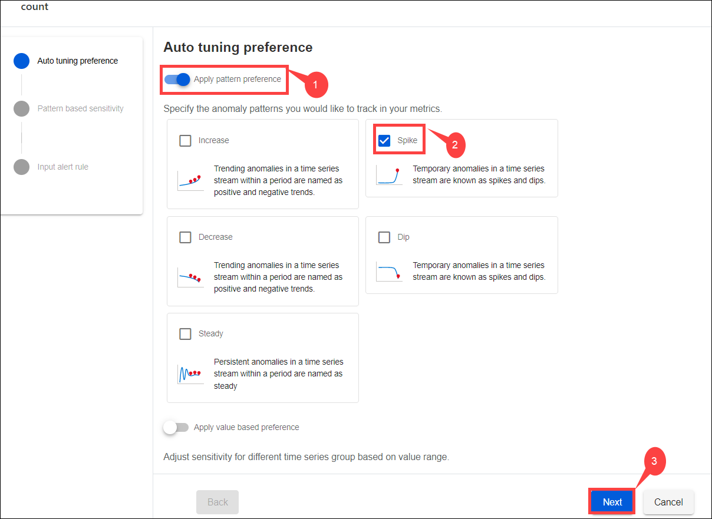

3. Select the **Apply Pattern preference** option (1), followed by selecting **Spike** (2) as the anomaly pattern and then select **Next** (3) to go the next section.

### Subtask 2 - Tune the configuration for selected anomaly patterns

The next step is to fine tune the configuration for each. There's a global  **sensitivity**  that is applied for all series. For each anomaly pattern, you can tune the  **adjustment**, which is based on the global  **sensitivity**.

1. You must tune each anomaly pattern that has been chosen individually. In our case the **Spike** (1) anomaly pattern will be visible. Under the **Adjustment for anomaly patterns** adjust the slider to change the **sensitivity**. Now select **Next** (2) to set up alerts.

    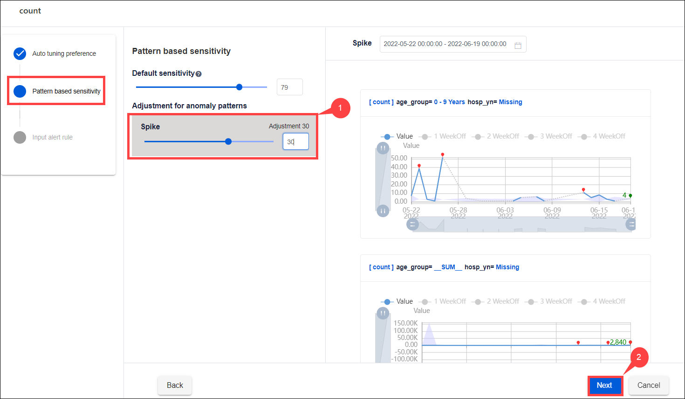

### Subtask 3 - Set up alert rules

Once the detection configuration on capturing valid anomalies is tuned, it's still important to input  **alert rules**  to make sure the final alert rules can meet eventual business needs. There are a number of rules that can be set, like  **filter rules**  or  **snooze continuous alert rules**.

1. On the **Setup alert Rules** page under the **Configuration name** enter **Test-Alert** (1) and leave the **Hooks** unselected. Expand the **Filter anomaly based on value** section (2) and the **Advanced Settings** (3).

    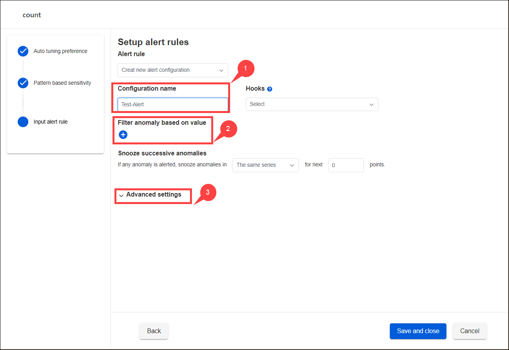

2. On the **Filter anamoly based on value** select the **This Metric** setting and from the dropdown select **Out of range** (2). Leave the **Snooze successive anomalies** (3) unchanged. Select the **Anomalies in all series** (4) under the **Alert Scope** section. Now select **Save and close** (5).

    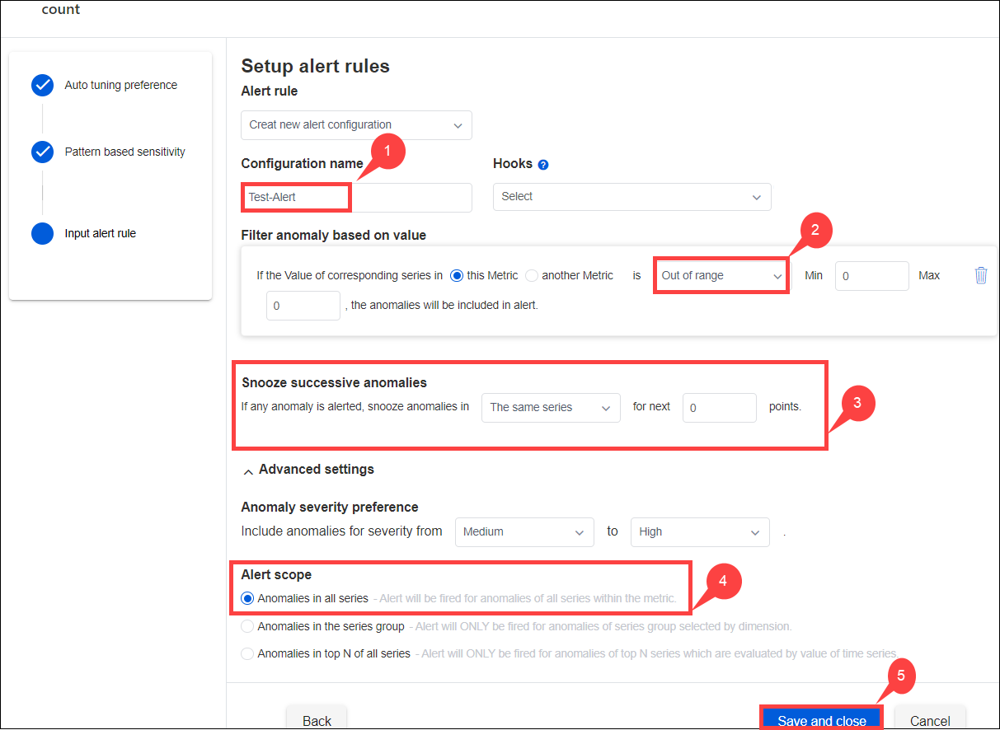

3. You can see the newly configured **Test-Alert** under the **metric-level configuration** pane on the left.

    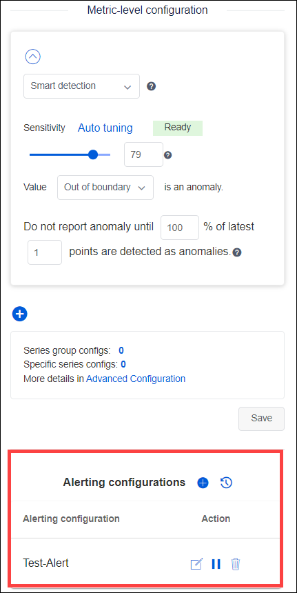

After configuring all the settings described in the section above, the system will orchestrate them together and automatically detect anomalies based on your inputted preferences. The goal is to get the best configuration that works for each metric, which can be achieved much easier through use of the new  **auto-tuning**  capability.

## Task 11 - Tune the configuration for a specific series or group

1. Select **Advanced configuration** below the metric level configuration options to see the group level configuration.

    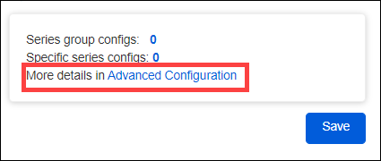

2. You can add a configuration for an individual series, or group of series by clicking the **'+'** icon in this window. 
    
    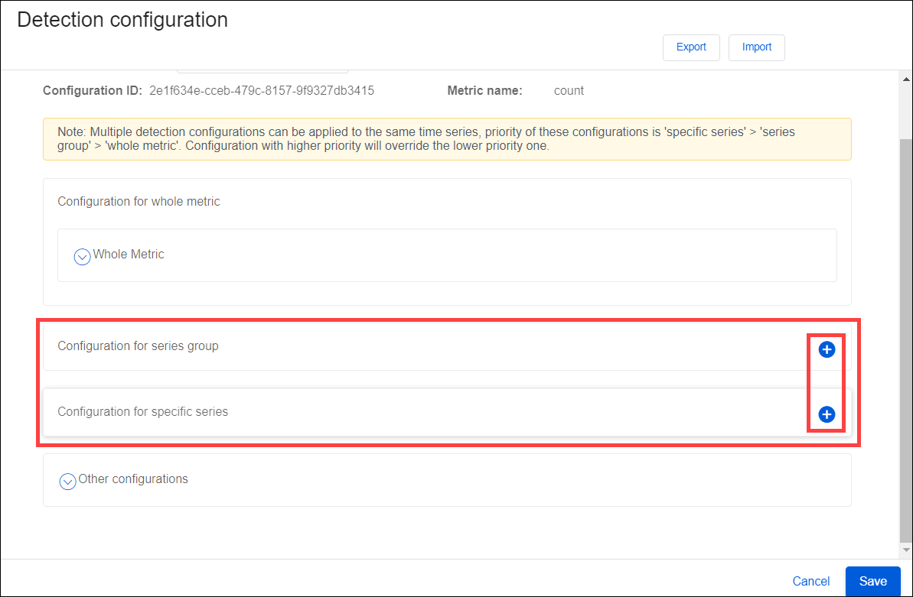

3. Select the **'+'** for **Configuration for series group**. Specify at least one **dimension value** (1) for a group-level configuration to identify a group of series. Leave the conditions as default and select **Save**.

    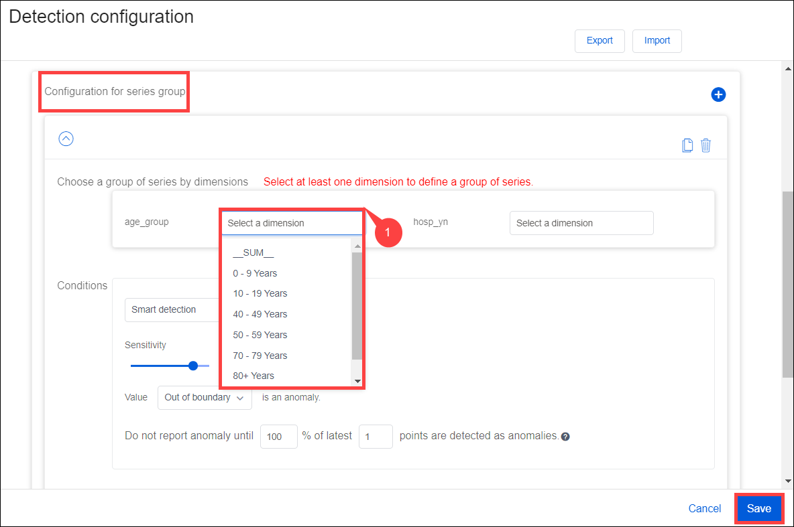

4. Under the **Metric-level configuration** pane, notice the **Series group configs** value has changed to **1**.

    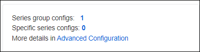

5. Select **Advanced configuration** once again to add **specific series** level configuration.

    

6. Select the **'+'** for **Configuration for specific series**. Specify all **dimension values** (1) and (2) for series-level configuration to identify a specific series. Leave the **Conditions** as default and select **Save**.

    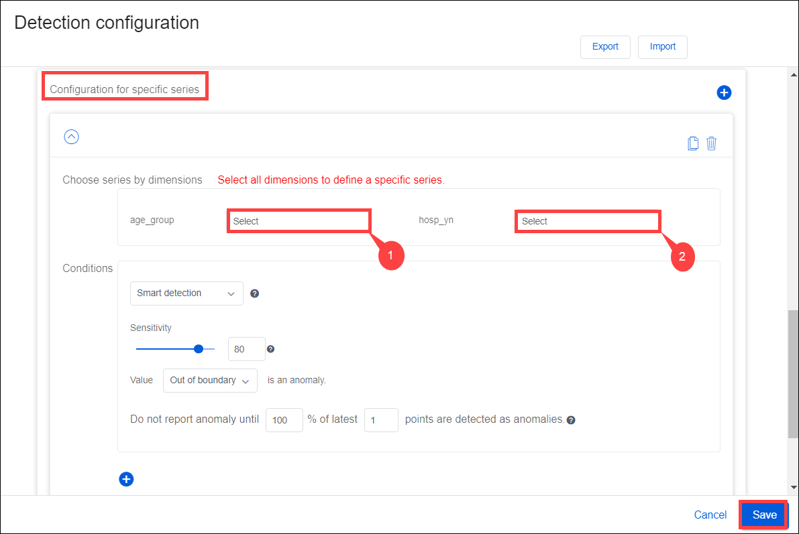

7. Under the **Metric-level configuration** pane, notice the **Specific series configs** value has changed to **1**.

    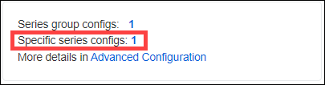

8. This configuration will be applied to the group of series or specific series instead of the metric level configuration. After setting the conditions for this group, **save**.

    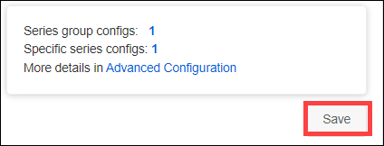

## Task 12 - Preset events

Sometimes, expected events and occurrences (such as holidays) can generate anomalous data. Using preset events, you can add flags to the anomaly detection output, during specified times. This feature should be configured after your data feed is onboarded. Each metric can only have one preset event configuration.

>**Note**: Preset event configuration will take holidays into consideration during anomaly detection, and may change your results. It will be applied to the data points ingested after you save the configuration.

1. Select the  **Configure Preset Event**  button next to the metrics drop-down list on each metric details page.

    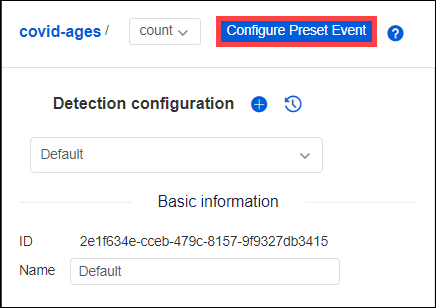

2. In the window that appears, Make sure  **Enable holiday event** (1) is selected to use the configuration.

3. On the **Strategy** option select **Suppress holiday** (2).

4. On the **Country Dimension** option select **age_group** (3) from the drop down. You will notice a new field is added named **Country of interest**.

5. On the **Country of interest** field, you will see two options. On the **Standard country code** select your country from the drop down and on the **age_group** option select
**__SUM__**.

6. On the **Holiday option** select **Only NON-PTO Holidays**.
Leave the rest of the options as default. The **Holiday event** pane should look like this: 

    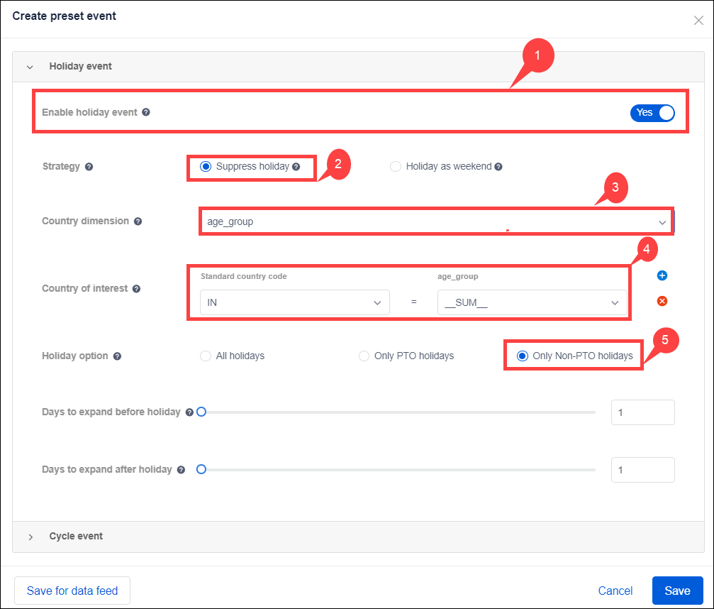

7. The **Cycle event** is used to reduce anomalies if they follow a cyclic pattern, but it will report an anomaly if multiple data points don't follow the pattern. Select the downward arrow to expand the **Cycle event** (1).

8. Make sure  **Enable Cycle event** (2) is selected to use the configuration.

9. On the **Cycle option**, select **MoM** (3).

    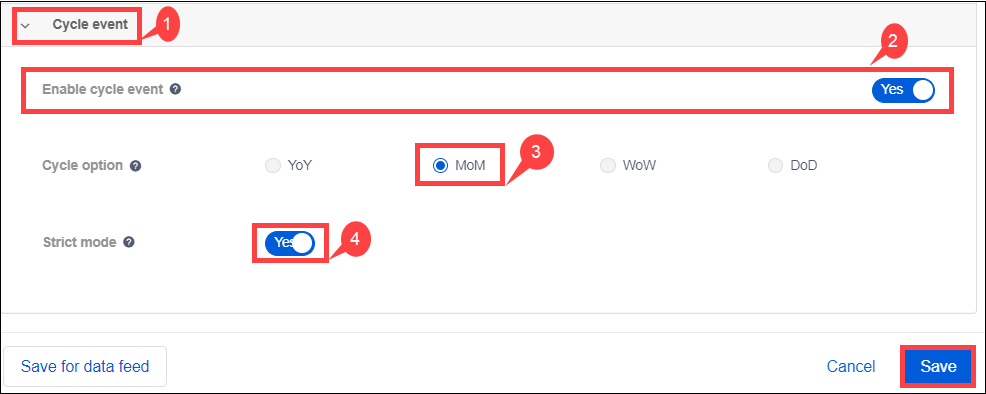

10. On the **Strict mode**, select **Yes** (4) and click on **Save** to save the preset.

11. You have now successfully configured **Preset events**.

>**Note**: For more information, see [Present Events](https://docs.microsoft.com/en-us/azure/applied-ai-services/metrics-advisor/how-tos/configure-metrics#preset-events).

## Task 13 - View recent incidents

Metrics Advisor detects anomalies on all your time series data as they're ingested. However, not all anomalies need to be escalated, because they might not have a significant impact. Aggregation will be performed on anomalies to group related ones into incidents. 

1. To view these incidents select the  **Incident**  tab in metrics details page.

    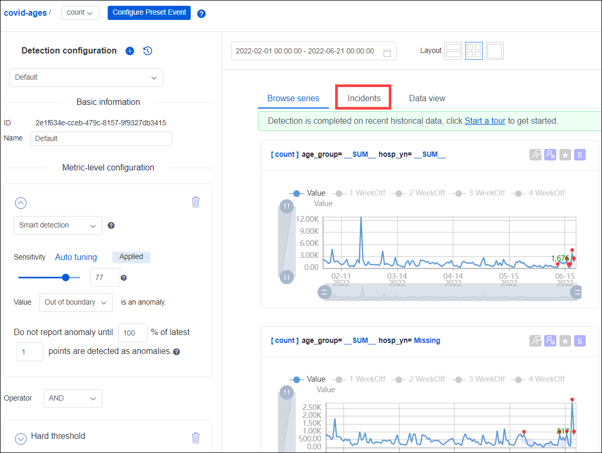

2. From the **Incident** page, select an incident to go to the **Incidents Analysis** page. Where you can see more details about it. 

    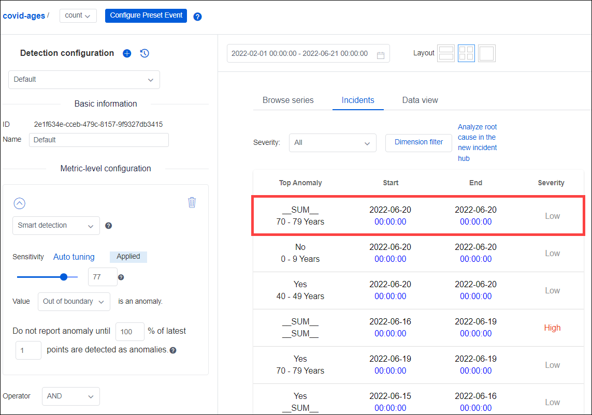
    
    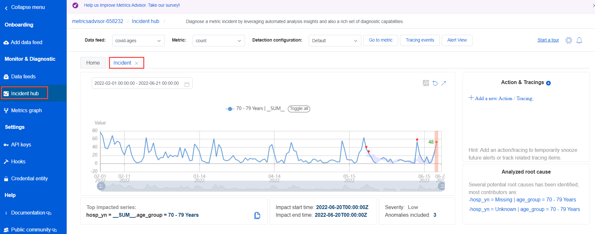

3. On the **Incident hub** select **Home** to find the page where you can find all the incidents under the specific metric.

    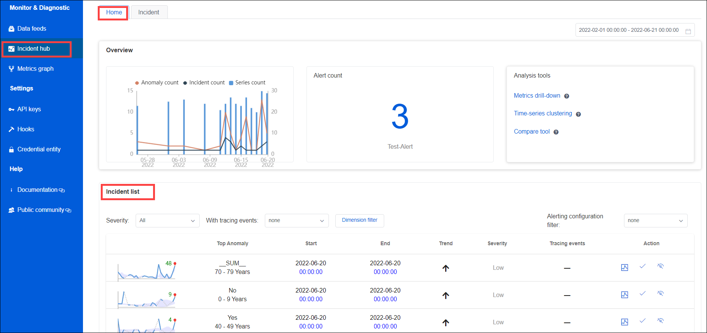
