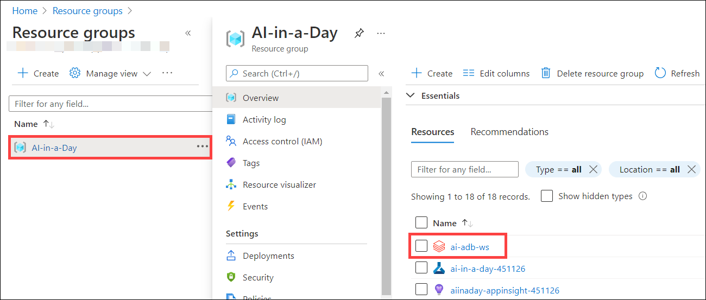
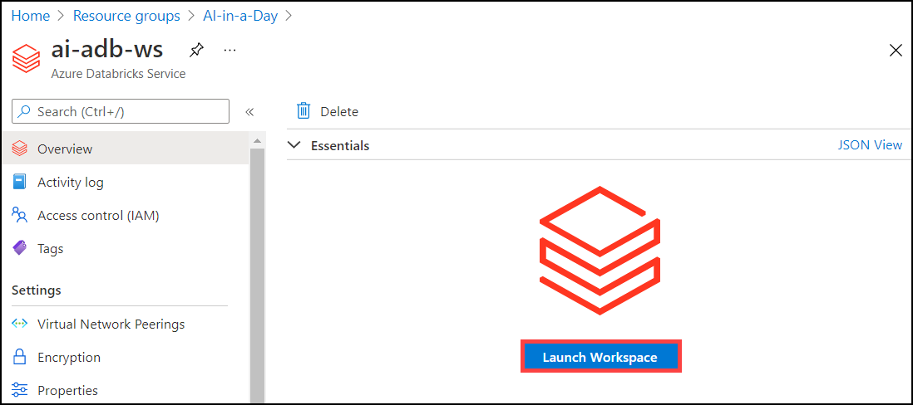
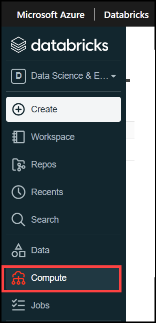
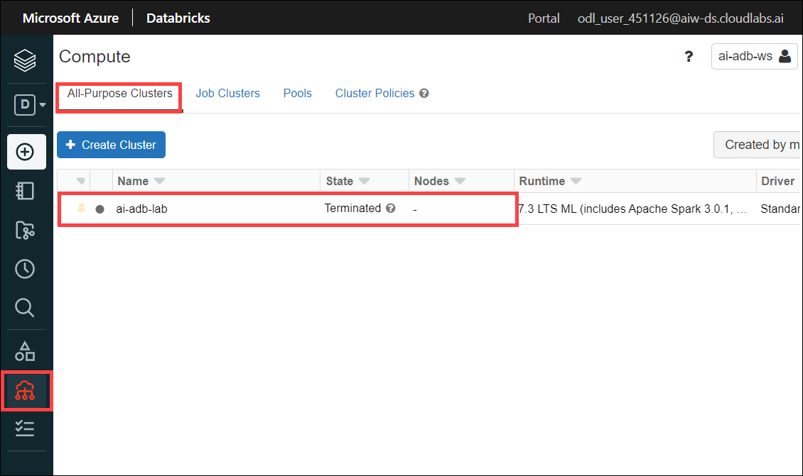
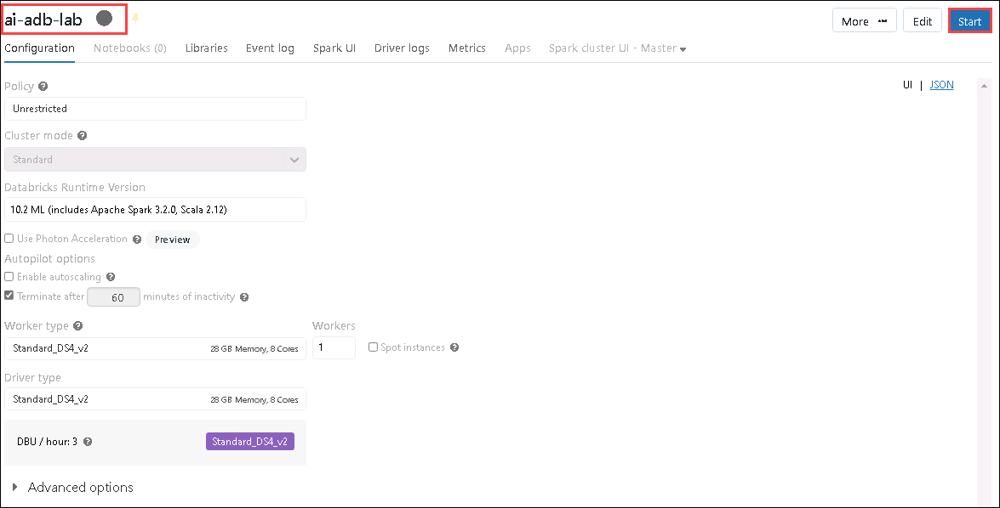
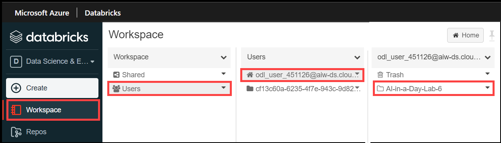
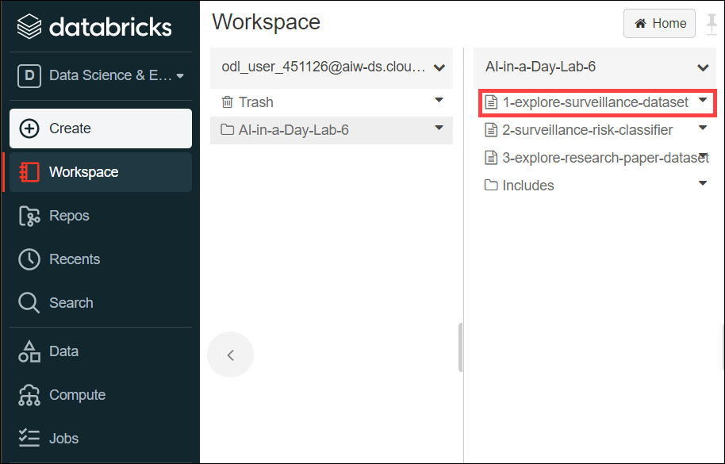
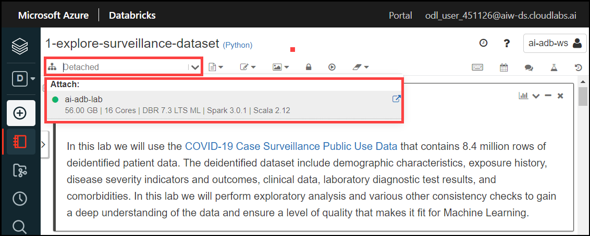
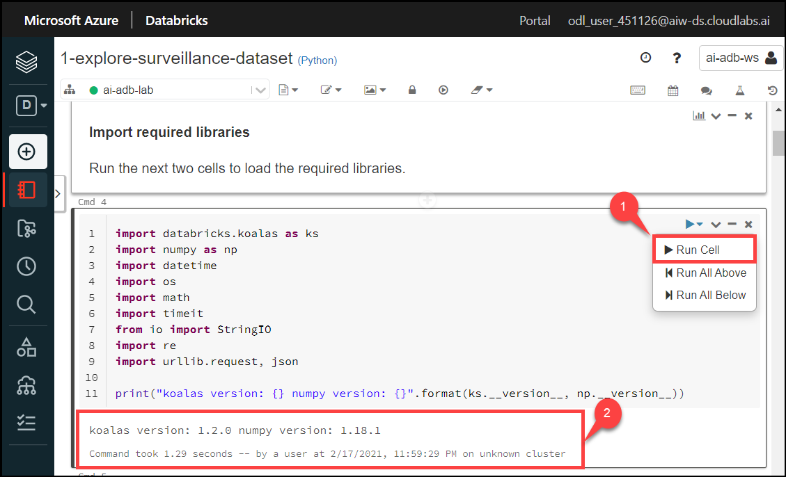
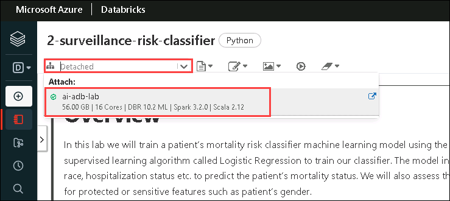

# Lab 5 - Machine Learning with Azure Databricks

The lab covers Data Engineering and Machine Learning using Azure Databricks notebooks.

## Task 1 - Explore dashboard of COVID-19 data

Understanding the source datasets is very important in AI and ML. To help you expedite the process, we have created a Power BI dashboard you can use to explore them at the begining of each lab.


To get more details about the source datasets, check out the [Data Overview](https://github.com/CloudLabsAI-Azure/ai-in-a-day/blob/main/data-overview.md) section.

To explore the dashboard of COVID-19 data, open the `Azure-AI-in-a-Day-Data-Overview` file located on the desktop (**C:\Users\public\desktop**) 💻 of the virtual machine provided with your environment. If you see `Introducing the updated mobile layout` popup screen, then close it by click on `Got it`. Collapse the **Fields** and **Visualizations** tabs to see the clear report.

 

> **Note:** Please close and reopen the Power BI Desktop document if it throws an error in the first attempt.

## Task 2 - Explore lab scenario

When data comes in natural language, a data engineering process should transform it into a numerical form useful in Machine Learning. In most cases, some input values will be off (e.g., resulting from human error) or even missing. The same process should be able to identify and handle these cases. Furthermore, analysts need to perform exploratory analysis and various other consistency checks to gain a deep understanding of the data and ensure a level of quality that makes it fit for Machine Learning.

Using Azure Databricks, we will prepare input datasets and analyze their content. We will also attempt to correlate the various datasets and clean their content. We will assess the resulting data quality using both statistical and Machine Learning-based approaches.

The following diagram highlights the portion of the general architecture covered by this lab.


The high-level steps covered in the lab are:

- Explore dashboard of COVID-19 data
- Explore lab scenario
- Explore source data and identify potential issues
- Perform data cleansing on research paper dataset and explore results
- Perform data cleansing on case surveillance data and explore results
- Correlate research paper and case surveillance datasets
- Use SparkML to build risk classifier on case surveillance dataset
- Assess fairness of risk classifier

## Task 3 - Start your Azure Databricks environment

1. Open the [Azure Portal](https://portal.azure.com) and sign-in with your lab credentials.

2. Navigate to your resource group `AI-in-a-Day` and locate the Azure Databricks workspace **ai-adb-ws**.

   
   
3. Select **launch workspace**. If you are prompted to sign-in again, use the same lab credentials you used at the previous step.

   

4. In the Azure Databricks workspace, select the `Compute` section on the left side menu.

   

5. Under **All-purpose clusters** select the **ai-adb-lab** cluster.

   
  
6. Select `Start` to start the Azure Databricks cluster. It will take 1-2 minutes to start.

   

7. While the cluster is starting, select the `Workspace` section on the left side menu, select the `Users` folder, then select the folder corresponding to the user name from your lab credentials, and then select the `AI-in-a-day-Lab-6` folder.

   

8. In the `AI-Lab6` folder, you should see the three notebooks that you will use in this lab.

   

9. Wait until the cluster starts, then proceed to the next tasks in the lab.

## Task 4 - Explore the surveillance dataset

1. With the Azure Databricks workspace opened and the cluster fully started, select the `1-explore-surveillance-dataset` notebook.
  
  
  
2. On the `1-explore-surrveillance-dataset` notebook, click on the dropdown and select `ai-adb-lab` cluster and attach it. Ensure the notebook is connected to the running cluster.

  

  

3. Execute each cell in the notebook (using Ctrl + Enter to remain on the same cell, or Shift + Enter to advance to the next cell, or **(1) selecting the arrow to run the cell**) and observe the **(2) results**.
    > **Note**: If you see error while running cell 47, please add the following line in cell 47 and re-run the cell.
    
    ```
    ks.set_option('compute.ops_on_diff_frames', True)
    ```

  

## Task 5 - Build a risk classifier based on surveillance data (optional)

1. With the Azure Databricks workspace opened and the cluster fully started, select the `2-surveillance-risk-classifier` notebook.

2. Ensure the notebook is connected to the running cluster.




3. Execute each cell in the notebook (using either Ctrl + Enter to remain on the same cell, or Shift + Enter to advance to the next cell) and observe the results.

## Task 6 - Explore the research papers dataset (optional)

1. With the Azure Databricks workspace opened and the cluster fully started, select the `3-explore-research-paper-dataset` notebook.

2. Ensure the notebook is connected to the running cluster.


3. Execute each cell in the notebook (using either Ctrl + Enter to remain on the same cell, or Shift + Enter to advance to the next cell) and observe the results.

