# Lab 5 - Machine Learning with Azure Databricks

The lab covers Data Engineering and Machine Learning using Azure Databricks notebooks activity in Azure Data Factory.

## Task 1 - Explore dashboard of COVID-19 data

Understanding the source datasets is very important in AI and ML. To help you expedite the process, we have created a Power BI dashboard you can use to explore them at the beginning of each lab.


To get more details about the source datasets, check out the [Data Overview](https://github.com/CloudLabsAI-Azure/ai-in-a-day/blob/main/data-overview.md) section.

To explore the dashboard of COVID-19 data, open the `Azure-AI-in-a-Day-Data-Overview` file located on the desktop (**C:\Users\public\desktop**) 💻 of the virtual machine provided with your environment. If you see `Introducing the updated mobile layout` popup screen, then close it by click on `Got it`. Collapse the **Fields** and **Visualizations** tabs to see the clear report.

 

> **Note:** Please close and reopen the Power BI Desktop document if it throws an error in the first attempt.

## Task 2 - Explore lab scenario

When data comes in natural language, a data engineering process should transform it into a numerical form useful in Machine Learning. In most cases, some input values will be off (e.g., resulting from human error) or even missing. The same process should be able to identify and handle these cases. Furthermore, analysts need to perform exploratory analysis and various other consistency checks to gain a deep understanding of the data and ensure a level of quality that makes it fit for Machine Learning.

Using Azure Databricks, we will prepare input datasets and analyse their content. We will also attempt to correlate the various datasets and clean their content. We will assess the resulting data quality using both statistical and Machine Learning-based approaches.

The following diagram highlights the portion of the general architecture covered by this lab.


The high-level steps covered in the lab are:

- Explore dashboard of COVID-19 data
- Explore lab scenario
- Explore source data and identify potential issues
- Perform data cleansing on research paper dataset and explore results
- Perform data cleansing on case surveillance data and explore results
- Correlate research paper and case surveillance datasets
- Use SparkML to build risk classifier on case surveillance dataset
- Assess fairness of risk classifier

## Task 3- Connect Data Factory to Azure Databricks using linked service

In this task you will be creating a link service in the Data factory to connect Azure Databricks with Data factory.
    
1. Navigate to Azure portal and in the search box on top, search for Data factory and select it.  

    

2. Now open the data factory resource from the list named as **datafactory-<inject key="DeploymentID" enableCopy="false"/>**.

     
     
3. Once you are on overview page of Data factory, click on the **Open Azure Data Factory** option in Getting started section. 

    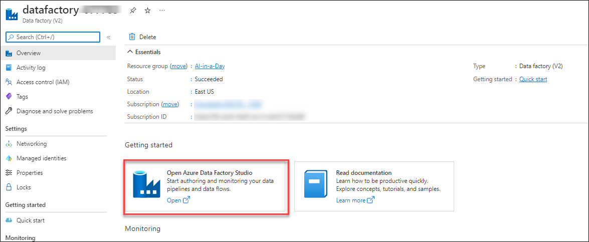 
    
4. Once you click on the option **Open Azure Data Factory**, a new browser tab with open with Data Factory portal.

    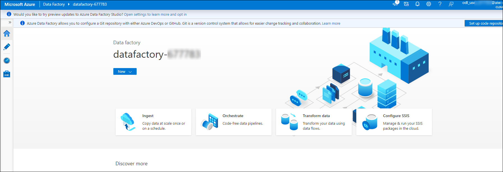
   
5. On the Data Factory portal, click on **Manage** button from the left side menu and select **Linked service**.

    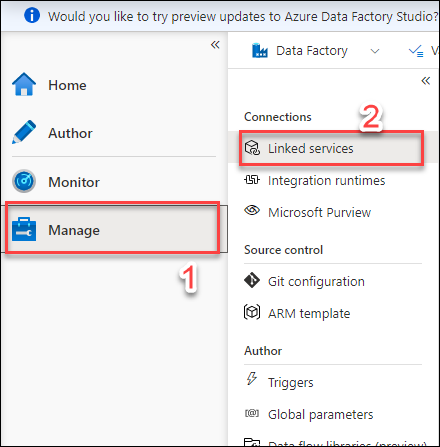
    
6. Now click on the **Create linked service** button.

    
    
7. Now, On the **New linked service** window select the **Compute** tab and select **Azure Databricks** option and click on **Continue**.

    
    
8. After clicking on **Continue** button, Enter the below details in creation window. Once done click on **Create** button.

    - Name: ```AzureDatabricks```
    - Description: ```AzureDatabricks linked service```
    - Connect via integration runtime: **Leave default**
    - Account Selection method: ```From Azure subscription```
    - Azure subscription: ```Select available subscription from drop down```
    - Databricks workspace: ```Select ai-adb-ws from drop down menu```
    - Select cluster: ```Existing interactive cluster```
    - Authentication type: ```Access token```
    - Access token: Paste the token you copied in the last exercise  
    - Choose from existing clusters: Select ```ai-adb-lab``` from dropdown menu.
    
    
      
    
      
9. Once the linked service creation is done, you will see a linked service in data factory linked service section.
   
    
    

## Task 4 - Create Data Factory Pipeline to run the Explore the surveillance dataset Databricks notebook
   In this task you will create a pipeline to run notebooks in Azure Databricks with the help of linked service in Data Factory and you will see the output in Azure Databricks.
   
1. While you are on the same Data Factory portal, navigate to **Author** section from the left side menu and click on the **+** button.

    
     
2. Now, Select **Pipeline** and then select **Pipeline** again.
   
    
   
3. On the Pipeline creation page, under properties section enter the pipeline name as **Databricks Notebook1**.  

    
    
4. In the **Activities** toolbox, expand **Databricks**. Drag the **Notebook** activity from the Activities toolbox to the pipeline designer surface. 
    
    
    
5. In the properties for the Databricks Notebook activity window at the bottom, complete the following steps:

    * Switch to the Azure Databricks tab.
      -Select **AzureDatabricks** LinkedService from the drop down. (which you created in the previous task).
      
      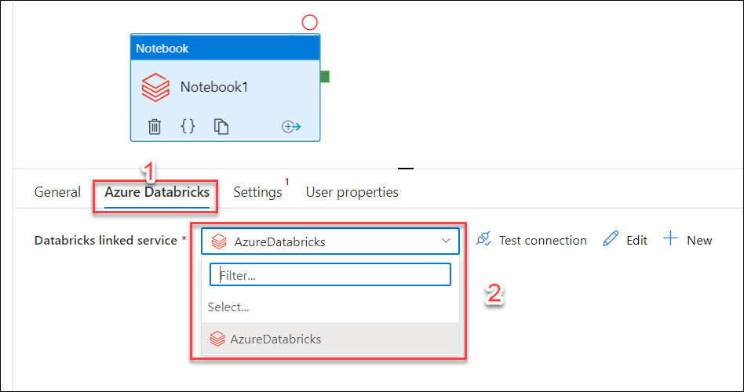
      
    * Switch to the Settings tab.
      - Click on **browse** on Notebook path option and navigate to ```Users/odl_user_XXXXX@aiw-ds.cloudlabs.ai/AI-in-a-Day-Lab-6``` path and select the first notebook **1-explore-surveillance-dataset** and click on **OK** button.

          
          
6. Leave the other things default and click on **Publish all** button to publish the newly created pipeline. You should be able to see a notification after sometime with the information of **Publishing completed**.

    
    
7. Now you will be triggering the pipeline, click on the **Add trigger** button and select **Trigger now**.

     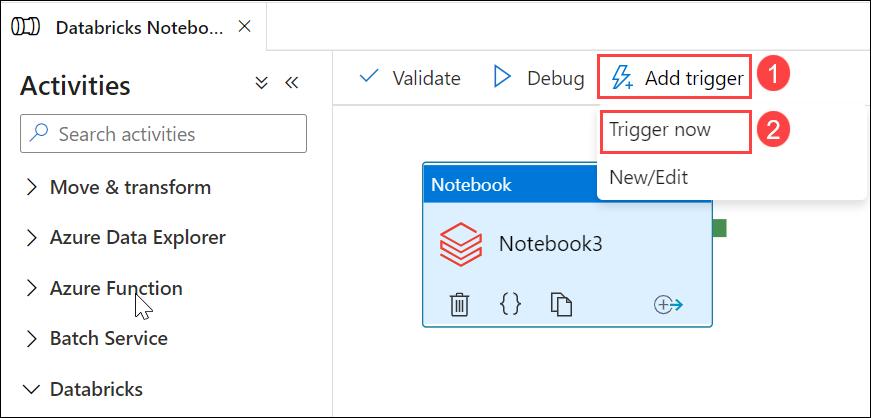
     
8. Now on the Pipeline run window, click on **OK** button to a start the trigger.

   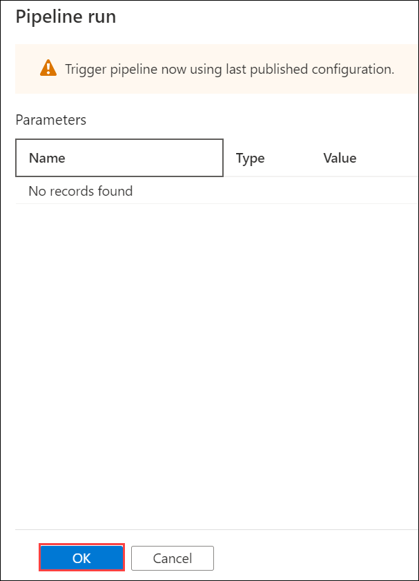

9. Now to see the pipeline running, navigate to **Monitor** section from the left side menu and select **Pipeline runs**. You should be able to see a pipeline under **Triggered** section. 
 
     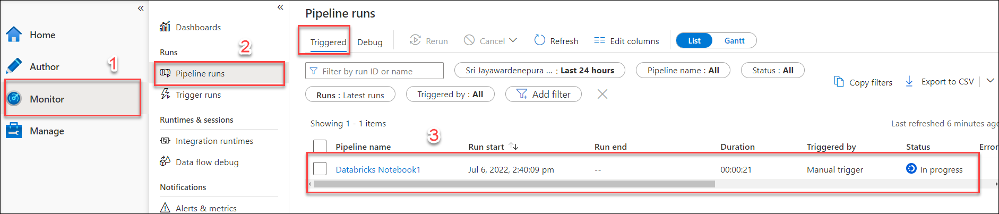
     
10. Now to see the output in Databricks, select the running pipeline and under the **Activity runs**, Click on the details button. 

     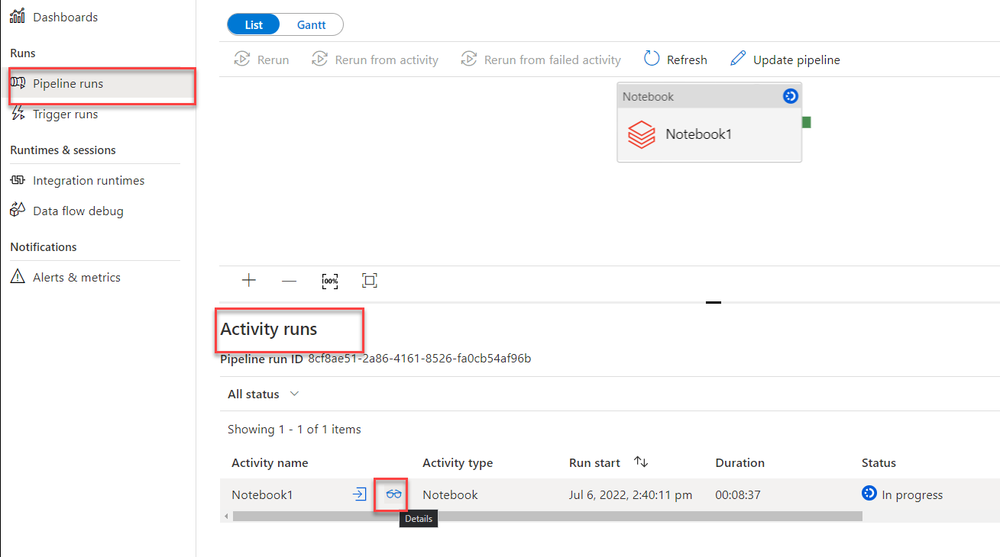
     
11. After some time you will see a pop-up with the details of real-time execution in Azure Databricks, to see the job run in Azure Databricks, click on the **Run page url**. 
     
     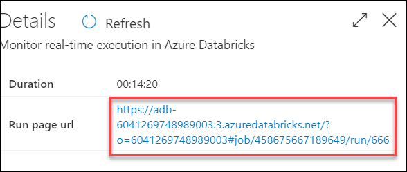
     
12. Now, you will be redirected to the Azure Databricks portal where you can see the notebook outputs, Task run details and other related information. You also will be having an option to Hide code to just see the results. Once you see that the job status is **Succeeded**, you can continue with next task.
     
     
     
## Task 5 - Create Data Factory Pipeline to run the Build a risk classifier based on surveillance data Azure Databricks Notebook
   In this task you will create pipeline to run notebooks in Azure Databricks with the help of linked service in Data Factory and you will see the output in Azure Databricks and Azure Machine Learning.
   
1. While you are on the same Data Factory portal, navigate to **Author** section from the left side menu and click on the **+** button.

    
     
1. Now, Select **Pipeline** and then select **Pipeline** again.
   
     
    
1. On the Pipeline creation page, under properties section enter the pipeline name as **Databricks Notebook2**.  

    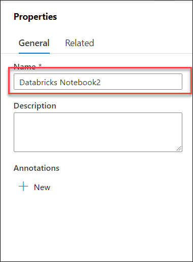
    
1. Now under the parameters section, click on **+New** button and add the below parameters and the values:

     - **experiment**: ```/Users/odl_user_xxxxxx@aiw-ds.cloudlabs.ai/2-surveillance-risk-classifier```, Please make sure to update the XXXXXX value with deployment inject
     - **client_id**: inject keys
     - **client_secret**: inject keys
       
        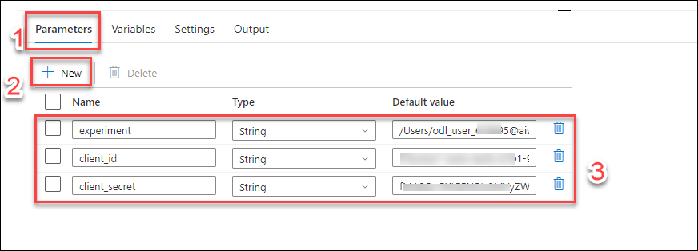

1. In the **Activities** toolbox, expand **Databricks**. Drag the **Notebook** activity from the Activities toolbox to the pipeline designer surface. 
    
    
  
1. In the properties for the Databricks Notebook activity window at the bottom, complete the following steps:

    * Switch to the Azure Databricks tab.
      -Select **AzureDatabricks** LinkedService from the drop down. (which you created in the previous task).
      
      
      
    * Switch to the Settings tab.
       - Click on **browse** on Notebook path option and navigate to ```Users/odl_user_XXXXX@aiw-ds.cloudlabs.ai/AI-in-a-Day-Lab-6``` path and select the second  notebook **2-surveillance-risk-classifier** and click on **OK** button.

        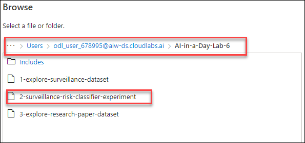
          
      - Expand the **Base parameters** section and click on the **+New** button and add the bellow parameters and the values:
      
           - **experiment**:    ```@pipeline().parameters.experiment```
           - **client_id**:     ```@pipeline().parameters.client_id```
           - **client_secret**: ```@pipeline().parameters.client_secret```
           
           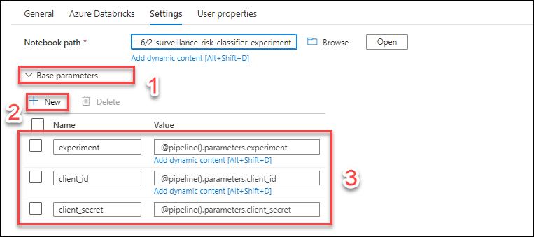
           
1. Leave the other things default and click on **Publish all** button to publish the newly created pipeline. You should be able to see a notification after sometime with the information of **Publishing completed**.
    
    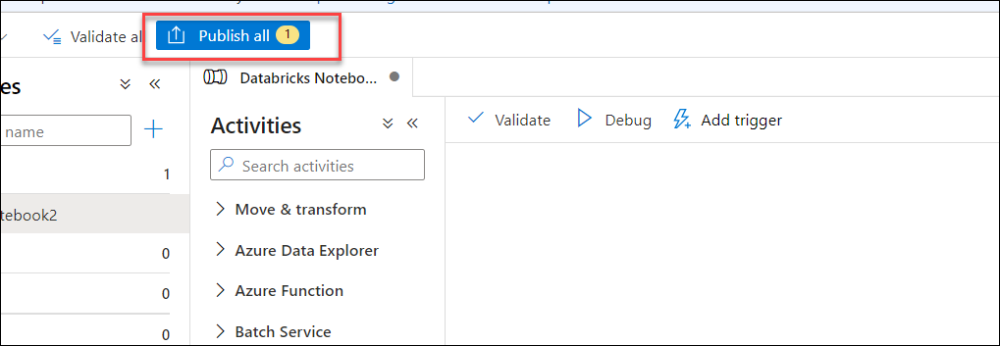
    
    
1. Now you will be triggering the pipeline, click on the **Add trigger** button and select **Trigger now**.

    
     
1. Now on the Pipeline run window, click on **OK** button to start the trigger, Also you should be able to see the parameters and values you have created in previous steps.

    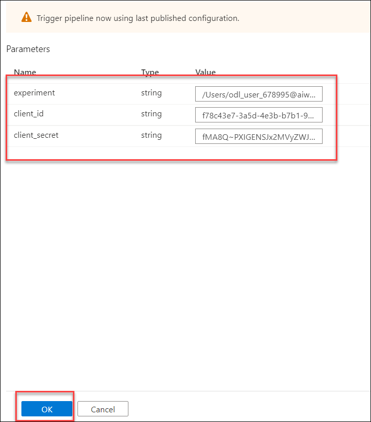

1. Now to see the pipeline running, navigate to **Monitor** section from the left side menu and select **Pipeline runs**. You should be able to see a pipeline under **Triggered** section. 
 
    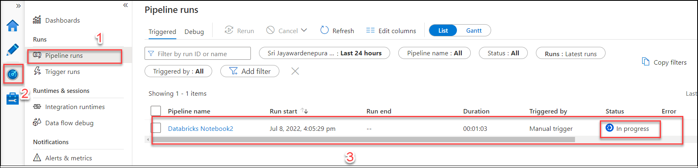
     
1. Now to see the output in Databricks, select the running pipeline and under the **Activity runs**, Click on the details button. 

    
     
1. After some time you will see a popup with the details of real-time execution in Azure Databricks. To see the job run in Azure Databricks, click on the **Run page url**. 
     
    
     
1. Now, you will be redirected to the Azure Databricks portal where you can see the notebook outputs, Task run details and other related information on the right side. You also will be having the parameters details that you have created. 
     
    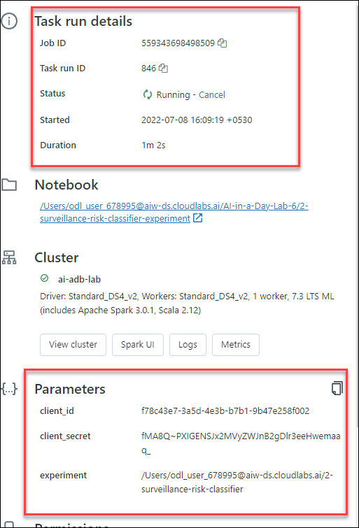
               
1. Now on the left side you will be having your notebook and the results, as in this Notebook we are creating few experiments in the databricks and in Azure Machine learning. Once you go thorough from the cells output, you will be having the direct URL's to launch the experiments and model details

    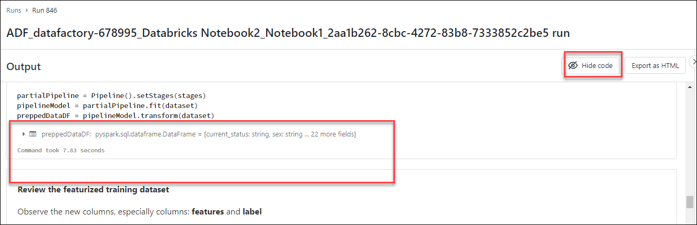
    
## Task 6 - Create Data Factory Pipeline to run the Explore the research papers dataset Azure Databricks for notebook
   In this task you will create pipeline to run notebooks in Azure Databricks with the help of linked service in Data Factory and you will see the output in Azure Databricks.
   
1. While you are on the same Data Factory portal, navigate to **Author** section from the left side menu and click on the **+** button.

    
     
2. Now, Select **Pipeline** and then select **Pipeline** again.
   
    
   
3. On the Pipeline creation page, under properties section enter the pipeline name as **Databricks Notebook3**.  

    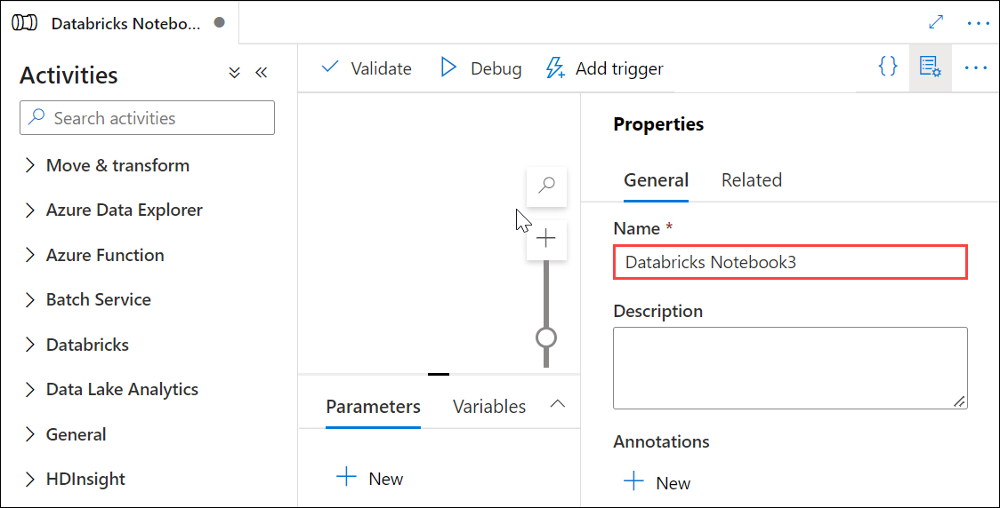
    
4. In the **Activities** toolbox, expand **Databricks**. Drag the **Notebook** activity from the Activities toolbox to the pipeline designer surface. 
    
    
    
5. In the properties for the Databricks Notebook activity window at the bottom, complete the following steps:

    * Switch to the Azure Databricks tab.
      -Select **AzureDatabricks** LinkedService from the drop down. (which you created in the previous task).
      
      
      
    * Switch to the Settings tab.
      - Click on **browse** on Notebook path option and navigate to ```Users/odl_user_XXXXX@aiw-ds.cloudlabs.ai/AI-in-a-Day-Lab-6``` path and select the third notebook **3-explore-research-paper-dataset** and click on **OK** button.

          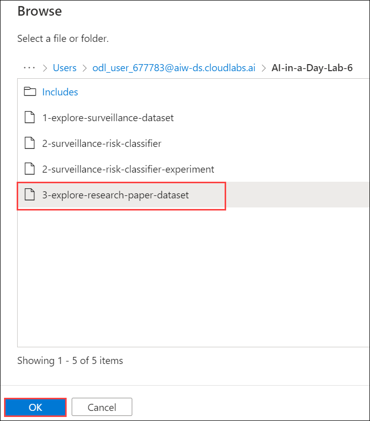
          
6. Leave the other things default and click on **Publish all** button to publish the newly created pipeline. You should be able to see a notification after sometime with the information of **Publishing completed**.

    
    
7. Now you will be triggering the pipeline, click on the **Add trigger** button and select **Trigger now**.

     
     
8. Now on the Pipeline run window, click on **OK** button to a start the trigger.

   

9. Now to see the pipeline running, navigate to **Monitor** section from the left side menu and select **Pipeline runs**. You should be able to see a pipeline under **Triggered** section. 
 
     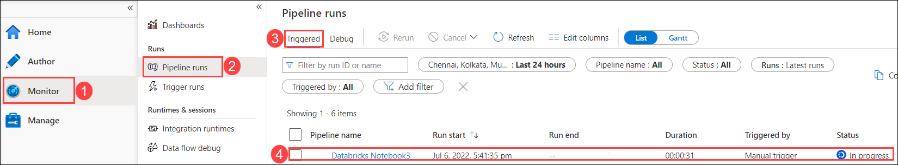
     
10. Now to see the output in Databricks, select the running pipeline and under the **Activity runs**, Click on the details button. 

     
     
11. After some time you will see a popup with the details of real-time execution in Azure Databricks. To see the job run in Azure Databricks, click on the **Run page url**. 
     
     
     
12. Now, you will be redirected to the Azure Databricks portal where you can see the notebook outputs, Task run details and other related information. You also will be having an option to Hide code to just see the results. Once you see that the job status is **Succeeded**, you can continue with next task.
     
     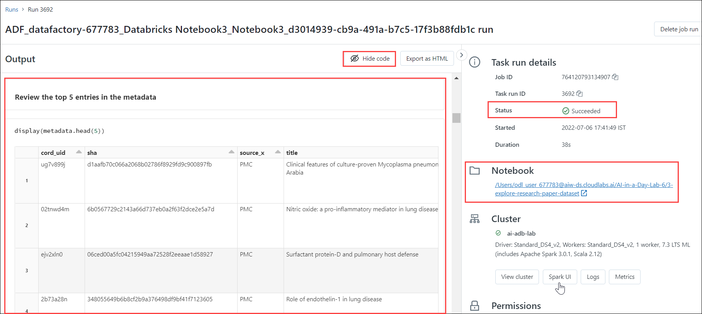
     

